### 5.1 அறிமுகம் (Introduction)

வடிவியல் வடிவங்களான புள்ளி, நேர்கோடு, வட்டம், பரவளையம், நீள்வட்டம் மற்றும் அதிபரவளையம் போன்றவற்றை கார்ட்டீசியன் முறையில் வரையறுக்க இரு பரிமாண பகுமுறை வடிவியல் பயன்படுகின்றது. கூம்பின் வளைவரைகளைப் பற்றி படிப்பது ஆச்சரியமூட்டும் கருத்துக்கள் பெறத் தூண்டுவதாகவும். சவாலாகவும் உற்சாகமூட்டுவதாகவும் இருந்ததால், இரண்டாயிரம் ஆண்டுகளுக்கு முன்னரே (≈ 2- 1 கி.மு(பொஆ.மு)), பண்டைய கிரேக்கர்கள் கூம்பு வளைவரை பற்றி படித்தனர்.

பகுமுறை வடிவ கணிதம், முதன்மையாக டி-கார்டே(Descartes) மற்றும் பெர்மெட்(Fermat), கெப்ளர் (Kepler), நியூட்டன் (Newton), ஆய்லர் (Euler), லீப்னிட்ஸ் (Leibniz), லோ பிதால் (l'Hôpital), கிளாரட் (Clairaut), கிராமர் (Cramer), ஜாகோபிஸ் (Jacobis) போன்ற மாபெரும் கணித மேதைகளால் 17-ஆம் நூற்றாண்டின் முற்பகுதியில் முறையாக மேம்படுத்தப்பட்டது.

வடிவ கணித பிரச்சினைகளைத் தீர்ப்பதற்குரிய சீரான வழிமுறைகளை நிறுவுவதற்கான தேவையின் அடிப்படையில் பகுமுறை வடிவியல் வளர்ந்தது. பகுமுறை வடிவியலின் வளர்ச்சி இன்றைய தொழில், மருத்துவம் மற்றும் அறிவியல் ஆய்வு ஆகியவற்றை வென்றுவிட்டது எனில் அது மிகையாகாது. அவர்கள் கற்பனையிலும் காணாத அளவிற்கு பின்வரும் நூற்றாண்டுகளில் இந்த வளைவரைகளின் பயன்பாடு உள்ளது.

ஜெர்மென் கணிதமேதையும் இயற்பியல் அறிஞருமான ஜொகன்ஸ் கெப்ளர் (Johanes Kepler)-ன் தலைகீழ் வர்க்க விதிக்குக் கட்டுப்பட்டு பூமி சூரியனை ஒரு குவியமாகக் கொண்டு நீள்வட்டப் பாதையில் சுற்றுகின்றது என்பது உட்பட கோள்கள் இயக்கம் பற்றிய எடுகோள்களின் தேற்றத்தின் ஊடாக பகுமுறை வடிவியல் பற்றிய ஆய்வு யூகிளீடின் (Euclidean Geometry) வடிவகணிதத்தை ஆயத் தொலைகள் மூலம் நிறுவ வழிவகுத்தது. ஆய்லர் (Euler), வெளி வளைவரைகள் மற்றும் வளைதளப் பரப்புகள் பற்றிய தனது ஆய்வில் பகுமுறை வடிவியலைப் பயன்படுத்தினார். ஆல்பர்ட் ஐன்ஸ்டீன் (Albert Einstein) தனது சார்புக் கொள்கையில் மேலும் இதனை மேம்படுத்தினார்.

சக்கரங்கள், பற்சக்கரங்கள், அணைக்கட்டுகளின் மதகுகள், வட்டவடிவியலின் மூலம் முக்கோணவியல் என்று பல இடங்களில் வட்டத்தின் பண்புகளும்; வளைவுகள், தொலைக்காட்சி துணைக்கோள் கிண்ண ஏற்பி, சூரிய அடுப்புகள், முகப்பு விளக்குகள், தொங்கு பாலங்கள், தேடும் விளக்குகள் போன்றவைகளில் பரவளையத்தின் பண்புகளும்; வளைவுகள், மருத்தவத்துறையில் லித்தோ டிரப்டர், நீள்வட்ட எதிரொளிப்பான் போன்று வடிவமைக்கப்பட்டிருக்கும் (Wispering Gallery) கூரை, அறிவியல் ஆய்வுகளில் மிகப் பரவலாகப் பயன்படுத்தப்படும் Nd: yag லேசர் மற்றும் நீள்வட்ட பற்சக்கரங்கள் போன்றவற்றில் நீள்வட்டத்தின் பண்புகளும்; தொலைநோக்கிகள், அனல்மின் நிலைய குளிரவைக்கும் கோபுரங்கள், கப்பல்கள் அல்லது விமானங்கள் நகரும் இடங்களைக் காணல் போன்ற இடங்களில் அதிபரவளையப் பண்புகளுமாக பல துறைகளில் கூம்பு வளைவரைகள் பயன்படுகின்றது.

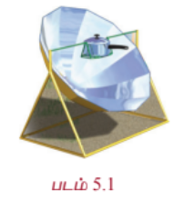    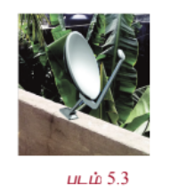

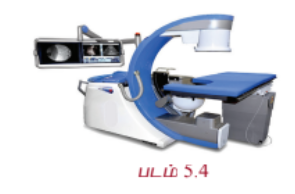  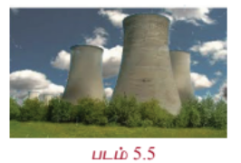  

ஓர் ஓட்டுநர் வளைதளத்தில் பெறப்பட்ட ஆணைகளுக்கான புத்தகங்களைக் கொண்டு சேர்க்கும் பணியில் இருந்தார். டிரக்கின் அகலம் 3 மீ, உயரம் 2.7 மீ, டிரக்கை ஓட்டும்போது ஒரு நீள்வட்ட நுழைவு கொண்ட சுரங்கப் பாதையின் முன் இருந்த எச்சரிக்கையைக் கண்டார். எச்சரிக்கை! சுரங்கப்பாதையின் மைய உயரம் 3 மீ எனவும் மற்றுமொரு எச்சரிக்கையில் எச்சரிக்கை! சுரங்கப்பாதையின் அகலம் 12 மீ எனவும் இருந்தது. சுரங்கப்பாதையின் அந்த வளைவு வழியே அந்த டிரக் செல்ல முடியுமா? இதுபோன்ற வினாக்களுக்கு இந்தப் பாடப் பகுதியின் முடிவில் விடையளிக்க இயலும்.

### கற்றலின் நோக்கங்கள்

இப்பாடப்பகுதி நிறைவுறும்போது பின்வருவனவற்றை மாணவர்கள் அறிந்திருப்பர்

- வட்டம், பரவளையம், நீள்வட்டம் மற்றும் அதிபரவளையம் ஆகியவற்றின் திட்ட சமன்பாடுகளைக் காணல்
- கூம்பு வளைவரைகளின் சமன்பாடுகளிலிருந்து மையம், முனைகள், குவியங்கள் போன்றவற்றை காணல்
- கூம்பு வளைவரைகளின் தொடுகோடு மற்றும் செங்கோட்டுச் சமன்பாடுகளை வருவித்தல்
- கூம்பு வளைவரைகள் மற்றும் அவற்றின் சிதைந்த வடிவங்களை வகைப்படுத்துதல்
- கூம்பு வளைவரைகளின் துணையலகுச் சமன்பாடுகள் மற்றும் அவற்றின் பயன்பாடுகள்
- அன்றாட வாழ்க்கையில் கூம்பு வளைவரைகளின் பயன்பாடுகள்.

### 5.2 வட்டம் (Circle)

வட்டம் என்ற வார்த்தை கிரேக்கத்தில் இருந்து தோன்றியது. மேலும் கி.மு. 17ஆம் நூற்றாண்டுகளில் வட்டங்கள் பற்றிய குறிப்புகள் உள்ளது. நிலவு, சூரியன், நீரில் ஏற்படும் சுழல்கள் என இயற்கையில் பல இடங்களில் நாம் வட்டத்தைக் காணலாம். சக்கரத்தின் அடிப்படை வட்டம் மேலும் நவீன இயந்திரங்கள் பலவற்றில் பயன்படும் பற்சக்கரம் போன்றவைகள் உருவாக காரணமானது வட்டம். கணிதத்தில் வட்டங்களைப் பற்றி படிப்பது, வடிவியல், வானஇயல் மற்றும் நுண்கணிதம் போன்றவற்றின் வளர்ச்சிக்கு ஊக்கமளிப்பதாக இருக்கின்றது. ஃபோர்-சோமர்பீல்ட்-டின் அணுக்கோட்பாட்டின் எலக்ட்ரான் சுற்றுப்பாதை வட்டவடிவமாகவும் இருக்கும்.

### வரையறை 5.1

ஒரு தளத்தில் உள்ள நிலைப்புள்ளியிலிருந்து மாறாத தூரத்தில் அதே தளத்தில் உள்ள ஒரு நகரும் புள்ளியின் நியமப் பாதை வட்டம் ஆகும். அந்த நிலைப்புள்ளி வட்டத்தின் மையம் என்றும் மாறாத தூரம் அந்த வட்டத்தின் ஆரம் என்றும் அழைக்கப்படும்.

### 5.2.1 வட்டச் சமன்பாட்டின் திட்டவடிவம்

#### (Equation of a circle in standard form)

(i) **மையம் $(0, 0)$ மற்றும் ஆரம் $r$ உடைய வட்டத்தின் சமன்பாடு**

மையம் $C(0, 0)$ , ஆரம் $r$ மற்றும் $P(x, y)$ ஒரு நகரும் புள்ளி என்க.

$P$ என்ற புள்ளியின் ஆயத்தொலைகள் $(x, y)$ என்பது $P(x, y)$ என குறிக்கப்படுவதைக் கவனிக்க.

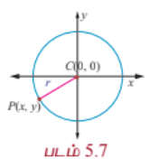

$CP = r$ மற்றும் $CP^2 = r^2$

$$(x - 0)^2 + (y - 0)^2 = r^2$$

$$x^2 + y^2 = r^2$$

இது மையம் $(0, 0)$ , ஆரம் $r$ உடைய வட்டத்தின் சமன்பாடாகும்.

(ii) **மையம் $(h, k)$ மற்றும் ஆரம் $r$ உடைய வட்டத்தின் சமன்பாடு**

மையம் $C(h, k)$, ஆரம் $r$ மற்றும் நகரும் புள்ளி $P(x, y)$ என்க.

தற்போது $CP = r$ எனவே $CP^2 = r^2$, அதாவது

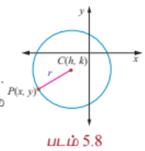

$$(x - h)^2 + (y - k)^2 = r^2.$$

இது வட்டத்தின் திட்டவடிவச் சமன்பாடு ஆகும். இது **மைய-ஆர வடிவம்** எனவும் அழைக்கப்படும்.

மேற்கண்ட சமன்பாட்டை விரிவுபடுத்த

$$x^2 + y^2 - 2hx - 2ky + h^2 + k^2 - r^2 = 0$$

எனக்கிடைக்கின்றது.

இங்கு $2g = -2h$, $2f = -2k$, $c = h^2 + k^2 - r^2$ எனக்கொண்டால் சமன்பாடு

$$x^2 + y^2 + 2gx + 2fy + c = 0$$

என்ற வடிவத்தைப் பெறும். இது வட்டத்தின் **பொது வடிவம்** எனப்படும்.

சமன்பாடு $x^2 + y^2 + 2gx + 2fy + c = 0$ என்பது பின்வரும் பண்புகளைக் கொண்ட $x , y$ என்ற மாறிகளில் அமைந்த இருபடிச் சமன்பாடு ஆகும்.

(i) இது $x , y$ இல் அமைந்த இருபடிச் சமன்பாடு

(ii) $x^2$ -ன் கெழு = $y^2$ -ன் கெழு $\neq 0$,

(iii) $xy$ -ன் கெழு = $0$.

மறுதலையாக மேற்கண்ட பண்புகள் உடைய ஒரு சமன்பாடு வட்டத்தைக் குறிக்கும் என நிறுவலாம்.

$ax^2 + ay^2 + 2g'x + 2f'y + c' = 0$ எனில், ... (1)

இது $x , y$ -ல் அமைந்த, பண்புகள் (i), (ii) மற்றும் (iii) உடைய இருபடிச்சமன்பாடு, மேலும் $a \neq 0$. $a$ -ஆல் (1)ஐ வகுக்க

$$x^2 + y^2 + 2\frac{g'}{a}x + 2\frac{f'}{a}y + \frac{c'}{a} = 0$$

என கிடைக்கும். ... (2)

$g = \frac{g'}{a}$, $f = \frac{f'}{a}$, $c = \frac{c'}{a}$ என எடுத்துக்கொண்டால் சமன்பாடு (2)

$$x^2 + y^2 + 2gx + 2fy + c = 0$$

என மாறும்.

$g^2$ மற்றும் $f^2$ -ஐ கூட்டி, கழிக்க பின்வரும் சமன்பாடு கிடைக்கும்.

$$x^2 + 2gx + g^2 + y^2 + 2fy + f^2 - g^2 - f^2 + c = 0$$

$$(x + g)^2 + (y + f)^2 = g^2 + f^2 - c$$

$$(x - (-g))^2 + (y - (-f))^2 = (\sqrt{g^2 + f^2 - c})^2$$

இது திட்ட வடிவில் உள்ளதால் வட்டத்தின் மையம் $(-g, -f)$ மற்றும் ஆரம் $r = \sqrt{g^2 + f^2 - c}$ ஆகும். எனவே சமன்பாடு (1), $\left(-\frac{g'}{a}, -\frac{f'}{a}\right)$ -ஐ மையமாகவும்

ஆரம் $\sqrt{g^2 + f^2 - c} = \frac{1}{a}\sqrt{g'^2 + f'^2 - ac'}$ உள்ள ஒரு வட்டத்தைக் குறிக்கும்.

#### குறிப்புரை

மையம் $(-g, -f)$ மற்றும் ஆரம் $\sqrt{g^2 + f^2 - c}$ உடைய $x^2 + y^2 + 2gx + 2fy + c = 0$ என்ற சமன்பாடு

(i) $g^2 + f^2 - c > 0$ எனில் **மெய்வட்டத்தை**க் குறிக்கும்;

(ii) $g^2 + f^2 - c = 0$ எனில் **ஒரு புள்ளி வட்டத்தை**க் குறிக்கும் ;

(iii) மற்றும் $g^2 + f^2 - c < 0$ எனில் **நியமப்பாதையற்ற ஒரு கற்பனை வட்டத்தை**க் குறிக்கும்.

---

### எடுத்துக்காட்டு 5.1

மையம் $(-3, 4)$ மற்றும் ஆரம் 3 அலகுகள் கொண்ட வட்டத்தின் பொதுவடிவச் சமன்பாடு காண்க.

#### தீர்வு

வட்டத்தின் திட்ட வடிவச் சமன்பாடு

$$(x - h)^2 + (y - k)^2 = r^2$$

$$\Rightarrow (x - (-3))^2 + (y - 4)^2 = 3^2$$

$$\Rightarrow (x + 3)^2 + (y - 4)^2 = 9$$

$$\Rightarrow x^2 + y^2 + 6x - 8y + 16 = 0$$

இது பொது வடிவம் ஆகும்.

---

### தேற்றம் 5.1

$lx + my + n = 0$ என்ற நேர்கோடும் $x^2 + y^2 + 2gx + 2fy + c = 0$ என்ற வட்டமும் வெட்டிக்கொள்ளும் புள்ளிகள் வழியே செல்லும் வட்டத்தின் சமன்பாடு

$$x^2 + y^2 + 2gx + 2fy + c + \lambda(lx + my + n) = 0, \quad \lambda \in \mathbb{R}$$

என்ற வடிவில் இருக்கும்.

#### நிரூபணம்

வட்டம் $S : x^2 + y^2 + 2gx + 2fy + c = 0$, ... (1)

மற்றும் நேர்கோடு $L : lx + my + n = 0$ என்க. ... (2)

$S + \lambda L = 0$ -ஐ கருத்தில் கொள்க.

அதாவது $x^2 + y^2 + 2gx + 2fy + c + \lambda(lx + my + n) = 0$ -ன் $x^2, y^2$ உறுப்புகள் மற்றும் மாறிலிகளை ஒன்று சேர்க்கக் கிடைப்பது ... (3)

$$x^2 + y^2 + 2(g + \frac{\lambda l}{2})x + 2(f + \frac{\lambda m}{2})y + (c + \lambda n) = 0$$

இது $x , y$ -இல் அமைந்த இருபடிச் சமன்பாடு மேலும் இங்கு $xy$ உறுப்பு இல்லை, மற்றும் $x^2 , y^2$ கெழுக்கள் சமமாக உள்ளதால் $S + \lambda L = 0$ என்பது ஒரு வட்டத்தைக் குறிக்கும். $(\alpha, \beta)$ என்ற புள்ளி $S$ மற்றும் $L$-இன் வெட்டும் புள்ளியானால் சமன்பாடுகள் (1) மற்றும் (2)-ஐ நிறைவு செய்கின்றன. எனவே இது சமன்பாடு (3)-ஐயும் நிறைவு செய்கிறது. எனவே $S + \lambda L = 0$ என்பது தேவையான வட்டத்தின் சமன்பாடு ஆகும்.

---

### எடுத்துக்காட்டு 5.2

$x^2 + y^2 = 16$ என்ற வட்டத்தின் நாண் $3x + 5y + 3 = 0$ -ஐ விட்டமாகக் கொண்ட வட்டத்தின் சமன்பாடு காண்க.

#### தீர்வு

தேற்றம் 5.1-ன் படி $x^2 + y^2 = 16$ என்ற வட்டமும் $3x + y + 5 = 0$ என்ற நேர்தோடும் வெட்டும் புள்ளிவழிச் செல்வும் வட்டத்தின் சமன்பாடு  
$\left( \frac{-3\lambda}{2}, \frac{-\lambda}{2} \right).$  
இது $3x + y + 5 = 0$ என்ற கோட்டின் மீதுள்ளதால்  
$$\Rightarrow \quad \frac{-9\lambda}{2} - \frac{\lambda}{2} + 5 = 0,$$  
$$\Rightarrow \quad \frac{-9\lambda}{2} - \frac{\lambda}{2} + 5 = 0,$$  
$$\Rightarrow \quad -5\lambda + 5 = 0,$$  
$$\Rightarrow \quad \lambda = 1.$$  

எனவே, தேவையான வட்டத்தின் சமன்பாடு $x^2 + y^2 + 3x + y - 11 = 0$.

---

### எடுத்துக்காட்டு 5.3

$x^2 + y^2 - 6x + 4y + c = 0$ என்ற வட்டத்திற்கு $c$ -ன் எல்லா மதிப்புகளுக்கும் $x + y - 1 = 0$ என்ற நேர்க்கோடு விட்டமாக அமையுமா எனத் தீர்மானிக்க.

#### தீர்வு

கொடுக்கப்பட்ட வட்டத்தின் மையம் $(3, -2)$. இது $x + y - 1 = 0$ -ல் உள்ளது. $(3) + (-2) - 1 = 0$. எனவே $x + y - 1 = 0$ என்ற கோடு $c$ -இன் எல்லா மதிப்பிற்கும் வட்டத்தின் மையம் வழிச்செல்லும் ஆதலால் $x + y - 1 = 0$ என்ற கோடு $c$-இன் எல்லா மதிப்பிற்கும் வட்டத்தின் விட்டமாக அமையும்.

---

### தேற்றம் 5.2

ஒரு வட்டத்தின் விட்டத்தின் முனைப்புள்ளிகள் $(x_1, y_1)$ மற்றும் $(x_2, y_2)$ எனில் அந்த வட்டத்தின் சமன்பாடு

$$(x - x_1)(x - x_2) + (y - y_1)(y - y_2) = 0$$

ஆகும்.

#### நிரூபணம்

$AB$ என்ற விட்டத்தின் முனைப்புள்ளிகள் $A(x_1, y_1)$, $B(x_2, y_2)$ என்க.

மேலும் $P(x, y)$ வட்டத்தின் மீதுள்ள ஏதேனும் ஒரு புள்ளி என்க.

அப்பொழுது $\angle APB = \frac{\pi}{2}$ (அரைவட்டத்தில் தாங்கும் கோணம்) எனவே $AP$, $PB$ என்பவற்றின் சாய்வுகளின் பெருக்கல் $-1$.

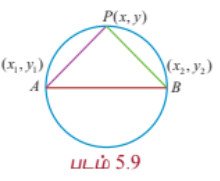

$$\frac{y - y_1}{x - x_1} \cdot \frac{y - y_2}{x - x_2} = -1$$

இதிலிருந்து வட்டத்தின் சமன்பாடு

$$(x - x_1)(x - x_2) + (y - y_1)(y - y_2) = 0$$

எனக்கிடைக்கின்றது.

---

### எடுத்துக்காட்டு 5.4

$(-4, -2)$ மற்றும் $(1, 1)$ என்ற புள்ளிகளை விட்டத்தின் முனைகளாகக் கொண்ட வட்டத்தின் பொதுச் சமன்பாடு காண்க.

#### தீர்வு

தேற்றம் 5.2 -ன் படி $(x_1, y_1)$ மற்றும் $(x_2, y_2)$ என்ற புள்ளிகளை விட்டத்தின் முனைகளாகக் கொண்ட வட்டத்தின் சமன்பாடு

$$(x - x_1)(x - x_2) + (y - y_1)(y - y_2) = 0$$

$$\Rightarrow (x + 4)(x - 1) + (y + 2)(y - 1) = 0$$

$$\Rightarrow x^2 + y^2 + 3x + y - 6 = 0.$$

எனவே தேவையான வட்டத்தின் சமன்பாடு $x^2 + y^2 + 3x + y - 6 = 0$.

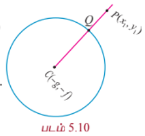

---

### எடுத்துக்காட்டு 5.5

$x^2 + y^2 - 6x - 8y + 12 = 0$ என்ற வட்டத்தைப் பொறுத்து $(2, 3)$ என்ற புள்ளியின் நிலையை ஆராய்க.

#### தீர்வு

$$x_1^2 + y_1^2 + 2gx_1 + 2fy_1 + c = 2^2 + 3^2 - 6(2) - 8(3) + 12,$$

$$= 4 + 9 - 12 - 24 + 12 = -11 < 0.$$

எனவே புள்ளி $(2, 3)$ தேற்றம் 5.3-ன் படி வட்டத்திற்கு உள்ளே அமையும்.

---

### எடுத்துக்காட்டு 5.6

$3x + 4y - 12 = 0$ என்ற நேர்க்கோடு ஆய அச்சுகளை $A$ மற்றும் $B$ என்ற புள்ளிகளில் சந்திக்கின்றது. கோட்டுத்துண்டு $AB$ -ஐ விட்டமாகக் கொண்ட வட்டத்தின் சமன்பாடு காண்க.

#### தீர்வு

நேர்க்கோடு $3x + 4y = 12$ -ஐ வெட்டுத்துண்டு வடிவில் எழுத

$$\frac{x}{4} + \frac{y}{3} = 1$$

எனக் கிடைக்கும்.

எனவே புள்ளிகள் $A$ மற்றும் $B$ முறையே $(4, 0)$ மற்றும் $(0, 3)$.

வட்டத்தின் சமன்பாடு விட்ட வடிவம்

$$(x - x_1)(x - x_2) + (y - y_1)(y - y_2) = 0$$

$$(x - 4)(x - 0) + (y - 0)(y - 3) = 0$$

$$x^2 + y^2 - 4x - 3y = 0.$$

---

### எடுத்துக்காட்டு 5.7

ஒரு நேர்க்கோடு $3x + 4y + 10 = 0$, மையம் $(2, 1)$ உள்ள ஒரு வட்டத்தில் 6 அலகுகள் நீளமுள்ள ஒரு நாணை வெட்டுகின்றது. அந்த வட்டத்தின் பொதுச் சமன்பாடு காண்க.

#### தீர்வு

மையம் $(2, 1)$ உடைய வட்டத்தில் $3x + 4y + 10 = 0$ என்ற நேர்க்கோடு $AB$ என்ற நாணை வெட்டுகின்றது. $AB$ -ன் மையப்புள்ளி $M$ என்க.

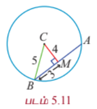

$AM = BM = 3$. $BMC$ ஒரு செங்கோண முக்கோணம்

$$CM = \frac{3(2) + 4(1) + 10}{\sqrt{3^2 + 4^2}} = \frac{20}{5} = 4.$$

பிதாகரஸ் தேற்றப்படி

$$BC^2 = BM^2 + MC^2 = 3^2 + 4^2 = 25.$$

$BC = 5 =$ ஆரம்

தேவையான வட்டத்தின் சமன்பாடு

$$(x - 2)^2 + (y - 1)^2 = 5^2$$

அதாவது $x^2 + y^2 - 4x - 2y - 20 = 0$.

---

### எடுத்துக்காட்டு 5.8

ஆரம் 3 அலகுகள் கொண்ட ஒரு வட்டம் ஆய அச்சுகளைத் தொட்டுச் செல்கின்றவாறு உருவாகும் அனைத்து வட்டங்களின் பொதுச் சமன்பாடுகளையும் காண்க.

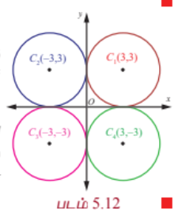

#### தீர்வு

வட்டம் இரு அச்சுகளையும் தொட்டுச் செல்வதால் அச்சுகளிலிருந்து வட்டத்தின் மையத்திற்கு உள்ள தூரம் 3 அலகுகள். எனவே மையம் $(\pm 3, \pm 3)$ ஆக இருக்கும். அதனால் ஆரம் 3 உடைய நான்கு வட்டங்களின் சமன்பாடுகள்

$$x^2 + y^2 \pm 6x \pm 6y + 9 = 0$$

ஆகும்.

---

### எடுத்துக்காட்டு 5.9

ஒரு வட்டத்தின் சமன்பாடு $3x^2 + (1 + a)y^2 + 6x - 9y + a + 4 = 0$ எனில் அதன் மையம், ஆரம் காண்க.

#### தீர்வு

$x^2$ -ன் கெழு = $y^2$ -ன் கெழு (இருபடிச் சமன்பாட்டின் பண்பு (ii)-ன் படி)

ஆதலால் $3 = 1 + a$, $a = 2$ எனக்கிடைக்கின்றது. எனவே வட்டத்தின் சமன்பாடு

$$3x^2 + 3y^2 + 6x - 9y + 6 = 0$$

$$x^2 + y^2 + 2x - 3y + 2 = 0$$

மையம் $\left(-1, \frac{3}{2}\right)$ மற்றும் ஆரம்

$$r = \sqrt{1 + \frac{9}{4} - 2} = \frac{\sqrt{5}}{2}.$$

---

### எடுத்துக்காட்டு 5.10

$(1, 1), (2, -1)$ , மற்றும் $(3, 2)$ என்ற மூன்று புள்ளிகள் வழிச்செல்லும் வட்டத்தின் சமன்பாடு காண்க.

#### தீர்வு

வட்டத்தின் பொதுச் சமன்பாடு

$$x^2 + y^2 + 2gx + 2fy + c = 0$$

... (1)

இது $(1, 1),(2, -1)$ மற்றும் $(3, 2)$ என்ற புள்ளிகள் வழிச்செல்வதால்

$$2 + 2g + 2f + c = 0 \Rightarrow 2g + 2f + c = -2,$$

... (2)

$$5 + 4g - 2f + c = 0 \Rightarrow 4g - 2f + c = -5,$$

... (3)

$$13 + 6g + 4f + c = 0 \Rightarrow 6g + 4f + c = -13.$$

... (4)

(2) – (3)-இலிருந்து

$$-2g + 4f = 3.$$

... (5)

(4) – (3)-இலிருந்து

$$2g + 6f = -8.$$

... (6)

(5) + (6)-இலிருந்து $10f = -5 \Rightarrow f = -\frac{1}{2}$ என கிடைக்கும் மதிப்பை (6)இல் பிரதியிட

$$2g + 6(-\frac{1}{2}) = -8 \Rightarrow 2g - 3 = -8 \Rightarrow g = -\frac{5}{2}.$$

$g, f$ இன் மதிப்புகளை (2)இல் பிரதியிட

$$2(-\frac{5}{2}) + 2(-\frac{1}{2}) + c = -2 \Rightarrow -5 - 1 + c = -2 \Rightarrow c = 4$$

எனவும் கிடைக்கிறது.

எனவே தேவையான வட்டத்தின் சமன்பாடு

$$x^2 + y^2 + 2(-\frac{5}{2})x + 2(-\frac{1}{2})y + 4 = 0$$

அதாவது $x^2 + y^2 - 5x - y + 4 = 0$.

---

### 5.2.2 வட்டத்தின் மீதமைந்த $P$ என்ற புள்ளியில் தொடுகோடு மற்றும் செங்கோட்டுச் சமன்பாடுகள்

#### (Equations of tangent and normal at a point P on a given circle)

ஒரு நேர்கோடு வட்டத்தை ஒரே ஒரு புள்ளியில் தொட்டுச்சென்றால் அது தொடுகோடாகும். மேலும் அந்த தொடுகோட்டுக்குச் செங்குத்தாகவும் தொடுபுள்ளி வழியாகவும் செல்லும் கோடு செங்கோடாகும்.

$P(x_1, y_1)$ மற்றும் $Q(x_2, y_2)$ என்பன $x^2 + y^2 + 2gx + 2fy + c = 0$ என்ற வட்டத்தின் மீதமைந்த இரு புள்ளிகள் என்க.

எனவே, $x_1^2 + y_1^2 + 2gx_1 + 2fy_1 + c = 0$ ... (1)

மற்றும் $x_2^2 + y_2^2 + 2gx_2 + 2fy_2 + c = 0$ ... (2)

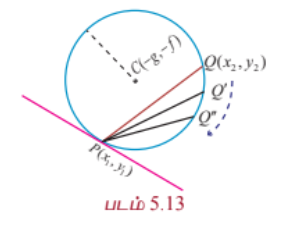

(2) - (1) -இலிருந்து

$$x_2^2 - x_1^2 + y_2^2 - y_1^2 + 2g(x_2 - x_1) + 2f(y_2 - y_1) = 0$$

$$(x_2 - x_1)(x_2 + x_1 + 2g) + (y_2 - y_1)(y_2 + y_1 + 2f) = 0$$

$$\frac{y_2 - y_1}{x_2 - x_1} = -\frac{x_2 + x_1 + 2g}{y_2 + y_1 + 2f}$$

இதனால் $PQ$ -இன் சாய்வு $= -\frac{x_1 + x_2 + 2g}{y_1 + y_2 + 2f}$.

$Q$ என்ற புள்ளி $P$-ஐ நோக்கி நகரும்போது $PQ$ என்ற நாண் $P$ என்ற புள்ளிக்கான தொடுகோடாக மாறும்.

தொடுகோட்டின் சாய்வு $-\frac{x_1 + x_1 + 2g}{y_1 + y_1 + 2f} = -\frac{2x_1 + 2g}{2y_1 + 2f} = -\frac{x_1 + g}{y_1 + f}$.

எனவே தொடுகோட்டின் சமன்பாடு

$$y - y_1 = -\frac{x_1 + g}{y_1 + f}(x - x_1)$$

$$(y - y_1)(y_1 + f) = -(x - x_1)(x_1 + g)$$

$$yy_1 + fy - y_1^2 - fy_1 + xx_1 + gx - x_1^2 - gx_1 = 0$$

$$xx_1 + yy_1 + gx + fy - (x_1^2 + y_1^2 + gx_1 + fy_1) = 0$$

... (1)

$(x_1, y_1)$ என்ற புள்ளி வட்டத்தின் மீதுள்ளதால்

$$x_1^2 + y_1^2 + 2gx_1 + 2fy_1 + c = 0$$

எனவே,

$$-(x_1^2 + y_1^2 + gx_1 + fy_1) = gx_1 + fy_1 + c.$$

... (2)

இதனால் $(x_1, y_1)$ என்ற புள்ளியில் தொடுகோட்டின் சமன்பாடு

$$xx_1 + yy_1 + g(x + x_1) + f(y + y_1) + c = 0$$

ஆகும்.

மேலும் செங்கோட்டின் சமன்பாடு

$$y - y_1 = \frac{y_1 + f}{x_1 + g}(x - x_1)$$

$$\Rightarrow (y - y_1)(x_1 + g) = (y_1 + f)(x - x_1)$$

$$\Rightarrow x_1 y - x_1 y_1 + gy - gy_1 = xy_1 - x_1 y_1 + fx - fx_1$$

$$\Rightarrow xy_1 - x_1 y + fx - gy - (fx_1 - gy_1) = 0$$

$$\Rightarrow xy_1 - x_1 y + f(x - x_1) - g(y - y_1) = 0$$

சமன்பாடுகள்

#### குறிப்புரை

(1) $x^2 + y^2 = a^2$ என்ற வட்டத்திற்கு $(x_1, y_1)$ என்ற புள்ளியில் தொடுகோட்டுச் சமன்பாடு

$$xx_1 + yy_1 = a^2.$$

(2) $x^2 + y^2 = a^2$ என்ற வட்டத்திற்கு $(x_1, y_1)$ என்ற புள்ளியில் செங்கோட்டுச் சமன்பாடு

$$xy_1 - yx_1 = 0.$$

(3) செங்கோடு வட்டத்தின் மையம் வழிச் செல்லும்.

---

### 5.2.3 $y = mx + c$ என்ற நேர்க்கோடு $x^2 + y^2 = a^2$ என்ற வட்டத்தின் தொடுகோடாக இருக்க கட்டுப்பாடு மற்றும் தொடும் புள்ளி காணல்

#### (Condition for the line $y = mx + c$ to be a tangent to the circle $x^2 + y^2 = a^2$ and finding the point of contact)

$y = mx + c$ என்ற நேர்க்கோடு $x^2 + y^2 = a^2$ என்ற வட்டத்தைத் தொடுகின்றது என்க. இந்த வட்டத்தின் மையம் மற்றும் ஆரம் முறையே $(0, 0)$ மற்றும் $a$ ஆகும்.

(i) **ஒரு நேர்கோடு தொடுகோடாக இருக்கக் கட்டுப்பாடு** (Condition for a line to be tangent)

$(0, 0)$ என்ற புள்ளியிலிருந்து $mx - y + c = 0$ என்ற நேர்கோட்டிற்கான செங்குத்து தூரம்

$$\frac{|m(0) - 0 + c|}{\sqrt{m^2 + 1}} = \frac{|c|}{\sqrt{1 + m^2}}.$$

இது ஆரத்திற்குச் சமம்.

எனவே $\frac{|c|}{\sqrt{1 + m^2}} = a$ அல்லது $c^2 = a^2(1 + m^2)$.

இதனால் $y = mx + c$ என்ற நேர்கோடு $x^2 + y^2 = a^2$ என்ற வட்டத்திற்குத் தொடுகோடாக அமைய கட்டுப்பாடு $c^2 = a^2(1 + m^2)$.

(ii) **தொடுபுள்ளி** (Point of contact)

$y = mx + c$ என்ற நேர்கோடு $x^2 + y^2 = a^2$ என்ற வட்டத்தை தொடும் புள்ளி $(x_1, y_1)$ எனில்

$$y_1 = mx_1 + c.$$

... (1)

$(x_1, y_1)$ -இல் தொடுகோட்டின் சமன்பாடு

$$xx_1 + yy_1 = a^2.$$

$$yy_1 = -xx_1 + a^2$$

... (2)

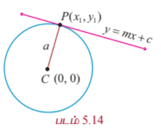

சமன்பாடு (1) மற்றும் (2) ஒரே நேர்க்கோட்டைக் குறிக்கின்றன. எனவே கெழுக்கள் விகித சமமாக இருக்கும்.

அதனால்,

$$\frac{y_1}{1} = -\frac{x_1}{m} = \frac{a^2}{c}.$$

$$y_1 = \frac{a^2}{c}, \quad x_1 = -\frac{a^2 m}{c}, \quad c = \pm a\sqrt{1+m^2}.$$

அதனால் தொடுபுள்ளி

(1) $\left(-\frac{am}{\sqrt{1+m^2}}, \frac{a}{\sqrt{1+m^2}}\right)$ அல்லது

(2) $\left(\frac{am}{\sqrt{1+m^2}}, -\frac{a}{\sqrt{1+m^2}}\right)$.

### குறிப்பு

$P$ என்ற புள்ளியில் வட்டத்தின் தொடுகோட்டுச் சமன்பாடு $y = mx \pm a\sqrt{1+m^2}$.

---

### தேற்றம் 5.4

$x^2 + y^2 = a^2$ என்ற வட்டத்திற்கு வெளியே உள்ள ஒரு புள்ளியிலிருந்து இரு தொடுகோடுகள் வரையலாம்.

#### நிரூபணம்

கொடுக்கப்பட்ட புள்ளி $P(x_1, y_1)$ என்ற புள்ளி வட்டத்திற்கு வெளியே உள்ளது என்க.

தொடுகோட்டுச் சமன்பாடு $y = mx \pm a\sqrt{1+m^2}$. இது $(x_1, y_1)$ வழிச்செல்லும். எனவே

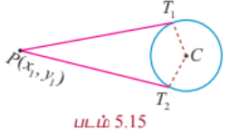

$$y_1 = mx_1 \pm a\sqrt{1+m^2}$$

$$y_1 - mx_1 = \pm a\sqrt{1+m^2}.$$

இருபுறமும் வர்க்கப்படுத்த,

$$(y_1 - mx_1)^2 = a^2(1+m^2)$$

$$y_1^2 + m^2 x_1^2 - 2mx_1 y_1 - a^2 - a^2 m^2 = 0$$

$$m^2(x_1^2 - a^2) - 2mx_1 y_1 + (y_1^2 - a^2) = 0.$$

$m$ -ன் இந்த இருபடிச் சமன்பாடு, $m$ க்கு இரண்டு மதிப்புகள் தரும். இந்த இருமதிப்புகள் வட்டத்திற்கான இரு தொடுகோடுகளைத் தரும்.

### குறிப்பு

(1) புள்ளி $(x_1, y_1)$ வட்டத்திற்கு வெளியில் அமையுமானால் இரு தொடுகோடுகளும் மெய்யானவையாகும்.

(2) புள்ளி $(x_1, y_1)$ வட்டத்திற்கு உள்ளே அமையுமானால் இரு தொடுகோடுகளும் கற்பனையானவையாகும்.

(3) புள்ளி $(x_1, y_1)$ வட்டத்தின் மீது அமையுமானால் இரு தொடுகோடுகளும் ஒன்றாக இணையும்.

---

### எடுத்துக்காட்டு 5.11

$x^2 + y^2 = 25$ என்ற வட்டத்திற்கு $P(-3, 4)$ -இல் தொடுகோடு மற்றும் செங்கோட்டுச் சமன்பாடுகளைக் காண்க.

#### தீர்வு

$P(x_1, y_1)$ -இல் தொடுகோட்டுச் சமன்பாடு $xx_1 + yy_1 = a^2$.

அதாவது, $(-3, 4)$ -இல்

$$x(-3) + y(4) = 25$$

$$-3x + 4y = 25.$$

செங்கோட்டுச் சமன்பாடு $xy_1 - yx_1 = 0$

அதாவது, $4x + 3y = 0$.

---

### எடுத்துக்காட்டு 5.12

$y = 4x + c$ என்ற நேர்க்கோடு $x^2 + y^2 = 9$ என்ற வட்டத்தின் தொடுகோடு எனில் $c$ -ன் மதிப்பு காண்க.

#### தீர்வு

$y = mx + c$ என்ற நேர்க்கோடு $x^2 + y^2 = a^2$ என்ற வட்டத்தின் தொடுகோடாக இருக்கக் கட்டுப்பாடு

$$c^2 = a^2(1 + m^2).$$

எனவே,

$$c = \pm 3\sqrt{1 + 16}$$

அல்லது $c = \pm 3\sqrt{17}$.

---

### எடுத்துக்காட்டு 5.13

பாசன வாய்க்கால் மீது அமைந்த சாலையில் 20 மீ அகலமுடைய இரண்டு அரைவட்ட வளைவு நீர்வழிகள் அமைக்கப்பட்டன. அவற்றின் துணைத்தூண்களின் அகலம் 2 மீ. படம் 5.16-ஐப் பயன்படுத்தி அந்த வளைவுகளின் மாதிரிக்கான சமன்பாடுகளைக் காண்க.

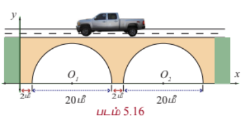

#### தீர்வு

அரைவட்ட வளைவு வழிகளின் மையப்புள்ளிகள் $O_1$ மற்றும் $O_2$ என்க.

முதல் வளைவு வழியின் மையம் $O_1(12, 0)$ மற்றும் $r = 10$. இதிலிருந்து அந்த அரைவட்டத்தைக் குறிக்கும் சமன்பாடு

$$(x - 12)^2 + (y - 0)^2 = 10^2$$

$$\Rightarrow x^2 + y^2 - 24x + 44 = 0, \quad y > 0.$$

இரண்டாம் வளைவு வழியின் மையம் $O_2(34, 0)$ மற்றும் ஆரம் $r = 10$. முதல் வளைவு போல இரண்டாம் வளைவு வழியின் சமன்பாடு

$$(x - 34)^2 + y^2 = 10^2$$

$$\Rightarrow x^2 + y^2 - 68x + 1056 = 0, \quad y > 0.$$

---

### பயிற்சி 5.1

1. ஆரம் 5 செ.மீ. அலகுகள் உடையதும், $x$-அச்சை ஆதிப்புள்ளியில் தொட்டுச் செல்வதுமான வட்டத்தின் சமன்பாட்டைத் தருவிக்க.

2. $(2, -1)$ என்ற புள்ளியை மையமாகவும், $(3, 6)$ என்ற புள்ளி வழிச் செல்வதுமான வட்டத்தின் சமன்பாடு காண்க.

3. இரு அச்சுக்களையும் தொட்டுச் செல்வதும், $(-4, -2)$ என்ற புள்ளி வழிச் செல்வதுமான வட்டத்தின் சமன்பாடு காண்க.

4. மையம் $(2, 3)$ உடையதும் $3x - 2y - 1 = 0$ மற்றும் $4x + y - 7 = 0$ என்ற கோடுகள் வெட்டும் புள்ளி வழிச் செல்வதுமான வட்டத்தின் சமன்பாடு காண்க.

5. $(3, 4)$ மற்றும் $(2, -7)$ என்ற புள்ளிகளை விட்டத்தின் முனைப்புள்ளிகளாகக் கொண்ட வட்டத்தின் சமன்பாட்டைப் பெறுக.

6. $(1, 0), (-1, 0)$, மற்றும் $(0, 1)$ என்ற புள்ளிகள் வழிச்செல்லும் வட்டத்தின் சமன்பாடு காண்க.

7. $9\pi$ சதுர அலகுகள் பரப்பு கொண்ட வட்டத்தின் விட்டங்கள், $x + y = 5$ மற்றும் $x - y = 1$ என்ற நேர்கோடுகள் மீது அமைந்துள்ளன எனில் அந்த வட்டத்தின் சமன்பாடு காண்க.

8. $y = 2x + c$ என்ற கோடு $x^2 + y^2 = 16$ என்ற வட்டத்தின் தொடுகோடு எனில், $c$ -ன் மதிப்பு காண்க.

9. $x^2 + y^2 - 6x + 6y - 8 = 0$ என்ற வட்டத்தின் தொடுகோடு மற்றும் செங்கோட்டுச் சமன்பாடுகளை $(2, 2)$ என்ற புள்ளியில் காண்க.

10. $(-2, 1), (0, 0)$ மற்றும் $(-4, -3)$ என்ற புள்ளிகள் $x^2 + y^2 - 5x + 2y - 5 = 0$ என்ற வட்டத்திற்கு வெளியே, வட்டத்தின் மீது அல்லது உள்ளே இவற்றில் எங்கே உள்ளன எனத் தீர்மானிக்கவும்.

11. பின்வரும் வட்டங்களுக்கு மையத்தையும் ஆரத்தையும் காண்க.

    (i) $x^2 + y^2 + (2x)^2 = 0$

    (ii) $x^2 + y^2 + 6x - 4y + 4 = 0$

    (iii) $x^2 + y^2 - 2x + 3y - 3 = 0$

    (iv) $2x^2 + 2y^2 - 6x + 4y + 2 = 0$

12. $3x^2 + (p - 3)y^2 + 2x - 8y + px = pq$ என்ற சமன்பாடு வட்டத்தைக் குறிக்கும் எனில் $p$ மற்றும் $q$ -ன் மதிப்பு காண்க. மேலும் அந்த வட்டத்தின் மையம் மற்றும் ஆரம் காண்க.

### 5.3. கூம்பு வளைவுகள் (Conics)

#### வரையறை 5.2

ஒரு தளத்தில் ஒரு நகரும் புள்ளியிலிருந்து நிலைப்புள்ளிக்கு உள்ள தூரத்திற்கும் நகரும் புள்ளியிலிருந்து நிலைப்புள்ளி வழிச்செல்லாத ஒரு நிலைக்கோட்டிற்குமான தூரத்திற்கும் உள்ள விகிதம் ஒரு மாறிலியாக இருக்குமாறு நகரும் எனில் அந்தப் புள்ளியின் நியமப்பாதை ஒரு கூம்பு வளைவு (வளைவரை) எனப்படும்.

நிலைப்புள்ளி **குவியம்** எனப்படும். நிலைக்கோடு **இயக்குவரை** எனப்படும் மற்றும் மாறாத விகிதம் **மையத் தொலைத்தகவு** எனப்படும். இது $e$ என குறிக்கப்படும்.

(i) இந்த மாறிலி $e = 1$ எனில் கூம்பு வளைவரை **பரவளையம்** எனப்படும்.

(ii) இந்த மாறிலி $e < 1$ எனில் கூம்பு வளைவரை **நீள்வட்டம்** எனப்படும்.

(iii) இந்த மாறிலி $e > 1$ எனில் கூம்பு வளைவரை **அதிபரவளையம்** எனப்படும்.

---

### 5.3.1 கூம்பு வளைவின் பொதுச் சமன்பாடு (The general equation of a Conic)

நிலைப்புள்ளி $S(x_1, y_1)$, நிலைக்கோடு $l$, $e$ மையத் தொலைத்தகவு மற்றும் $P(x, y)$ நகரும் புள்ளி என்க. கூம்பு வரையறையின்படி

$$\frac{SP}{PM} = \text{மாறிலி} = e,$$

... (1)

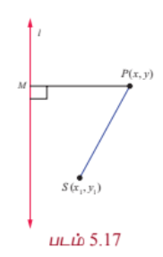

$$SP = \sqrt{(x - x_1)^2 + (y - y_1)^2}$$

$$PM = P(x, y)$$ -இலிருந்து நேர்க்கோடு

$$lx + my + n = 0$$ -க்கான செங்குத்து தூரம்

$$= \frac{|lx + my + n|}{\sqrt{l^2 + m^2}}.$$

மேலும் $$SP^2 = e^2 PM^2$$

$$\Rightarrow (x - x_1)^2 + (y - y_1)^2 = e^2 \left[\frac{lx + my + n}{l^2 + m^2}\right]^2.$$

மேற்கண்ட சமன்பாட்டை சுருக்க இருபடிச் சமன்பாட்டின் பொது வடிவம்

$$Ax^2 + Bxy + Cy^2 + Dx + Ey + F = 0$$

எனக்கிடைக்கும்.

இங்கு

$$A = 1 - \frac{e^2 l^2}{l^2 + m^2}, \quad B = -\frac{2e^2 lm}{l^2 + m^2}, \quad C = 1 - \frac{e^2 m^2}{l^2 + m^2}.$$

தற்போது

$$B^2 - 4AC = 4 - \frac{4e^2(l^2 + m^2)}{l^2 + m^2} = 4(1 - e^2).$$

இதிலிருந்து

(i) $B^2 - 4AC = 0 \iff e = 1$ எனவே கூம்பு வளைவு ஒரு **பரவளையம்**,

(ii) $B^2 - 4AC < 0 \iff 0 < e < 1$ எனவே கூம்பு வளைவு ஒரு **நீள்வட்டம்**,

(iii) $B^2 - 4AC > 0 \iff e > 1$ எனவே கூம்பு வளைவு ஒரு **அதிபரவளையம்**.

---

### 5.3.2 பரவளையம் (Parabola)

பரவளையத்தின் மையத்தொலைத்தகவு $e = 1$ என்பதால் ஒரு தளத்தில் குவியம் மற்றும் இயக்குவரைகளுக்கு சமதூரத்தில் இருக்குமாறு நகரும் ஒரு புள்ளியின் நியமப்பாதை பரவளையம் ஆகும்.

(i) **முனை $(0, 0)$ உள்ள பரவளைய சமன்பாட்டின் திட்ட வடிவம்** (Equation of a parabola in standard form with vertex at $(0, 0)$)

$S$ குவியம் எனவும் $l$ இயக்குவரை எனவும் கொள்க.

$l$ -க்கு செங்குத்தாக $S$ வழியே $SZ$ வரைக.

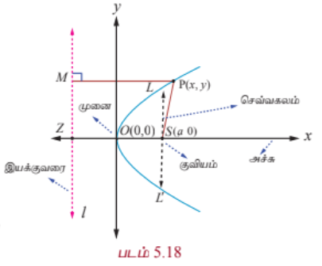

$SZ$ -ஐ $x$ -அச்சு எனவும் $SZ$ -ன் மையக்குத்துக்கோட்டை $y$ - அச்சு எனவும் கொள்க.

மையக்குத்துக்கோடு $SZ$ -ஐ சந்திக்கும் புள்ளி ஆதிப்புள்ளி $O$ என்க.

$SZ = 2a$ எனில், $S$ என்பது $(a, 0)$ மற்றும் இயக்குவரையின் சமன்பாடு $x + a = 0$ ஆகும்.

பரவளையத்தை தரும் நகரும் புள்ளி $P(x, y)$ என்க. இயக்குவரைக்கு செங்குத்தாக $PM$ வரைக.

பரவளைய வரையறையின்படி $e = \frac{SP}{PM} = 1$. அதாவது $SP^2 = PM^2$.

எனவே, $(x - a)^2 + y^2 = (x + a)^2$. இதை விரிவுபடுத்திச் சுருக்க

$$y^2 = 4ax$$

எனக் கிடைக்கின்றது.

இது பரவளையச்சமன்பாட்டின் திட்ட வடிவமாகும். பரவளையச்சமன்பாட்டின் மற்ற திட்டவடிவங்கள்

$$y^2 = -4ax, \quad x^2 = 4ay, \quad \text{மற்றும்} \quad x^2 = -4ay$$

ஆகும்.

### வரையறை 5.3

- இயக்குவரைக்கு செங்குத்தாகவும், குவியம் வழியாகவும் செல்லும் நேர்கோடு பரவளையத்தின் **அச்சு** எனப்படும்.

- பரவளையம் மற்றும் அதன் அச்சு வெட்டிக்கொள்ளும் புள்ளி பரவளையத்தின் **முனை** எனப்படும்.

- பரவளையத்தின் குவியம் வழியாகச் செல்லும் நாண் அப்பரவளையத்தின் **குவி நாண்** எனப்படும்.

- பரவளையத்தின் அச்சுக்கு செங்குத்தாக உள்ள குவிநாண் பரவளையத்தின் **செவ்வகலம்** ஆகும்.

---

### எடுத்துக்காட்டு 5.14

பரவளையம் $y^2 = 4ax$ -ன் செவ்வகல நீளம் காண்க.

#### தீர்வு

பரவளையத்தின் சமன்பாடு $y^2 = 4ax$.

செவ்வகலம் $LL'$ குவியம் $(a, 0)$ வழிச் செல்கின்றது. (படம் 5.18-ஐ பார்க்கவும்)

எனவே $L$ என்பது $(a, y_1)$ ஆகும்.

அதனால் $y_1^2 = 4a^2$.

எனவே $y_1 = \pm 2a$.

செவ்வகலத்தின் முனைப்புள்ளிகள் $(a, 2a)$ மற்றும் $(a, -2a)$ ஆகும்.

எனவே செவ்கலத்தின் நீளம் $LL' = 4a$.

### குறிப்புரை

பரவளையச் சமன்பாட்டின் திட்ட வடிவம் $y^2 = 4ax$ -க்கு முனை $(0, 0)$, அச்சு $x$ -அச்சு மற்றும் குவியம் $(a, 0)$ ஆக இருக்கும். பரவளையம் $y^2 = 4ax$ முழுவதுமாக $x$ -அச்சின் குறையற்ற பகுதியில் அமையும். $y^2 = 4ax$ -இல் $y$ -க்கு $-y$ பிரதியிட சமன்பாடு மாறாமல் இருக்கின்றது. எனவே பரவளையம் $y^2 = 4ax$, $x$ -அச்சுக்கு சமச்சீராக இருக்கும். அதாவது $y^2 = 4ax$ பரவளைத்தின் சமச்சீர் அச்சு $x$ -அச்சாகும்.

(ii) **$(h, k)$ -ஐ முனையாக உடைய பரவளையங்கள்** (Parabolas with vertex at $(h, k)$)

முனை $(h, k)$ மற்றும் அச்சு $x$ -அச்சுக்கு இணை எனில் பரவளையத்தின் சமன்பாடு

$$(y - k)^2 = 4a(x - h) \quad \text{அல்லது} \quad (y - k)^2 = -4a(x - h)$$

என இருக்கும் (படம் 5.19, 5.20).

முனை $(h, k)$ மற்றும் அச்சு $y$ -அச்சுக்கு இணை எனில் பரவளையத்தின் சமன்பாடு

$$(x - h)^2 = 4a(y - k) \quad \text{அல்லது} \quad (x - h)^2 = -4a(y - k)$$

(படம் 5.21, 5.22).

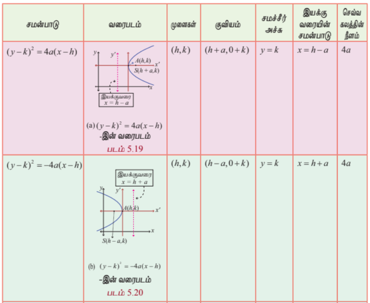

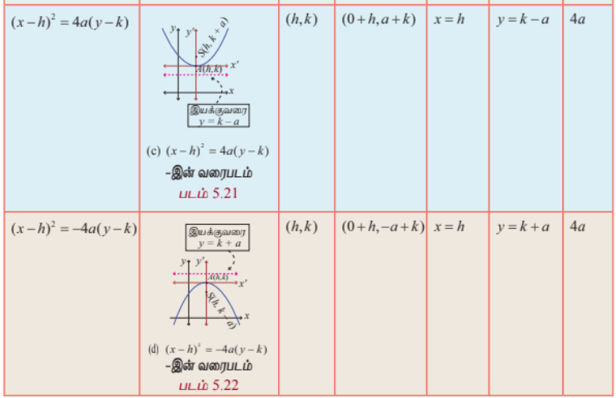

### 5.3.3 நீள்வட்டம் (Ellipse)

ஒரு தளத்தில், ஒரு நகரும் புள்ளிக்கும் குவியத்திற்கும் உள்ள தூரம் அந்த நகரும் புள்ளிக்கும் இயக்குவரைக்கும் உள்ள தூரத்தைவிடக் குறைவாக $e$ என்ற மாறாத விகிதமுடையதாக ($0 < e < 1$) இருப்பின் அந்த நகரும் புள்ளியின் நியமப்பாதை ஓர் **நீள்வட்டம்** ஆகும்.

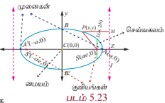

(i) **மையம் $(0, 0)$ உடைய நீள்வட்டச் சமன்பாட்டின் திட்ட வடிவம்**

குவியம் $S$, இயக்குவரை $l$, மையத் தொலைத்தகவு $e$ ($0 < e < 1$) மற்றும் நகரும் புள்ளி $P(x, y)$ என்க.

இயக்குவரை $l$ -க்குச் செங்குத்தாக $SZ$ மற்றும் $PM$ வரைக.

$A$ மற்றும் $A'$ என்ற புள்ளிகள் முறையே $SZ$ -ஐ உட்புறமாகவும் வெளிப்புறமாகவும் $e:1$ என்ற விகிதத்தில் பிரிக்கின்றன என்க. $AA' = 2a$ என்க. $AA'$ -ன் மையக்குத்துக்கோடு $AA'$ -ஐ $C$ -இல் வெட்டுகின்றது என்க.

$C$ -ஐ மையமாகவும் $CZ$ -இன் நீட்சியை $x$ -அச்சாகவும், $AA'$ -இன் மையக் குத்துக்கோட்டை $y$ -அச்சாகவும் கொள்க. அதனால் $CA = a$ மற்றும் $CA' = a$ ஆகும்.

வரையறையின்படி

$$\frac{SA}{AZ} = e \quad \text{மற்றும்} \quad \frac{SA'}{A'Z} = e$$

$$SA = eAZ \quad \text{மற்றும்} \quad SA' = eA'Z$$

$$CA - CS = e(CZ - CA) \quad \text{மற்றும்} \quad CA' + CS = e(A'C + CZ)$$

$$a - CS = e(CZ - a) \tag{1}$$

$$a + CS = e(a + CZ) \tag{2}$$

(2) + (1) இதிலிருந்து $CZ = \frac{a}{e}$ மற்றும் (2) - (1) இதிலிருந்து $CS = ae$ எனக்கிடைக்கும்.

எனவே $M$ என்பது $\left(\frac{a}{e}, y\right)$ மற்றும் $S$ என்பது $(ae, 0)$ ஆக இருக்கும்.

வரையறையின்படி

$$\frac{SP}{PM} = e \quad \text{அல்லது} \quad SP^2 = e^2 PM^2$$

$$\Rightarrow (x - ae)^2 + (y - 0)^2 = e^2 \left(x - \frac{a}{e}\right)^2$$

இதைச்சுருக்க

$$\frac{x^2}{a^2} + \frac{y^2}{a^2(1 - e^2)} = 1.$$

$1 - e^2$ மிகை மதிப்பு எனவே, $b^2 = a^2(1 - e^2)$ எனவும் $a^2 e^2 = a^2 - b^2$ எனக்கொண்டால்

இப்போது $P$ -ன் நியமப்பாதை

$$\frac{x^2}{a^2} + \frac{y^2}{b^2} = 1$$

எனக்கிடைக்கும். இது நீள்வட்டச் சமன்பாட்டின் திட்டவடிவம் ஆகும். மேலும் வளைவரை $x, y$ அச்சுகளுக்கு சமச்சீராக உள்ளதைக் கவனிக்கவும்.

### வரையறை 5.4

(1) கோட்டுத்துண்டு $AA'$ என்பது **நெட்டச்சு** மற்றும் அதன் நீளம் $2a$ ஆகும்.

(2) கோட்டுத்துண்டு $BB'$ என்பது **குற்றச்சு** மற்றும் அதன் நீளம் $2b$ ஆகும்.

(3) கோட்டுத்துண்டு $CA =$ கோட்டுத்துண்டு $CA' =$ **அரை நெட்டச்சு** $= a$ மற்றும் கோட்டுத்துண்டு $CB =$ கோட்டுத்துண்டு $CB' =$ **அரை குற்றச்சு** $= b$.

(4) சமச்சீர் தன்மையினால் குவியம் $S'(-ae, 0)$ மற்றும் இயக்குவரை $l'$, $x = -\frac{a}{e}$ எடுத்துக்கொண்டாலும் அதே நீள்வட்டம் கிடைக்கும்.

இதன் மூலம் நீள்வட்டத்திற்கு $S(ae, 0)$ மற்றும் $S'(-ae, 0)$ என இரு குவியங்களும் $A(a, 0)$ மற்றும் $A'(-a, 0)$ என இரு முனைகளும், $x = \frac{a}{e}$ மற்றும் $x = -\frac{a}{e}$ என இரு இயக்குவரைகளும் உண்டு.

### எடுத்துக்காட்டு 5.15

நீள்வட்டம் $\frac{x^2}{a^2} + \frac{y^2}{b^2} = 1$ -ன் செவ்வகல நீளம் காண்க.

### தீர்வு

$\frac{x^2}{a^2} + \frac{y^2}{b^2} = 1$ என்ற நீள்வட்டத்தின் செவ்வகலம் $LL'$ (படம் 5.22) $S(ae, 0)$ வழிச்செல்கின்றது.

எனவே, $L(ae, y_1)$ நீள்வட்டத்தின் மீதுள்ளது.

அதனால்,

$$\frac{a^2 e^2}{a^2} + \frac{y_1^2}{b^2} = 1$$

$$\frac{y_1^2}{b^2} = 1 - e^2$$

$$y_1^2 = b^2(1 - e^2)$$

$$= b^2\left(1 - \frac{b^2}{a^2}\right) \quad \left(\because e^2 = 1 - \frac{b^2}{a^2}\right)$$

$$y_1 = \pm \frac{b^2}{a}.$$

அதாவது செவ்வகலத்தின் முனைப்புள்ளிகள் $L$ மற்றும் $L'$ முறையே $\left(ae, \frac{b^2}{a}\right)$ மற்றும் $\left(ae, -\frac{b^2}{a}\right)$ ஆகும்.

செவ்வகலத்தின் நீளம்

$$LL' = \frac{2b^2}{a}.$$

---

(ii) **மையம் $(h, k)$ உடைய நீள்வட்டத்தின் வகைகள்** (Types of ellipses with centre at $(h, k)$)

**(அ) நெட்டச்சு $x$-அச்சுக்கு இணை** (Major axis parallel to the x-axis)

நீள்வட்டத்தின் சமன்பாடு (படம் 5.24)

$$\frac{(x - h)^2}{a^2} + \frac{(y - k)^2}{b^2} = 1, \quad a > b.$$

நெட்டச்சின் நீளம் $2a$ மற்றும் குற்றச்சின் நீளம் $2b$ ஆகும். முனைப்புள்ளிகள் $(h + a, k)$ மற்றும் $(h - a, k)$, மேலும் குவியங்கள் $(h + c, k)$ மற்றும் $(h - c, k)$ ஆக இருக்கும். இங்கு $c^2 = a^2 - b^2$.

**(ஆ) நெட்டச்சு $y$-அச்சுக்கு இணை** (Major axis parallel to the y-axis)

நீள்வட்டத்தின் சமன்பாடு (படம் 5.25)

$$\frac{(x - h)^2}{b^2} + \frac{(y - k)^2}{a^2} = 1, \quad a > b.$$

நெட்டச்சின் நீளம் $2a$, குற்றச்சின் நீளம் $2b$ ஆகும். முனைப்புள்ளிகள் $(h, k + a)$ மற்றும் $(h, k - a)$ மேலும் குவியங்கள் $(h, k + c)$ மற்றும் $(h, k - c)$ ஆக இருக்கும். இங்கு $c^2 = a^2 - b^2$.

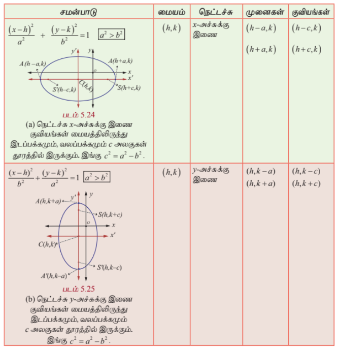

### தேற்றம் 5.5

நீள்வட்டத்தின் மீதுள்ள ஏதேனும் ஒரு புள்ளியின் குவித்தொலைவுகளின் கூடுதல் அதன் நெட்டச்சின் நீளத்திற்குச் சமம்.

#### நிரூபணம்

$P(x, y)$ என்பது நீள்வட்டம் $\frac{x^2}{a^2} + \frac{y^2}{b^2} = 1$-ன் மீதுள்ள ஏதேனும் ஒரு புள்ளி என்க.

$P$ -ன் வழியாக $l, l'$ இயக்குவரைகளுக்கு செங்குத்தாக $MM'$ வரைக.

$x$ -அச்சுக்கு செங்குத்தாக $PN$ வரைக.

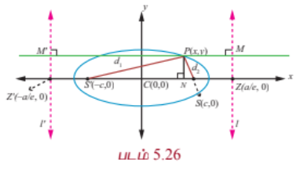

வரையறையிலிருந்து

$$SP = ePM$$

$$= eNZ$$

$$= e(CZ - CN)$$

$$= e\left(\frac{a}{e} - x\right) = a - ex$$

... (1)

$$SP' = ePM'$$

$$= e(CN + CZ')$$

$$= e\left(x + \frac{a}{e}\right) = ex + a$$

... (2)

$$SP + SP' = (a - ex) + (ex + a) = 2a$$

### குறிப்புரை

$b = a$ ஆக இருக்கும்போது $\frac{(x - h)^2}{a^2} + \frac{(y - k)^2}{b^2} = 1$ என்ற சமன்பாடு

$$(x - h)^2 + (y - k)^2 = a^2$$

என மாறும். இது மையம் $(h, k)$ மற்றும் ஆரம் $a$ உடைய வட்டத்தின் சமன்பாடு ஆகும்.

$b = a$ ஆக இருக்கும்போது $e = \sqrt{1 - \frac{a^2}{a^2}} = 0$. எனவே வட்டத்தின் மையத்தொலைத்தகவு பூச்சியம்.

$$\frac{SP}{PM} = 0 \Rightarrow PM \rightarrow \infty.$$

அதாவது வட்டத்தின் இயக்குவரை (முடிவிலியில்) கந்தழியில் உள்ளது எனலாம்.

### குறிப்புரை

ஒரு நீள்வட்டத்தின் நெட்டச்சை விட்டமாகக் கொண்ட வட்டம் **துணைவட்டம்** அல்லது **சுற்றுவட்டம்** எனப்படும். மேலும் குற்றச்சை விட்டமாகக் கொண்ட வட்டம் **உள்வட்டம்** எனப்படும். அவற்றின் சமன்பாடுகள் முறையே $x^2 + y^2 = a^2$ மற்றும் $x^2 + y^2 = b^2$ ஆகும்.

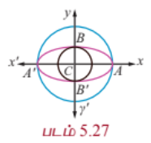

---

### 5.3.4 அதிபரவளையம் (Hyperbola)

ஒரு தளத்தில், ஒரு நகரும் புள்ளிக்கும் குவியத்திற்கும் உள்ள தூரம் அந்த நகரும் புள்ளிக்கும் இயக்குவரைக்கும் உள்ள தூரத்தைவிட அதிகமாக, $e$ ($e > 1$) என்ற மாறாத விகிதம் உடையதாக இருப்பின் அந்த நகரும் புள்ளியின் நியமப்பாதை ஓர் **அதிபரவளையம்** ஆகும்.

(i) **மையம் $(0, 0)$ உடைய நீள்வட்டச் சமன்பாட்டின் திட்ட வடிவம்**

$A$ மற்றும் $A'$ என்ற புள்ளிகள் முறையே $SZ$ -ஐ உட்புறமாகவும் வெளிப்புறமாகவும் $e:1$ என்ற விகிதத்தில் பிரிக்கின்றன என்க. $AA' = 2a$ என்க. $AA'$ -ன் மையக்குத்துக்கோடு $AA'$ -ஐ $C$ -இல் வெட்டுகின்றது என்க. $C$ -ஐ மையமாகவும் $CZ$ -இன் நீட்சியை $x$ -அச்சாகவும், $AA'$ -இன் மையக் குத்துக்கோட்டை $y$ -அச்சாகவும் கொள்க. அதனால் $CA = a$ மற்றும் $CA' = a$ ஆகும்.

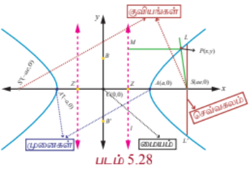

வரையறையின்படி

$$\frac{AS}{AZ} = e \quad \text{மற்றும்} \quad \frac{A'S}{A'Z} = e$$

ஆகும்.

$$\Rightarrow AS = eAZ \quad \text{மற்றும்} \quad A'S = eA'Z$$

$$\Rightarrow CS - CA = e(CA - CZ) \quad \text{மற்றும்} \quad CA' + CS = e(A'C + CZ)$$

$$\Rightarrow CS - a = e(a - CZ) \tag{1}$$

$$a + CS = e(a + CZ) \tag{2}$$

(1)+(2) -இலிருந்து $CS = ae$ மற்றும் (2)-(1) -இலிருந்து $CZ = \frac{a}{e}$ என கிடைக்கும்.

எனவே, $S$ -ன் ஆயத்தொலைகள் $(ae, 0)$. $PM = x - \frac{a}{e}$, மற்றும் இயக்குவரையின் சமன்பாடு $x - \frac{a}{e} = 0$ எனக்கிடைக்கும். $P(x, y)$ அதிபரவளையத்தின் மீதுள்ள புள்ளி என்க.

கூம்பு வளைவின் வரையறைப்படி,

$$\frac{SP}{PM} = e \quad \text{அல்லது} \quad SP^2 = e^2 PM^2.$$

அதனால்

$$(x - ae)^2 + (y - 0)^2 = e^2\left(x - \frac{a}{e}\right)^2$$

$$\Rightarrow (x - ae)^2 + y^2 = (ex - a)^2$$

$$\Rightarrow (e^2 - 1)x^2 - y^2 = a^2(e^2 - 1)$$

$$\Rightarrow \frac{x^2}{a^2} - \frac{y^2}{a^2(e^2 - 1)} = 1$$

இங்கு $a^2(e^2 - 1) = b^2$ எனப்பிரதியிட $P$ -ன் நியமப்பாதை

$$\frac{x^2}{a^2} - \frac{y^2}{b^2} = 1$$

எனக்கிடைக்கும். இந்த அதிபரவளையச் சமன்பாட்டின் திட்ட வடிவம். இங்கு $ae = c$ என எடுக்க,

$$c^2 = a^2 + b^2$$

எனக்கிடைக்கும். இந்த அதிபரவளையம் $x$ மற்றும் $y$-அச்சுகளுக்கு சமச்சீராக உள்ளதைக் காணலாம்.

### வரையறை 5.5

(1) கோட்டுத்துண்டு $AA'$ என்பது **குறுக்கச்சு** மற்றும் அதன் நீளம் $2a$ ஆகும்.

(2) கோட்டுத்துண்டு $BB'$ என்பது **துணையச்சு** மற்றும் அதன் நீளம் $2b$ ஆகும்.

(3) கோட்டுத்துண்டு $CA =$ கோட்டுத்துண்டு $CA' =$ **அரைக்குறுக்கச்சு** $= a$ மற்றும் கோட்டுத்துண்டு $CB =$ கோட்டுத்துண்டு $CB' =$ **அரைத்துணையச்சு** $= b$ ஆகும்.

(4) சமச்சீர் தன்மையினால் குவியம் $S'(-ae, 0)$ மற்றும் இயக்குவரை $l'$, $x = -\frac{a}{e}$ என எடுத்துக்கொண்டாலும் அதே அதிபரவளையம் கிடைக்கும். இதன் மூலம் அதிபரவளையத்திற்கு $S(ae, 0)$ மற்றும் $S'(-ae, 0)$ என இரு குவியங்களும் $A(a, 0)$ மற்றும் $A'(-a, 0)$ என இரு முனைகளும், $x = \frac{a}{e}$ மற்றும் $x = -\frac{a}{e}$ என இரு இயக்குவரைகளும் உள்ளதைக் காணலாம்.

அதிபரவளையத்தின் செவ்வகலத்தின் நீளம் $\frac{2b^2}{a}$, என நீள்வட்டத்தில் பெற்றதுபோல பெறலாம்.

### தொலைத்தொடுகோடுகள் (Asymptotes)

$P(x, y)$ என்பது $y = f(x)$ என வரையறுக்கப்பட்ட வளைவரையின் மீதுள்ள புள்ளி என்க. $P$ என்ற புள்ளிக்கும் ஏதேனும் ஒரு நிலைக்கோட்டிற்குமான தூரம் பூச்சியத்தை நெருங்குமாறு $P$ என்ற புள்ளி ஆதிப்புள்ளியை விட்டு மேலும் மேலும் விலகிச் செல்லுமானால் அந்த நிலைக்கோடு வளைவரையின் **தொலைத்தொடுகோடு** எனப்படும்.

அதிபரவளையத்திற்கு தொலைத்தொடுகோடுகள் உண்டு. அதே சமயம் பரவளையத்திற்கும், நீள்வட்டத்திற்கும் தொலைத்தொடுகோடுகள் இல்லை.

(ii) **$(h, k)$ -ஐ முனையாக உடைய அதிபரவளையங்கள்** (Types of Hyperbola with centre at $(h, k)$)

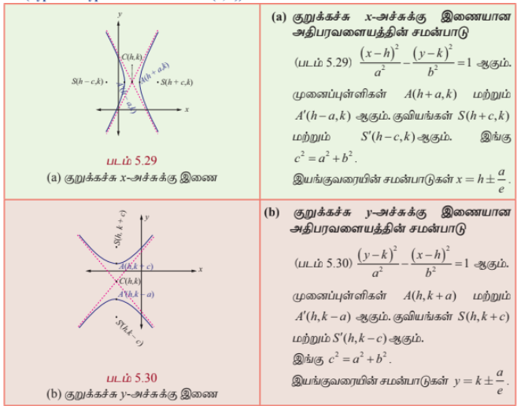
---

### குறிப்புரை

(1) அதிபரவளையத்தின் குறுக்கச்சை விட்டமாகக்கொண்டு வரையப்படும் வட்டம் அதிபரவளையத்தின் **துணைவட்டம்** எனப்படும். அதன் சமன்பாடு $x^2 + y^2 = a^2$.

(2) அதிபரவளையத்தின் மீதுள்ள ஒரு புள்ளிக்கும் குவியங்களுக்கும் இடையேயான தூரங்களின் வித்தியாசத்தின் மட்டு மதிப்பு குறுக்கச்சின் நீளத்திற்குச் சமம். அதாவது $||PS - PS'|| = 2a$. (இதை நீள்வட்டத்திற்கான நிரூபணம் போன்று நிறுவலாம்.)

இதுவரை நாம் பரவளையத்தின் நான்கு திட்டவடிவங்களையும், நீள்வட்டத்தின் இரு திட்டவடிவங்களையும், அதிபரவளையத்தின் இரு திட்டவடிவங்களையும் பற்றி படித்தோம். இவற்றைத் தவிர இந்த திட்ட வடிவங்களில் வகைப்படுத்த முடியாத பல வகையான, பரவளையங்கள், நீள்வட்டங்கள் மற்றும் அதிபரவளையங்களும் உள்ளன. எடுத்துக்காட்டாக பின்வரும் பரவளையம், நீள்வட்டம், அதிபரவளையம் ஆகியவற்றைக் கருத்தில் கொள்க.

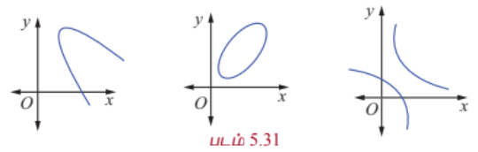

ஆனால் மேற்கண்ட வளைவரைகளை சரியான அச்சின் இடப்பெயர்ச்சி மூலம் திட்டவடிவங்களுக்கு மாற்றலாம்.

### எடுத்துக்காட்டு 5.16

குவியம் $(-2, 0)$ மற்றும் இயக்குவரை $x = 2$ உடைய பரவளையத்தின் சமன்பாடு காண்க.

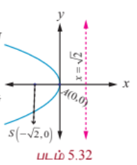

#### தீர்வு

பரவளையம் இடப்பக்கம் திறப்புடையது மற்றும் சமச்சீர் அச்சு $x$ -அச்சாகவும் முனை $(0, 0)$ ஆகவும் இருக்கும்.

எனவே தேவையான பரவளையத்தின் சமன்பாடு

$$(y - 0)^2 = -4(2)(x - 0)$$

$$\Rightarrow y^2 = -8x.$$

---

### எடுத்துக்காட்டு 5.17

முனை $(5, -2)$ மற்றும் குவியம் $(2, -2)$ உடைய பரவளையத்தின் சமன்பாடு காண்க.

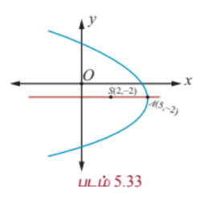

#### தீர்வு

கொடுக்கப்பட்டவைகள் முனை $A(5, -2)$ மற்றும் குவியம் $S(2, -2)$,

குவியதூரம் $AS = a = 3$.

பரவளையத்தின் சமச்சீர் அச்சு $x$ -அச்சுக்கு இணை மற்றும் பரவளையம் இடப்பக்கம் திறப்புடையது.

தேவையான பரவளையத்தின் சமன்பாடு

$$(y + 2)^2 = -4(3)(x - 5)$$

$$\Rightarrow y^2 + 4y + 4 = -12x + 60$$

$$\Rightarrow y^2 + 4y + 12x - 56 = 0.$$

---

### எடுத்துக்காட்டு 5.18

முனை $(-1, -2)$, அச்சு $y$ -அச்சுக்கு இணை மற்றும் $(3, 6)$ வழிச்செல்லும் பரவளையத்தின் சமன்பாடு காண்க.

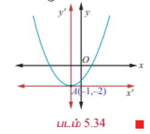

#### தீர்வு

அச்சு $y$ -அச்சுக்கு இணை என்பதால் தேவையான பரவளையத்தின் சமன்பாடு

$$(x + 1)^2 = 4a(y + 2).$$

இது $(3, 6)$ வழிச்செல்வதால்

$$(3 + 1)^2 = 4a(6 + 2)$$

$$16 = 32a \Rightarrow a = \frac{1}{2}.$$

எனவே பரவளையத்தின் சமன்பாடு

$$(x + 1)^2 = 2(y + 2)$$

இதைச்சுருக்க

$$x^2 + 2x - 2y - 3 = 0$$

எனக்கிடைக்கும்.

---

### எடுத்துக்காட்டு 5.19

$x^2 - 4x - 5y - 1 = 0$ என்ற பரவளையத்தின் முனை, குவியம், இயக்குவரை மற்றும் செவ்வகல நீளம் ஆகியவற்றைக் காண்க.

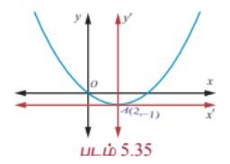

#### தீர்வு

பரவளையத்தின் சமன்பாடு

$$x^2 - 4x - 5y - 1 = 0$$

$$\Rightarrow x^2 - 4x = 5y + 1$$

$$\Rightarrow x^2 - 4x + 4 = 5y + 5$$

$$(x - 2)^2 = 5(y + 1)$$

இது திட்ட வடிவம் ஆகும்.

எனவே, $4a = 5$ மற்றும் முனை $(2, -1)$,

குவியம் $\left(2, -1 + \frac{5}{4}\right) = \left(2, \frac{1}{4}\right)$.

இயக்குவரையின் சமன்பாடு

$$y - k + a = 0$$

$$y + 1 + \frac{5}{4} = 0$$

$$4y + 9 = 0.$$

செவ்வகலத்தின் நீளம் $5$ அலகுகள்.

---

### எடுத்துக்காட்டு 5.20

குவியங்கள் $(\pm 2, 0)$, மற்றும் முனைகள் $(\pm 3, 0)$ உடைய நீள்வட்டத்தின் சமன்பாடு காண்க.

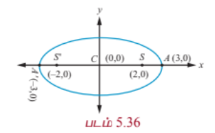

#### தீர்வு

படம் 5.36லிருந்து

$$SS' = 2c \quad \text{மற்றும்} \quad 2c = 4; \quad AA' = 2a = 6$$

$$\Rightarrow c = 2 \quad \text{மற்றும்} \quad a = 3,$$

$$\Rightarrow b^2 = a^2 - c^2 = 9 - 4 = 5.$$

நெட்டச்சு $x$ -அச்சு, $a > b$.

மையம் $(0, 0)$ மற்றும் குவியம் $(\pm 2, 0)$.

எனவே நீள்வட்டத்தின் சமன்பாடు

$$\frac{x^2}{9} + \frac{y^2}{5} = 1.$$

---

### எடுத்துக்காட்டு 5.21

மையத்தொலைத்தகவு $\frac{1}{2}$, குவியங்களில் ஒன்று $(2, 3)$ மற்றும் ஒரு இயக்குவரை $x = 7$ உடைய நீள்வட்டத்தின் சமன்பாடு காண்க. மேலும் நெட்டச்சு, குற்றச்சு நீளங்களைக் காண்க.

#### தீர்வு

கூம்பு வளைவின் வரையறைப்படி

$$\frac{SP}{PM} = e \quad \text{அல்லது} \quad SP^2 = e^2 PM^2.$$

இதனால்,

$$(x - 2)^2 + (y - 3)^2 = \frac{1}{4}(x - 7)^2$$

$$\Rightarrow 3x^2 + 4y^2 - 2x - 24y + 43 = 0,$$

இதைப்பின்வருமாறு எழுதலாம்

$$\Rightarrow 3\left(x - \frac{1}{3}\right)^2 + 4(y - 3)^2 = 3\left(\frac{1}{9}\right) + 4(9) - 43 = \frac{100}{3}.$$

$$\Rightarrow \frac{\left(x - \frac{1}{3}\right)^2}{\frac{100}{9}} + \frac{(y - 3)^2}{\frac{100}{12}} = 1$$

இது திட்டவடிவம் ஆகும்.

எனவே நெட்டச்சின் நீளம் $= 2a = 2\sqrt{\frac{100}{9}} = \frac{20}{3}$ மற்றும்

குற்றச்சின் நீளம் $= 2b = 2\sqrt{\frac{100}{12}} = \frac{10}{\sqrt{3}}$.

---

### எடுத்துக்காட்டு 5.22

$4x^2 + 36y^2 + 40x - 288y + 532 = 0$ என்ற கூம்பு வளைவின் குவியங்கள், முனைகள் மற்றும் அதன் நெட்டச்சு, குற்றச்சு நீளங்களைக் காண்க.

#### தீர்வு

$x$ மற்றும் $y$ மதிப்புகளை முழுவர்க்கமாக்க

$$4(x^2 + 10x + 25) + 36(y^2 - 8y + 16) = -532 + 100 + 576$$

இலிருந்து

$$4(x + 5)^2 + 36(y - 4)^2 = 144.$$

இருபுறமும் 144 -ஆல் வகுக்க சமன்பாடு

$$\frac{(x + 5)^2}{36} + \frac{(y - 4)^2}{4} = 1.$$

இது மையம் $(-5, 4)$, மற்றும் நெட்டச்சு $x$ -அச்சுக்கு இணையான நீள்வட்டம். இதன் அரை நெட்டச்சின் நீளம் $6$ மற்றும் குற்றச்சின் நீளம் $2$. முனைகள் $(-5 \pm 6, 4)$ அதாவது $(1, 4)$ மற்றும் $(-11, 4)$.

தற்போது, $c^2 = a^2 - b^2 = 36 - 4 = 32$

மற்றும் $c = \pm 4\sqrt{2}$.

எனவே குவியங்கள் $(-5 \pm 4\sqrt{2}, 4)$.

நெட்டச்சின் நீளம் $= 2a = 12$ அலகுகள் மற்றும்

குற்றச்சின் நீளம் $= 2b = 4$ அலகுகள்.

---

### எடுத்துக்காட்டு 5.23

$4x^2 + y^2 + 24x - 2y + 21 = 0$ என்ற நீள்வட்டத்தின் மையம், முனைகள் மற்றும் குவியங்கள் காண்க. மேலும் செவ்வகல நீளம் $2$ என நிறுவுக.

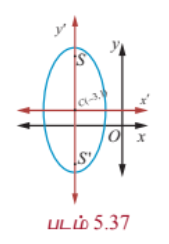

#### தீர்வு

உறுப்புகளை வரிசைப்படுத்தி எழுத நீள்வட்டத்தின் சமன்பாடு

$$4x^2 + 24x + y^2 - 2y + 21 = 0$$

அதாவது,

$$4(x^2 + 6x + 9) + (y^2 - 2y + 1) - 36 - 1 + 21 = 0,$$

$$4(x + 3)^2 + (y - 1)^2 = 16,$$

$$\frac{(x + 3)^2}{4} + \frac{(y - 1)^2}{16} = 1.$$

மையம் $(-3, 1)$, $a = 4, b = 2$, மற்றும் நெட்டச்சு $y$ -அச்சுக்கு இணை

$$c^2 = 16 - 4 = 12$$

$$c = \pm 2\sqrt{3}.$$

எனவே குவியங்கள் $(-3, 1 \pm 2\sqrt{3})$ மற்றும்

முனைகள் $(-3, 1 \pm 4)$, அதாவது $(-3, 5)$ மற்றும் $(-3, -3)$, மற்றும்

செவ்வகல நீளம் $= \frac{2b^2}{a} = \frac{2(4)}{4} = 2$ அலகுகள்.

---

### எடுத்துக்காட்டு 5.24

முனைகள் $(0, \pm 4)$ மற்றும் குவியங்கள் $(0, \pm 6)$ உள்ள அதிபரவளையத்தின் சமன்பாடு காண்க.

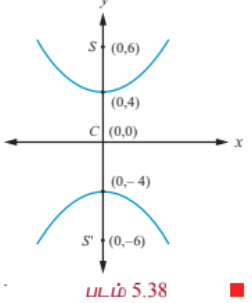

#### தீர்வு

குவியங்களின் நடுப்புள்ளி மையம் $C(0, 0)$ (படம் 5.38)

குறுக்கச்சு $y$ -அச்சு

$$AA' = 2a \Rightarrow 2a = 8,$$

$$SS' = 2c \Rightarrow 2c = 12,$$

$$a = 4, \quad c = 6$$

$$b^2 = c^2 - a^2 = 36 - 16 = 20.$$

எனவே தேவையான அதிபரவளையத்தின் சமன்பாடு

$$\frac{y^2}{16} - \frac{x^2}{20} = 1.$$

---

### எடுத்துக்காட்டு 5.25

$9x^2 - 16y^2 = 144$ என்ற அதிபரவளையத்தின் முனைகள், குவியங்கள் காண்க.

#### தீர்வு

$9x^2 - 16y^2 = 144$ என்ற சமன்பாட்டைத் திட்டவடிவில் மாற்ற

$$\frac{x^2}{16} - \frac{y^2}{9} = 1$$

எனக்கிடைக்கும்.

குறுக்கச்சு $x$ -அச்சு, முனைகள் $(-4, 0)$ மற்றும் $(4, 0)$;

மற்றும் $c^2 = a^2 + b^2 = 16 + 9 = 25$, $c = 5$.

எனவே குவியங்கள் $(-5, 0)$ மற்றும் $(5, 0)$.

---

### எடுத்துக்காட்டு 5.26

$11x^2 - 25y^2 - 44x + 50y - 256 = 0$ என்ற அதிபரவளையத்தின் மையம், குவியங்கள் மற்றும் மையத்தொலைத்தகவு காண்க.

#### தீர்வு

சமன்பாட்டின் உறுப்புகளை வரிசைப்படுத்தி அதிபரவளையத்தின் திட்டவடிவமாக மாற்ற

$$11(x^2 - 4x) - 25(y^2 - 2y) - 256 = 0$$

$$11(x - 2)^2 - 25(y - 1)^2 = 256 + 44 - 25$$

$$11(x - 2)^2 - 25(y - 1)^2 = 275$$

$$\frac{(x - 2)^2}{25} - \frac{(y - 1)^2}{11} = 1.$$

மையம் $(2, 1)$, $a^2 = 25$, $b^2 = 11$

$$c^2 = a^2 + b^2 = 25 + 11 = 36$$

எனவே, $c = \pm 6$

$$e = \frac{c}{a} = \frac{6}{5}$$

மற்றும் குவியங்கள் $(2 \pm 6, 1)$ அதாவது $(8, 1)$ மற்றும் $(-4, 1)$.

---

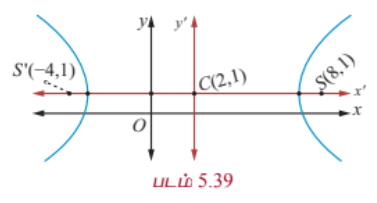

### எடுத்துக்காட்டு 5.27

ஹாலேயின் வால் நட்சத்திர சுற்றுப்பாதை, (படம் 5.51) $36.18$ விண்வெளி அலகு நீளமும் $9.12$ விண்வெளி அலகுகள் அகலமும் கொண்ட நீள்வட்டம். அந்த நீள்வட்டத்தின் மையத்தொலைத்தகவு காண்க.

#### தீர்வு

$2a = 36.18$, $2b = 9.12$, எனத் தரப்பட்டுள்ளது.

இதிலிருந்து

$$e = \sqrt{1 - \frac{b^2}{a^2}} = \frac{\sqrt{a^2 - b^2}}{a}$$

$$= \frac{\sqrt{(18.09)^2 - (4.56)^2}}{18.09}$$

$$e = \frac{\sqrt{327.2481 - 20.7936}}{18.09} \approx 0.97.$$

### குறிப்பு

ஒரு விண்வெளி அலகு (சூரியனுக்கும் பூமிக்கும் இடையேயுள்ள தூரத்தின் சராசரி) என்பது $149,597,870$ கி.மீ, பூமியின் சுற்றுப்பாதையின் அரைநெட்டச்சு.

---

### பயிற்சி 5.2

1. பின்வரும் ஒவ்வொன்றிற்கும் பரவளையத்தின் சமன்பாடு காண்க:

   (i) குவியம் $(4, 0)$ மற்றும் இயக்குவரை $x = -4$.

   (ii) $y$ -அச்சுக்கு சமச்சீரானது மற்றும் $(2, -3)$ வழிச்செல்வது.

   (iii) முனை $(1, -2)$ மற்றும் குவியம் $(4, -2)$.

   (iv) செவ்வகலத்தின் முனைகள் $(4, -8)$ மற்றும் $(4, 8)$.

2. பின்வரும் ஒவ்வொன்றிற்குமான நீள்வட்டத்தின் சமன்பாடு காண்க:

   (i) குவியங்கள் $(\pm 3, 0)$ மற்றும் $e = \frac{1}{2}$

   (ii) குவியங்கள் $(0, \pm 4)$ மற்றும் நெட்டச்சின் முனைகள் $(0, \pm 5)$.

   (iii) செவ்வகல நீளம் 8, $e = \frac{3}{5}$, மையம் $(0,0)$ மற்றும் நெட்டச்சு $x$ -அச்சு.

   (iv) செவ்வகல நீளம் 4, குவியங்களுக்கிடையேயான தூரம் $4\sqrt{2}$, மையம் $(0,0)$ மற்றும் நெட்டச்சு $y$ - அச்சு.

3. பின்வரும் ஒவ்வொன்றிற்குமான அதிபரவளையத்தின் சமன்பாடு காண்க:

   (i) குவியங்கள் $(\pm 2, 0)$, $e = \frac{3}{2}$.

   (ii) மையம் $(2, 1)$, ஒரு குவியம் $(8, 1)$ மற்றும் இதற்கொத்த இயக்குவரை $x = 4$.

   (iii) $(5, -2)$ வழிச்செல்வது மற்றும் குறுக்கச்சின் நீளம் 8 அலகுகள், குறுக்கச்சு $x$ -அச்சு.

4. பின்வருவனவற்றிற்கான முனை, குவியம், இயக்குவரையின் சமன்பாடு மற்றும் செவ்வகல நீளம் காண்க:

   (i) $y^2 = 16x$

   (ii) $x^2 = 24y$

   (iii) $y^2 = -8x$

   (iv) $x^2 - 2x + 8y + 17 = 0$

   (v) $y^2 - 4y - 8x + 12 = 0$

5. பின்வரும் சமன்பாடுகளின் கூம்புவளைவின் வகையைக் கண்டறிந்து அவற்றின் மையம், குவியங்கள், முனைகள் மற்றும் இயக்குவரைகள் காண்க:

   (i) $\frac{x^2}{25} + \frac{y^2}{9} = 1$

   (ii) $\frac{x^2}{3} + \frac{y^2}{10} = 1$

   (iii) $\frac{x^2}{25} - \frac{y^2}{144} = 1$

   (iv) $\frac{y^2}{16} - \frac{x^2}{9} = 1$

6. $\frac{x^2}{a^2} - \frac{y^2}{b^2} = 1$ என்ற அதிபரவளையத்தின் செவ்வகல நீளம் $\frac{2b^2}{a}$ என நிறுவுக.

7. அதிபரவளையத்தின் மீதுள்ள புள்ளி $P$-இலிருந்து அதன் குவியத்தூரங்களின் வித்தியாசத்தின் மட்டு மதிப்பு குறுக்கச்சின் நீளத்திற்குச் சமம் என நிறுவுக.

8. பின்வரும் சமன்பாடுகளின் கூம்பு வளைவின் வகையைக் கண்டறிந்து அவற்றின் மையம், குவியங்கள், முனைகள் மற்றும் இயக்குவரைகளைக் காண்க:

   (i) $\frac{(x - 3)^2}{225} + \frac{(y - 4)^2}{289} = 1$

   (ii) $\frac{(x + 1)^2}{100} + \frac{(y - 2)^2}{64} = 1$

   (iii) $\frac{(x + 3)^2}{225} - \frac{(y - 4)^2}{64} = 1$

   (iv) $\frac{(y - 2)^2}{25} - \frac{(x + 1)^2}{16} = 1$

   (v) $18x^2 + 12y^2 + 144x + 48y + 120 = 0$

   (vi) $9x^2 + 36y^2 + 6x + 18y = 0$

### 5.4 கூம்பு வெட்டு முகங்கள் (Conic Sections)

வளைவரைகளை தீர்மானிக்க பிரிவு 5.3-இல் விவரித்த முறைகளுடன் வடிவியல் முறையிலான கூம்பு வெட்டு முகங்களைப் பற்றி இங்கு காண்போம். ஓர் இரட்டைக் கூம்பை ஒரு தளத்தால் வெட்டும்போது வட்டம், நீள்வட்டம், பரவளையம், அதிபரவளையம் போன்ற வடிவங்களைப் பெறலாம். எனவே அந்த வடிவங்கள் கூம்பின் வெட்டு முக வடிவங்கள் அல்லது சுருக்கமாக கூம்பு வளைவரைகள் எனக்குறிக்கப்படுகின்றன.

---

### 5.4.1 கூம்பு வெட்டு முகங்களின் வடிவியல் விளக்கம்
### (Geometric description of conic section)

கூம்பின் அச்சுக்கு செங்குத்தான ஒரு தளம் (தளம் $C$) இரட்டைக் கூம்பின் ஒரு பகுதியை மட்டும் வெட்டும்போது **வட்டம்** (படம் 5.40) கிடைக்கின்றது. தளம் $E$, அச்சுக்கு செங்குத்தாக இல்லாமல் சற்று சாய்ந்த நிலையில் இரட்டைக் கூம்பின் ஒரே ஒரு பகுதியை மட்டும் வெட்டும்போது **நீள்வட்டம்** (படம் 5.40) கிடைக்கின்றது. இரட்டைக் கூம்பின் ஒரு கூம்பின் பக்கத்திற்கு இணையாக ஒரு தளம் வெட்டும்போது **பரவளையம்** (படம் 5.41) கிடைக்கின்றது. இரட்டைக் கூம்பின் அச்சுக்கு இணையாக ஒரு தளம் இரட்டைக் கூம்பின் இரு பகுதிகளையும் வெட்டும்போது **அதிபரவளையம்** (படம் 5.42) கிடைக்கின்றது.

| படம் 5.40 | படம் 5.41 | படம் 5.42 |
|---|---|---|
|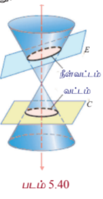|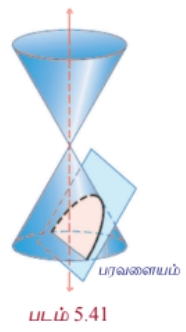|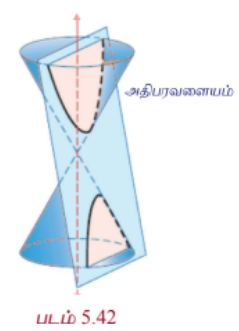|
---

### 5.4.2 சிதைந்த வடிவங்கள் (Degenerate Forms)

கூம்பு வளைவுகளின் சிதைந்த வடிவங்கள், (படம் 5.43) இரட்டைக் கூம்பை வெட்டும் தளத்தின் கோணம் மற்றும் அது முனை வழிச்செல்கிறதா என்பதைப் பொறுத்து, **புள்ளி, ஒரு நேர்க்கோடு, ஓர் இரட்டை நேர்க்கோடு, வெட்டும் கோடுகள் அல்லது வெற்றுக்கணமாக** இருக்கும். அல்லது தளம் உருளையின் அச்சுக்கு இணையாக இருக்கும்போது சிதைவு ஒரு உருளையாக இருக்கும். கூம்பு வளைவின் வெட்டுகின்ற தளம் இரட்டைக் கூம்பின் முனை வழியாகவும் அச்சுக்கு செங்குத்தாகவும் இருக்கும்போது ஒரு **புள்ளி** அல்லது **புள்ளிவட்டம்** கிடைக்கும்.

வெட்டுகின்ற தளம் கூம்பு உருவாக்கி வழியாகச் செல்லும்போது ஒரு **நேர்க்கோடு** அல்லது ஒரு **சோடி இணைகோடு** கிடைக்கின்றது. இது பரவளையத்தின் ஒரு சிதைந்த வடிவம் கூம்பின் பொதுச் சமன்பாட்டில் $A = B = C = 0$ எனும்போது கிடைக்கின்றது. மற்றும் வெட்டுகின்ற தளம் அச்சு வழியாகவும் இரட்டைக் கூம்பின் முனை வழியாகவும் செல்லும்போது அதிபரவளையத்தின் ஒரு சிதைந்த வடிவம் கிடைக்கின்றது.

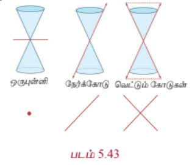

---

### குறிப்புரை

நீள்வட்டத்தை ($0 < e < 1$) பொறுத்தவரை $e = \sqrt{1 - \frac{b^2}{a^2}}$, $e \rightarrow 0$ எனில் $\frac{b}{a} \rightarrow 1$ அதாவது $b \rightarrow a$ அல்லது நெட்டச்சு, குற்றச்சு நீளங்கள் சமம். அதாவது நீள்வட்டம் ஒரு **வட்டமாக** மாறுகின்றது. $e \rightarrow 1$ எனில் $\frac{b}{a} \rightarrow 0$ மற்றும் நீள்வட்டம் ஒரு **கோட்டுத்துண்டாக** மாறும். அதாவது நீள்வட்டம் தட்டையாக இருக்கும்.

---

### குறிப்புரை

அதிபரவளையத்தை ($e > 1$) பொறுத்தவரை $e = \sqrt{1 + \frac{b^2}{a^2}}$, $e \rightarrow 1$ எனில் $\frac{b}{a} \rightarrow 0$ அதாவது $e \rightarrow 1$ எனில் $b$-ன் மதிப்பு $a$-ஐப் பொறுத்தவரை மிகச்சிறிய மதிப்பு மற்றும் அதிபரவளையம் ஒரு **கூர்முனையாக** மாறும். $e \rightarrow \infty$ எனில் $a$-ஐப் பொறுத்து $b$ மிகப்பெரிய மதிப்பு மற்றும் அதிபரவளையம் **தட்டையாக** மாறும்.

---

### 5.4.3 கூம்பு வளைவின் பொதுச் சமன்பாடு $Ax^2 + Bxy + Cy^2 + Dx + Ey + F = 0$-லிருந்து கூம்புவளைவின் வடிவங்களை அடையாளம் காணல்

### (Identifying the conics from the general equation of the conic $Ax^2 + Bxy + Cy^2 + Dx + Ey + F = 0$)

இரண்டாம்படி சமன்பாட்டின் வரைபடம் பின்வரும் நிபந்தனைகளுக்கு ஏற்ப வட்டம், பரவளையம், நீள்வட்டம், அதிபரவளையம், ஒரு புள்ளி, வெற்றுக்கணம், ஒரு நேர்க்கோடு அல்லது ஒரு இரட்டை நேர்க்கோடாக இருக்கும்.

(1) $A = C \neq 0$, $B = 0$ மற்றும் $D = -2h$, $E = -2k$, $F = h^2 + k^2 - r^2$ எனில், பொதுச்சமன்பாடு $(x - h)^2 + (y - k)^2 = r^2$ எனக்கிடைக்கும். இது ஒரு **வட்டம்** ஆகும்.

(2) $B = 0$ மற்றும் $A$ அல்லது $C = 0$ எனில், பொதுச்சமன்பாடு நாம் படித்த ஏதேனும் ஒரு **பரவளையம்** ஆகும்.

(3) $A \neq C$ மற்றும் $A$ மற்றும் $C$ இரண்டும் ஒரே குறியாக இருப்பின் பொதுச் சமன்பாடு **நீள்வட்டத்தை**த் தரும்.

(4) $A \neq C$ மற்றும் $A$ மற்றும் $C$ இரண்டும் ஒன்றுக்கொன்று எதிர்குறியாக இருக்குமானால் பொதுச் சமன்பாடு **அதிபரவளையத்தை**த் தரும்.

(5) $A = C$ மற்றும் $B = D = E = F = 0$, எனில் பொதுச் சமன்பாடு $x^2 + y^2 = 0$ என்ற **புள்ளியாக** மாறும்.

(6) $A = C = F$ மற்றும் $B = D = E = 0$, எனில் பொதுச் சமன்பாடு $x^2 + y^2 + 1 = 0$ என்ற **வெற்றுக் கணத்தை**த் தரும்.

(7) $A \neq 0$ அல்லது $C \neq 0$ மற்றும் மற்ற கெழுக்கள் பூச்சியம் எனில் பொதுச் சமன்பாடு ஆய அச்சுகளின் சமன்பாட்டைத் தரும்.

(8) $A = -C$ மற்றும் மற்ற அனைத்து உறுப்புகளும் பூச்சியம் எனில் பொதுச் சமன்பாடு $x^2 - y^2 = 0$ என்ற **இரட்டை நேர்க்கோட்டை**த் தரும்.

---

### எடுத்துக்காட்டு 5.28

பின்வரும் சமன்பாடுகளிலிருந்து கூம்பு வளைவின் வகையைக் கண்டறிக:

(1) $16x^2 = 4y^2 - 64$

(2) $x^2 + y^2 = -4x - 4y + 4$

(3) $x^2 - y = 2x + 3$

(4) $4x^2 - 9y^2 - 16x + 18y - 29 = 0$

#### தீர்வு

| வினா எண் | சமன்பாடு | கட்டுப்பாடு | கூம்பு வளைவின் வகை |
|---|---|---|---|
| 1 | $16x^2 = 4y^2 - 64$ | 4 | அதிபரவளையம் |
| 2 | $x^2 + y^2 = -4x - 4y + 4$ | 1 | வட்டம் |
| 3 | $x^2 - y = 2x + 3$ | 2 | பரவளையம் |
| 4 | $4x^2 - 9y^2 - 16x + 18y - 29 = 0$ | 4 | அதிபரவளையம் |

---

### பயிற்சி 5.3

பின்வரும் சமன்பாடுகளிலிருந்து அவற்றின் கூம்பு வளைவு வகையை கண்டறிக.

1. $2x^2 - 7y^2 = 0$

2. $3x^2 + 3y^2 - 4x + 3y + 10 = 0$

3. $3x^2 + 2y^2 = 14$

4. $x^2 + y^2 + x - y = 0$

5. $11x^2 - 25y^2 - 44x + 50y - 256 = 0$

6. $y^2 + 4y + 3x + 4 = 0$

### 5.5 கூம்பு வடிவின் துணையலகு வடிவம் (Parametric form of Conics)

#### 5.5.1 துணையலகுச் சமன்பாடுகள் (Parametric equations)

$f(t)$ மற்றும் $g(t)$ என்பன $t$ -ன் சார்புகள் எனில் $x = f(t)$ மற்றும் $y = g(t)$ என்ற சமன்பாடுகள் இரண்டும் சேர்ந்து தளத்தில் ஒரு வளைவரையை உருவாக்கும். பொதுவாக $t$ ஒரு தனித்த மாறியாகும், இங்கு இது ஒரு **துணையலகு** எனப்படும், மற்றும் ஒரு வளைவரையை இந்த முறையில் குறிப்பிடுவதை **துணையலகுச் சமன்பாடுகள்** என அறியப்படுகிறது. $t$ -ன் ஒரு முக்கியப் பொருள் காலத்தைக் குறிப்பது. இந்த விளக்கத்தில் $x = f(t)$ மற்றும் $y = g(t)$ என்ற சமன்பாடுகள் ஒரு குறிப்பிட்ட நேரம் $t$ -இல் ஒரு பொருளின் நிலையைக் குறிக்கின்றன.

சுருக்கமாக, $x$ மற்றும் $y$ மதிப்புகளை ஒரு மூன்றாவது மாறி மூலம் எழுதுவது துணையலகுச் சமன்பாடு எனப்படும். இந்த மூன்றாவது மாறி துணையலகு எனப்படும். ஒரு துணையலகு எப்போதும் $t$ ஆக இருக்க வேண்டியதில்லை. $t$ -ஐப் பயன்படுத்துவது ஒரு வழக்கு என்றாலும் வேறு மாறிகளையும் பயன்படுத்தலாம்.

---

(i) **$x^2 + y^2 = a^2$ என்ற வட்டத்தின் துணையலகு வடிவம்** (Parametric form of the circle $x^2 + y^2 = a^2$)

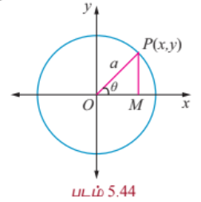

$P(x, y)$ என்பது $x^2 + y^2 = a^2$ என்ற வட்டத்தின் மீதுள்ள ஏதேனும் ஒரு புள்ளி என்க.

$OP$ -ஐ இணைத்து அது $x$-அச்சுடன் $\theta$ என்ற கோணத்தை உருவாக்கும் என்க.

$x$ -அச்சுக்கு செங்குத்தாக $PM$ வரைக.

முக்கோணம் $OPM$ -இலிருந்து

$$x = OM = a\cos\theta$$

$$y = PM = a\sin\theta$$

இதனால் வட்டத்தின் மீதுள்ள ஏதேனும் ஒரு புள்ளி $(a\cos\theta, a\sin\theta)$.

மேலும் $x = a\cos\theta, y = a\sin\theta, 0 \leq \theta \leq 2\pi$ என்பன $x^2 + y^2 = a^2$ என்ற வட்டத்தின் துணையலகுச் சமன்பாடுகள் ஆகும்.

மறுதலையாக, $x = a\cos\theta, y = a\sin\theta, 0 \leq \theta \leq 2\pi$ எனில்,

$\frac{x}{a} = \cos\theta, \frac{y}{a} = \sin\theta$.

வர்க்கப்படுத்திக் கூட்ட,

$\frac{x^2}{a^2} + \frac{y^2}{a^2} = \cos^2\theta + \sin^2\theta = 1$.

எனவே $x^2 + y^2 = a^2$ என்ற சமன்பாடு மையம் $(0, 0)$ மற்றும் ஆரம் $a$ அலகுகள் கொண்ட வட்டத்தைத் தரும்.

### குறிப்பு

(1) $x = a\cos t, y = a\sin t, 0 \leq t \leq 2\pi$ என்ற துணையலகுச் சமன்பாடுகளும் $x^2 + y^2 = a^2$ என்ற வட்டத்தைக் குறிக்கின்றன. இங்கு $t$ கடிகார எதிர்திசையில் அதிகரிக்கும்.

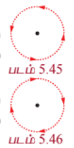

(2) $x = a\sin t, y = a\cos t, 0 \leq t \leq 2\pi$ என்ற துணையலகுச் சமன்பாடுகளும் $x^2 + y^2 = a^2$ என்ற வட்டத்தைக் குறிக்கின்றன. இங்கு $t$ கடிகார திசையில் அதிகரிக்கும்.

---

(ii) **பரவளையம் $y^2 = 4ax$ -ன் துணையலகு வடிவம்** (Parametric form of the parabola $y^2 = 4ax$)

$P(x_1, y_1)$ பரவளையத்தின் மீதுள்ள புள்ளி என்க.

$$y_1^2 = 4ax_1$$

$$(y_1)(y_1) = (2a)(2x_1)$$

$$\frac{y_1}{2a} = \frac{2x_1}{y_1} = t \quad (-\infty < t < \infty)$$

என்க.

$$y_1 = 2at, \quad x_1 = at^2$$

எனவே $y^2 = 4ax$ துணையலகு வடிவம்

$$x = at^2, \quad y = 2at, \quad -\infty < t < \infty$$

மறுதலையாக $x = at^2$ மற்றும் $y = 2at$, $-\infty < t < \infty$ எனில் இவற்றிலிருந்து $t$ -ஐ நீக்க, $y^2 = 4ax$ என்ற சமன்பாடு கிடைக்கும்.

---

(iii) **நீள்வட்டம் $\frac{x^2}{a^2} + \frac{y^2}{b^2} = 1$ -ன் துணையலகு வடிவம்** (Parametric form of the Ellipse $\frac{x^2}{a^2} + \frac{y^2}{b^2} = 1$)

நீள்வட்டத்தின் மீதுள்ள ஏதேனும் ஒரு புள்ளி $P$ என்க. $P$-ன் $y$-அச்சு தூரம் $MP$ துணைவட்டத்தை $Q$ -இல் சந்திக்கின்றது என்க.

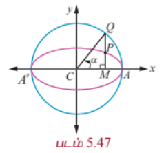

$\angle ACQ = \alpha$ என்க.

$$\therefore CM = a\cos\alpha, \quad MQ = a\sin\alpha$$

மற்றும் $Q(a\cos\alpha, a\sin\alpha)$.

தற்போது $P$ -ன் $x$ -அச்சு தூரம் $a\cos\alpha$.

$y$ -அச்சு தூரம் $y'$, எனில் $P(a\cos\alpha, y')$, $\frac{x^2}{a^2} + \frac{y^2}{b^2} = 1$ என்ற நீள்வட்டத்தின் மீதுள்ளது.

எனவே $\cos^2\alpha + \frac{y'^2}{b^2} = 1$

$$\Rightarrow y' = b\sin\alpha.$$

அதனால் $P$ -ன் ஆயத்தொலைகள் $(a\cos\alpha, b\sin\alpha)$.

இந்த துணையலகு $\alpha$ $P$ -ன் மையத்தகவு கோணம் எனப்படும். இங்கு $\alpha$ என்பது $CQ$ என்ற கோடு $x$ -அச்சுடன் ஏற்படுத்தும் கோணம் மற்றும் $CP$ ஏற்படுத்தும் கோணம் அல்ல என்பது குறிப்பிடத்தக்கது.

எனவே நீள்வட்டத்தின் துணையலகுச் சமன்பாடுகள்

$$x = a\cos\theta, \quad y = b\sin\theta, \quad \text{இங்கு } \theta \text{ ஒரு துணையலகு } 0 \leq \theta \leq 2\pi.$$

---

(iv) **அதிபரவளையம் $\frac{x^2}{a^2} - \frac{y^2}{b^2} = 1$ -இன் துணையலகு வடிவம்** (Parametric form of the Hyperbola $\frac{x^2}{a^2} - \frac{y^2}{b^2} = 1$)

இதுபோலவே அதிபரவளையத்தின் துணையலகுச் சமன்பாடுகள்

$$x = a\sec\theta, \quad y = b\tan\theta, \quad \text{இங்கு } \theta \text{ ஒரு துணையலகு } -\pi \leq \theta \leq \pi, \theta = \pm\frac{\pi}{2} \text{ தவிர}.$$

---

சுருக்கமாக வட்டம், பரவளையம், நீள்வட்டம், அதிபரவளையம் ஆகியவற்றின் துணையலகுச் சமன்பாடுகள் பின்வரும் அட்டவணையில் தரப்பட்டுள்ளன.

| கூம்பு வளைவு | துணையலகுச் சமன்பாடுகள் | துணையலகு வீச்சு | கூம்பு வளைவின் மீதுள்ள ஒரு புள்ளி |
|---|---|---|---|
| வட்டம் | $x = a\cos\theta$   $y = a\sin\theta$ | $0 \leq \theta \leq 2\pi$ | $(a\cos\theta, a\sin\theta)$ |
| பரவளையம் | $x = at^2$   $y = 2at$ | $-\infty < t < \infty$ | $(at^2, 2at)$ |
| நீள்வட்டம் | $x = a\cos\theta$   $y = b\sin\theta$ | $0 \leq \theta \leq 2\pi$ | $(a\cos\theta, b\sin\theta)$ |
| அதிபரவளையம் | $x = a\sec\theta$   $y = b\tan\theta$ | $-\pi \leq \theta \leq \pi$   $\theta \neq \pm\frac{\pi}{2}$ | $(a\sec\theta, b\tan\theta)$ |

---

### குறிப்புரை

(1) துணையலகு வடிவம் என்பது கூம்பு வளைவின் மீதுள்ள புள்ளிகளின் தொகுப்பைக் குறிக்கின்றது. மேலும் துணையலகு, மாறிலி மற்றும் மாறி என்ற இரண்டு பணிகளையும் செய்கிறது. ஆனால் கார்ட்டீசியன் வடிவம் என்பது கூம்பு வளைவை உருவாக்கும் ஒரு புள்ளியின் நியமப்பாதையைக் குறிக்கின்றது. துணையலகு முறை வளைவரையின் திசைப்போக்கைக் குறிக்கின்றது.

(2) துணையலகு வடிவம் என்பது ஒருமைத்தன்மையுடையதாக இருக்கத் தேவையில்லை.

(3) துணையலகு வடிவம் என்பது மாறிகளின் எண்ணிக்கையில் குறைந்தது ஒன்றையாவது குறைக்கின்றது.

### 5.6 கூம்பு வளைவரையின் தொடுகோடுகள் மற்றும் செங்கோடுகள் (Tangents and Normals to Conics)

தொடுகோடு என்பது வளைவரையை ஒரே ஒரு புள்ளியில் தொட்டுச் செல்லும் ஒரு நேர்க்கோடு மற்றும் தொடுகோட்டிற்குச் செங்குத்தாக தொடுபுள்ளி வழியாக செல்லும் நேர்க்கோடு செங்கோடு எனப்படும்.

---

### 5.6.1 $y^2 = 4ax$ என்ற பரவளையத்தின் தொடுகோடு மற்றும் செங்கோட்டுச் சமன்பாடுகள்

#### (Equation of tangent and normal to the parabola $y^2 = 4ax$)

(i) **தொடுகோட்டுச் சமன்பாட்டின் கார்ட்டீசியன் வடிவம்** (Equation of tangent in cartesian form)

$P(x_1, y_1)$ மற்றும் $Q(x_2, y_2)$ என்ற புள்ளிகள் பரவளையம் $y^2 = 4ax$ -ன் மீது உள்ளன என்க.

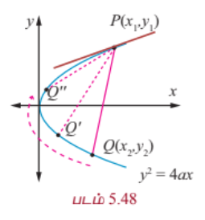

இதனால், $y_1^2 = 4ax_1$, $y_2^2 = 4ax_2$,

மற்றும் $y_2^2 - y_1^2 = 4a(x_2 - x_1)$.

சுருக்க

$$\frac{y_2 - y_1}{x_2 - x_1} = \frac{4a}{y_1 + y_2},$$

இது நாண் $PQ$ -ன் சாய்வு.

இதனால் $(y - y_1) = \frac{4a}{y_1 + y_2}(x - x_1)$, என்பது நாண் $PQ$ -ன் சமன்பாட்டைக் குறிக்கின்றது.

$Q \rightarrow P$ அல்லது $y_2 \rightarrow y_1$ எனும்போது நாண் $PQ$ என்பது $P$ -ன் தொடுகோடாக மாறுகின்றது.

இதனால் $(x_1, y_1)$ -இல் தொடுகோட்டுச் சமன்பாடு

$$y - y_1 = \frac{2a}{y_1}(x - x_1)$$

இங்கு $\frac{2a}{y_1}$ என்பது தொடுகோட்டின் சாய்வு ... (1)

$$yy_1 - y_1^2 = 2ax - 2ax_1$$

$$yy_1 - 4ax_1 = 2ax - 2ax_1$$

$$yy_1 = 2a(x + x_1)$$

(ii) **தொடுகோட்டுச் சமன்பாட்டின் துணையலகு வடிவம்** (Equation of tangent in parametric form)

பரவளையத்தின் புள்ளி $(at^2, 2at)$ -இல் தொடுகோட்டுச் சமன்பாடு

$$y(2at) = 2a(x + at^2)$$

$$yt = x + at^2$$

---

(iii) **செங்கோட்டுச் சமன்பாட்டின் கார்ட்டீசியன் வடிவம்** (Equation of normal in cartesian form)

(1)-இலிருந்து செங்கோட்டின் சாய்வு $-\frac{y_1}{2a}$.

அதனால் செங்கோட்டுச் சமன்பாடு

$$y - y_1 = -\frac{y_1}{2a}(x - x_1)$$

$$2ay - 2ay_1 = -y_1x + y_1x_1$$

$$xy_1 + 2ay = y_1x_1 + 2ay_1$$

$$xy_1 + 2ay = y_1(x_1 + 2a)$$

---

(iv) **செங்கோட்டுச் சமன்பாட்டின் துணையலகு வடிவம்** (Equation of normal in parametric form)

பரவளையத்தின் புள்ளி $(at^2, 2at)$ -இல் செங்கோட்டுச் சமன்பாடு

$$x(2at) + 2ay = 2a(at^2) + 2a(2at)$$

$$2a(xt + y) = 2a^2(t^2 + 2t)$$

$$y = -tx + 2at + at^3$$

---

### தேற்றம் 5.6

கொடுக்கப்பட்ட புள்ளியிலிருந்து $y^2 = 4ax$ என்ற பரவளையத்திற்கு மூன்று செங்கோடுகள் வரையலாம். அவற்றில் ஒன்று எப்போதும் மெய்யானது.

#### நிரூபணம்

கொடுக்கப்பட்ட பரவளையம் $y^2 = 4ax$ மற்றும் $(\alpha, \beta)$ கொடுக்கப்பட்ட புள்ளி என்க.

செங்கோட்டுச் சமன்பாட்டின் துணையலகு வடிவம்

$$y = -tx + 2at + at^3$$

... (1)

செங்கோட்டின் சாய்வு $m$ எனில் $m = -t$.

எனவே சமன்பாடு (1)

$$y = mx - 2am - am^3$$

என மாறுகின்றது.

இது $(\alpha, \beta)$ வழிச் செல்வதால்

$$\beta = m\alpha - 2am - am^3$$

$$am^3 + m(2a - \alpha) + \beta = 0$$

இது $m$ -இல் அமைந்த ஒரு மூன்றாம்படிச் சமன்பாடு. இதற்கு மூன்று $m$ -ன் மதிப்புகள் இருக்கும். இதன் விளைவாக ஒரு புள்ளியிலிருந்து பரவளையத்திற்கு மூன்று செங்கோடுகள் வரையலாம், மெய்யெண் சமன்பாட்டின் கலப்பு எண் மூலங்கள் எப்போதும் இணை எண் கொண்ட சோடியாக அமையும் என்பதாலும் சமன்பாடு (1) ஒற்றைப்படை அடுக்கு கொண்டிருப்பதாலும், குறைந்தபட்சம் ஒரு மெய்யெண் மூலம் இருக்கும். எனவே பரவளையத்தின் செங்கோடுகளில் ஒன்று மெய்யானதாக இருக்கும்.

---

### 5.6.2 நீள்வட்டம் மற்றும் அதிபரவளையங்களின் தொடுகோடு மற்றும் செங்கோட்டுச் சமன்பாடுகள்

(பின்வரும் நிரூபணங்கள் படிப்பவரின் பயிற்சிக்கு விடப்படுகின்றது)

#### (Equations of tangent and normal to Ellipse and Hyperbola)

(1) $\frac{x^2}{a^2} + \frac{y^2}{b^2} = 1$ என்ற நீள்வட்டத்தின் தொடுகோட்டின் சமன்பாடு

(i) $(x_1, y_1)$ -இல் $\frac{xx_1}{a^2} + \frac{yy_1}{b^2} = 1$ கார்ட்டீசியன் வடிவம்

(ii) $\theta$ -இல் $\frac{x\cos\theta}{a} + \frac{y\sin\theta}{b} = 1$. துணையலகு வடிவம்

(2) $\frac{x^2}{a^2} + \frac{y^2}{b^2} = 1$ என்ற நீள்வட்டத்தின் செங்கோட்டின் சமன்பாடு

(i) $(x_1, y_1)$ -இல் $\frac{a^2x}{x_1} - \frac{b^2y}{y_1} = a^2 - b^2$ கார்ட்டீசியன் வடிவம்

(ii) $\theta$ -இல் $\frac{ax}{\cos\theta} - \frac{by}{\sin\theta} = a^2 - b^2$ துணையலகு வடிவம்

(3) $\frac{x^2}{a^2} - \frac{y^2}{b^2} = 1$ என்ற அதிபரவளையத்தின் தொடுகோட்டின் சமன்பாடு

(i) $(x_1, y_1)$ -இல் $\frac{xx_1}{a^2} - \frac{yy_1}{b^2} = 1$ கார்ட்டீசியன் வடிவம்

(ii) $\theta$ -இல் $\frac{x\sec\theta}{a} - \frac{y\tan\theta}{b} = 1$ துணையலகு வடிவம்

(4) $\frac{x^2}{a^2} - \frac{y^2}{b^2} = 1$ என்ற அதிபரவளையத்தின் செங்கோட்டின் சமன்பாடு

(i) $(x_1, y_1)$ -இல் $\frac{a^2x}{x_1} + \frac{b^2y}{y_1} = a^2 + b^2$ கார்ட்டீசியன் வடிவம்

(ii) $\theta$ -இல் $\frac{ax}{\sec\theta} + \frac{by}{\tan\theta} = a^2 + b^2$ துணையலகு வடிவம்

---

### 5.6.3 நேர்க்கோடு $y = mx + c$ கூம்பு வெட்டுமுக வளைவரைகளின் தொடுகோடாக இருக்க நிபந்தனை

#### (Condition for the line $y = mx + c$ to be a tangent to the conic sections)

(i) **பரவளையம் $y^2 = 4ax$** (Parabola $y^2 = 4ax$)

$y^2 = 4ax$ என்ற பரவளையத்தின் மீதுள்ள புள்ளி $(x_1, y_1)$ என்க. எனவே, $y_1^2 = 4ax_1$ ... (1)

பரவளையத்தின் தொடுகோடு $y = mx + c$ என்க. ... (2)

$(x_1, y_1)$ என்ற புள்ளியில் பரவளையத்தின் தொடுகோடு 5.6.1-லிருந்து $yy_1 = 2a(x + x_1)$. ... (3)

(2) மற்றும் (3) இரண்டும் ஒரே நேர்க்கோட்டை குறிக்கின்றதால் கெழுக்கள் விகிதச்சமமாக இருக்கும்.

$$\frac{y_1}{1} = \frac{2a}{m} = \frac{2ax_1}{c}$$

$$\Rightarrow y_1 = \frac{2a}{m}, \quad x_1 = \frac{c}{m}$$

இதனால் சமன்பாடு (1),

$$\left(\frac{2a}{m}\right)^2 = 4a\left(\frac{c}{m}\right)$$

$$\Rightarrow c = \frac{a}{m}$$

என மாறும்.

எனவே தொடுபுள்ளி $\left(\frac{a}{m^2}, \frac{2a}{m}\right)$ மற்றும் பரவளையத்தின் தொடுகோட்டுச் சமன்பாடு $y = mx + \frac{a}{m}$.

பரவளையத்தைப் போல நீள்வட்டத்திற்கும், அதிபரவளையத்திற்கும் $y = mx + c$ என்ற கோடு தொடுகோடாக இருப்பதற்கான நிபந்தனைகளை நிறுவலாம்.

(ii) **நீள்வட்டம் $\frac{x^2}{a^2} + \frac{y^2}{b^2} = 1$** (ellipse $\frac{x^2}{a^2} + \frac{y^2}{b^2} = 1$)

$y = mx + c$ என்ற கோடு நீள்வட்டம் $\frac{x^2}{a^2} + \frac{y^2}{b^2} = 1$ -க்குத் தொடுகோடாக இருக்க நிபந்தனை

$$c^2 = a^2m^2 + b^2$$

தொடுபுள்ளி $\left(-\frac{a^2m}{c}, \frac{b^2}{c}\right)$ மற்றும் தொடுகோட்டுச் சமன்பாடு $y = mx \pm \sqrt{a^2m^2 + b^2}$.

(iii) **அதிபரவளையம் $\frac{x^2}{a^2} - \frac{y^2}{b^2} = 1$** (Hyperbola $\frac{x^2}{a^2} - \frac{y^2}{b^2} = 1$)

$y = mx + c$ என்ற கோடு அதிபரவளையம் $\frac{x^2}{a^2} - \frac{y^2}{b^2} = 1$ -க்கு தொடுகோடாக இருக்க நிபந்தனை

$$c^2 = a^2m^2 - b^2$$

தொடுபுள்ளி $\left(-\frac{a^2m}{c}, -\frac{b^2}{c}\right)$ மற்றும் தொடுகோட்டுச் சமன்பாடு $y = mx \pm \sqrt{a^2m^2 - b^2}$.

---

### குறிப்பு

(1) $y = mx \pm \sqrt{a^2m^2 + b^2}$ -இல் $y = mx + \sqrt{a^2m^2 + b^2}$ அல்லது $y = mx - \sqrt{a^2m^2 + b^2}$ இவற்றில் ஏதேனும் ஒன்றுதான் நீள்வட்டத்தின் தொடுகோடாக இருக்கும், இரண்டும் அல்ல.

(2) $y = mx \pm \sqrt{a^2m^2 - b^2}$ -இல் $y = mx + \sqrt{a^2m^2 - b^2}$ அல்லது $y = mx - \sqrt{a^2m^2 - b^2}$ இவற்றில் ஏதேனும் ஒன்றுதான் அதிபரவளையத்தின் தொடுகோடாக இருக்கும், இரண்டும் அல்ல.

---

### முடிவுகள் (நிரூபணங்கள் இல்லாமல்)

(1) தளத்தில் உள்ள ஏதேனும் ஒரு புள்ளியிலிருந்து (i) பரவளையம், (ii) நீள்வட்டம், (iii) அதிபரவளையம் ஆகியவற்றுக்கு இரு தொடுகோடுகள் வரையலாம்.

(2) தளத்தில் உள்ள ஏதேனும் ஒரு புள்ளியிலிருந்து (i) நீள்வட்டம், (ii) அதிபரவளையம் ஆகியவற்றுக்கு நான்கு செங்கோடுகள் வரையலாம்.

(3) செங்குத்துத் தொடுகோடுகள் வெட்டிக்கொள்ளும் புள்ளியின் நியமப்பாதை

(i) $y^2 = 4ax$ என்ற பரவளையத்திற்கு $x = -a$ (இயங்குவரை).

(ii) $\frac{x^2}{a^2} + \frac{y^2}{b^2} = 1$ என்ற நீள்வட்டத்திற்கு $x^2 + y^2 = a^2 + b^2$ (இயங்குவட்டம்).

(iii) $\frac{x^2}{a^2} - \frac{y^2}{b^2} = 1$ என்ற அதிபரவளையத்திற்கு $x^2 + y^2 = a^2 - b^2$ (இயங்கு வட்டம்) ஆகும்.

---

### எடுத்துக்காட்டு 5.29

$x^2 + y^2 + 6x + 4y + 5 = 0$ என்ற பரவளையத்திற்கு $(1, -3)$ என்ற புள்ளியில் தொடுகோடு மற்றும் செங்கோட்டுச் சமன்பாடுகளைக் காண்க.

#### தீர்வு

பரவளையத்தின் சமன்பாடு

$$x^2 + y^2 + 6x + 4y + 5 = 0$$

$$x^2 + 6x + y^2 + 4y + 5 = 0$$

$$(x + 3)^2 + (y + 2)^2 = 8$$

வட்டத்தின் தொடுகோட்டு சமன்பாடு

$$(x_1 + g)x + (y_1 + f)y = r^2$$

$(1, -3)$ -இல்

$$(1 + 3)x + (-3 + 2)y = 8$$

$$4x - y = 8$$

$$4x - y - 8 = 0$$

(1, -3) -இல் தொடுகோட்டின் சாய்வு 4, எனவே செங்கோட்டின் சாய்வு $-\frac{1}{4}$.

$(1, -3)$ -இல் செங்கோட்டின் சமன்பாடு

$$y + 3 = -\frac{1}{4}(x - 1)$$

$$4y + 12 = -x + 1$$

$$x + 4y + 11 = 0.$$

---

### எடுத்துக்காட்டு 5.30

$\frac{x^2}{32} + \frac{y^2}{8} = 1$ என்ற நீள்வட்டத்திற்கு $\theta = \frac{\pi}{4}$ எனும்போது தொடுகோடு மற்றும் செங்கோட்டுச் சமன்பாடுகளைக் காண்க.

#### தீர்வு

நீள்வட்டத்தின் சமன்பாடு

$$\frac{x^2}{32} + \frac{y^2}{8} = 1$$

$$a^2 = 32, b^2 = 8$$

$$a = 4\sqrt{2}, b = 2\sqrt{2}$$

$\theta = \frac{\pi}{4}$ -இல் தொடுகோட்டுச் சமன்பாடு

$$\frac{x\cos\frac{\pi}{4}}{4\sqrt{2}} + \frac{y\sin\frac{\pi}{4}}{2\sqrt{2}} = 1$$

$$\frac{x}{8} + \frac{y}{4} = 1$$

$$x + 2y - 8 = 0.$$

செங்கோட்டின் சமன்பாடு

$$\frac{4\sqrt{2}x}{\cos\frac{\pi}{4}} - \frac{2\sqrt{2}y}{\sin\frac{\pi}{4}} = 32 - 8$$

$$8x - 4y = 24$$

$$2x - y - 6 = 0.$$

மாற்று முறை

$\theta = \frac{\pi}{4}$ எனில்

$$(a\cos\theta, b\sin\theta) = \left(4\sqrt{2}\cos\frac{\pi}{4}, 2\sqrt{2}\sin\frac{\pi}{4}\right)$$

$$= (4, 2)$$

∴ தொடுகோட்டுச் சமன்பாடு $\theta = \frac{\pi}{4}$ -இல் என்பதும் புள்ளி $(4, 2)$ -இல் என்பதும் ஒன்றே.

எனவே தொடுகோட்டுச் சமன்பாடு

$$\frac{xx_1}{a^2} + \frac{yy_1}{b^2} = 1$$

$$\frac{4x}{32} + \frac{2y}{8} = 1$$

$$x + 2y - 8 = 0$$

தொடுகோட்டுச் சாய்வு $-\frac{1}{2}$

செங்கோட்டுச் சாய்வு 2

செங்கோட்டின் சமன்பாடு

$$y - 2 = 2(x - 4)$$

$$y - 2 = 2x - 8$$

$$2x - y - 6 = 0.$$

---

### பயிற்சி 5.4

1. $(5, 2)$ என்ற புள்ளியிலிருந்து $2x^2 + 7y^2 = 14$ என்ற நீள்வட்டத்திற்கு வரையப்படும் தொடுகோடுகளின் சமன்பாடுகளைக் காண்க.

2. $\frac{x^2}{16} - \frac{y^2}{64} = 1$ என்ற அதிபரவளையத்திற்கு, $x - 10y + 39 = 0$ என்ற நேர்க்கோட்டிற்கு இணையான தொடுகோட்டுச் சமன்பாடுகளைக் காண்க.

3. $x - y + 4 = 0$ என்ற நேர்க்கோடு $x^2 + y^2 = 312$ என்ற நீள்வட்டத்தின் தொடுகோடு என நிறுவுக. மேலும் தொடும் புள்ளியைக் காண்க.

4. $y^2 = 16x$ என்ற பரவளையத்திற்கு, $2x + 2y + 3 = 0$ என்ற கோட்டிற்குச் செங்குத்தான தொடுகோட்டுச் சமன்பாடு காண்க.

5. $y^2 = 8x$ என்ற பரவளையத்திற்கு $t = 2$ -இல் தொடுகோட்டுச் சமன்பாடு காண்க. (குறிப்பு : துணையலகு வடிவத்தைப் பயன்படுத்துக)

6. $12x^2 - 9y^2 = 108$ என்ற அதிபரவளையத்திற்கு $\theta = \frac{\pi}{3}$ -இல் தொடுகோடு மற்றும் செங்கோட்டுச் சமன்பாடுகளைக் காண்க. (குறிப்பு : துணையலகு வடிவத்தைப் பயன்படுத்துக)

7. $y^2 = 4ax$ என்ற பரவளையத்திற்கு $t_1$ மற்றும் $t_2$ ஆகிய புள்ளிகளில் அமையும் தொடுகோடுகள் $(at_1t_2, a(t_1 + t_2))$ என்ற புள்ளியில் சந்திக்கின்றன என நிறுவுக.

8. $y^2 = 4ax$ என்ற பரவளையத்திற்கு $t_1$ என்ற புள்ளியில் வரையப்படும் செங்கோடு, பரவளையத்தை மீண்டும் $t_2$ என்ற புள்ளியில் சந்திக்குமெனில், $t_2 = -t_1 - \frac{2}{t_1}$ என நிறுவுக.     

### 5.7 அன்றாட வாழ்வில் கூம்பு வளைவுகளின் பயன்பாடுகள் (Real life Applications of Conics)

#### 5.7.1 பரவளையம் (Parabola)

பரவளையத்தின் முக்கியப் பயன்பாடுகள் ஒளி அல்லது வானொலி அலைகளின் எதிரொளிப்பான் அல்லது ஏற்பியை உள்ளடக்கியதாக இருக்கின்றது. எடுத்துக்காட்டாக வாகனங்களின் முகப்பு விளக்கின் குறுக்கு வெட்டு. சுடர் விளக்கு இவற்றில் பரவளைய எதிரொளிப்பான்கள் பயன்படுத்தப்படுகிறது.

பரவளைய எதிரொளிப்பான் என்பது வெள்ளி முலாம் பூசப்பட்ட பரவளையம் தன் அச்சைப் பற்றிச் சுற்றுவதால் உருவாகும் வளைதளப்பரப்பாகும். இவற்றில் பல்புகள் குவியத்தில் பொருத்தப்படுகின்றன. இதனால் குவியத்திலிருந்து புறப்படும் ஒளி பரவளையத்தில் பட்டு பரவளையத்தின் அச்சுக்கு இணையாக பிரதிபலிக்கின்றது. (படம் 5.60) அதே சமயம் துணைக்கோள் கிண்ண ஏற்பி மற்றும் விளையாட்டு நிகழ்ச்சிகளில் பயன்படுத்தப்படும் ஒலிப்பெருக்கிகள் போன்றவற்றில் உள்ளே வரும் அச்சுக்கு இணையான வானொலி அலைகள் அல்லது ஒலி அலைகள் பிரதிபலிக்கப்பட்டு குவியத்தில் ஒன்று சேருகின்றது (படம் 5.59). இதேபோல் ஒரு சட்டத்தில் பரவளையக் கண்ணாடியும் அதன் குவியத்தில் சமையற்பாத்திரமும் பொருத்தப்பட்டால் (படம் 5.1) உள்ளே வரும் அச்சுக்கு இணையான சூரிய ஒளிக்கற்றைகள் பிரதிபலிக்கப்பட்டுக் குவியத்தில் சமைப்பதற்குத் தேவையான வெப்பத்தை உற்பத்தி செய்கின்றது.

பரவளைய வளைவுகள் அதன் மிகச்சிறந்த கட்டுமான நிலைத்தன்மைக்கும் மற்றும் அதன் அழகுக்கும் சிறந்தது. அவற்றில் சில இந்தியாவில், ஆந்திர மாநிலத்தில் கோதாவரி நதியின் மீதுள்ள பாலம், பிரான்ஸ் நாட்டில் பாரிஸ் நகரில் உள்ள ஈபில் கோபுரம் ஆகும்.

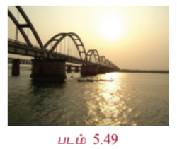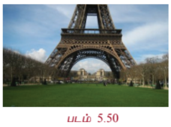

---

#### 5.7.2 நீள்வட்டம் (Ellipse)

ஜோகன்ஸ் கெப்ளரின் கூற்றுப்படி சூரியக் குடும்பத்தில் உள்ள எல்லாக் கோள்களும் சூரியனை ஒரு குவியமாகக் கொண்ட நீள்வட்டப்பாதையில் சுற்றுகின்றன. சில வால் நட்சத்திரங்களும்கூட சூரியனை ஒரு குவியமாகக் கொண்ட நீள்வட்டப்பாதையிலேயே சுற்றுகின்றன. எடுத்துக்காட்டாக, 75 ஆண்டுகளுக்கு ஒருமுறை தோன்றும் ஹாலேயின் வால் நட்சத்திரம் $e \approx 0.97$ கொண்ட ஒரு நீள்வட்டப் பாதையில் (படம் 5.51) சுற்றுகின்றது. நம்முடைய துணைக்கோள் சந்திரன் பூமியை ஒரு குவியமாகக் கொண்ட நீள்வட்டப்பாதையில் சுற்றுகின்றது. மற்ற கோள்களின் துணைக்கோள்களும் அவற்றின் கோள்களைச் சுற்றி நீள்வட்டப்பாதையிலேயே சுற்றுகின்றன.

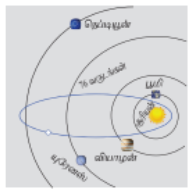

நீள்வட்ட வளைவுகள் அவற்றின் நிலைத்தன்மைக்கும் அழகுக்கும் பயன்படுத்தப்படுகின்றன. தலைப்பு பாகம் நெட்டச்சும் குற்றச்சும் $2:1$ என்ற விகிதத்தில் இருக்குமாறு நீள்வட்ட வடிவில் அமைக்கப்பட்ட நீராவி கொதிகலன்கள் மிகவும் பலம் வாய்ந்ததாக இருக்கும் என நம்பப்படுகின்றது. ஃபோர்-சோபர் பீல்டு (Bohr-Sommerfeld) அணுக்கோட்பாட்டில் எலக்ட்ரானின் சுற்றுப்பாதை வட்டம் அல்லது நீள்வட்டமாக இருக்கும். சில நேரங்களில் (குறிப்பிட்ட தேவைக்காக) பற்சக்கரங்களும் நீள்வட்ட வடிவில் செய்யப்படுகின்றன. (படம் 5.52)

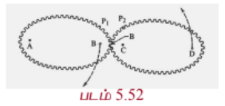

நாம் வாழும் கோளாகிய பூமி சாய்ந்த கோளமாகும். அதாவது நீள்வட்டம் தனது குற்றச்சைப் பற்றிச் சுற்றுவதால் உருவாகும் திண்மம். இந்த சாய்வுக் கோளமானது நிலநடுக்கோட்டுப் பகுதியில் புடைத்தும், துருவப்பகுதியில் தட்டையாகவும் இருக்கும்.

நீள்வட்டத்தின் ஒரு குவியத்திலிருந்து வெளியாகும் ஒளி அல்லது ஒளிக்கற்றை நீள்வட்டத்தில் பட்டுப் பிரதிபலித்து மற்றொரு குவியத்தை (படம் 5.62) அடைகின்றது. இது நீள்வட்டத்தின் பிரதிபலிப்பு பண்பு ஆகும். இதை இயற்பியலின் படுகதிர் மற்றும் பிரதிபலிப்புக் கதிர் என்ற கருத்துக்களைப் பயன்படுத்தி நிறுவலாம்.

ஓர் ஆச்சரியமூட்டும் நீள்வட்ட எதிரொளிப்பான் பயன்படுத்தும் மருத்துவக் கருவி லித்தோரிப்டர் (படம் 5.4 மற்றும் 5.63). இது சிறுநீரகக் கற்களைக் கரைப்பதற்கு மின்காந்த தொழில்நுட்பம் அல்லது அல்ட்ராசவுண்டை பயன்படுத்தி மின் அதிர்வு அலைகளை உருவாக்குகின்றது. அந்த அலைகள் நீள்வட்டத்தின் குறுக்குவெட்டில் ஒரு குவியத்தில் தோன்றி மற்றொரு குவியப்புள்ளியில் சிறுநீரகக் கல்லில் பிரதிபலிக்கின்றது. இந்த முறையில் குணமாவதற்கான காலம் வழக்கமான அறுவைச் சிகிச்சைக்கு ஆவதைவிட குறைவாக இருக்கும். மேலும் அறுவைச் சிகிச்சை இல்லாதது மற்றும் இறப்பு விகிதம் குறைவானது இதன் சிறப்பம்சம்.

---

#### 5.7.3 அதிபரவளையம் (Hyperbola)

சில வால் நட்சத்திரங்கள் சூரியனை ஒரு குவியத்தில் கொண்ட அதிபரவளையப் பாதையில் பயணிக்கின்றன. இவ்வகை வால் நட்சத்திரங்கள், நீள் வட்டப்பாதையில் வரும் வால் நட்சத்திரங்கள் குறிப்பிட்ட இடைவெளியில் வருவதுபோல் அல்லாமல் ஒரே ஒரு முறை மட்டும் சூரியனின் அருகில் வரும். மேலும் மும்பை விமான நிலையக்கட்டிடக்கலை (படம் 5.53), கோளரங்கத்தின் குறுக்குவெட்டு, கப்பல்களின் இருப்பிடம் காணல் (படம் 5.54) அணுமின் நிலைய அல்லது அனல்மின் நிலையக் குளிரவைக்கும் கோபுரங்கள் (படம் 5.5).

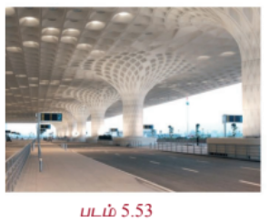
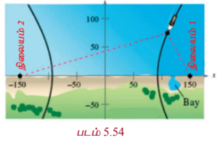

---

### எடுத்துக்காட்டு 5.31

ஒருவழிப்பாதையில் உள்ள அரை நீள்வட்ட வளைவின் உயரம் 3 மீ மற்றும் அகலம் 12 மீ. ஒரு சரக்கு வாகனத்தின் அகலம் 3 மீ மற்றும் உயரம் 2.7 மீ எனில் இந்த வாகனம் வளைவின் வழி செல்ல முடியுமா? (படம் 5.6)

#### தீர்வு

சரக்கு வாகனத்தின் அகலம் 3மீ என்பதால் அது வளைவு வழிச் செல்ல சாலையின் மையத்திலிருந்து 1.5மீ தூரத்தில் வளைவின் உயரம் கணக்கிட வேண்டும். இந்த உயரம் 2.7மீ அல்லது குறைவாக இருந்தால் சரக்கு வாகனம் வளைவு வழிச் செல்லாது. (படம் 5.6)

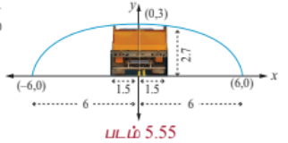

படத்திலிருந்து $a = 6$ மற்றும் $b = 3$ என்பது $\frac{x^2}{6^2} + \frac{y^2}{3^2} = 1$ என்ற நீள்வட்டச் சமன்பாட்டை அளிக்கின்றது.

3மீ அகல வாகனத்தின் விளிம்பு மையத்திலிருந்து $x = 1.5$ மீ-இல் இருக்கும். மையத்திலிருந்து 1.5மீ தூரத்தில் வளைவின் உயரம் காண $x = 1.5$ எனச் சமன்பாட்டில் பிரதியிட்டு $y$ -இன் தீர்வு காண

$$\frac{(1.5)^2}{36} + \frac{y^2}{9} = 1$$

$$y^2 = 9\left(1 - \frac{2.25}{36}\right) = 9\left(\frac{33.75}{36}\right) = \frac{135}{16}$$

$$y = \frac{\sqrt{135}}{4} = \frac{11.62}{4} = 2.90$$

இதனால் வளைவின் மையத்திலிருந்து 1.5மீ தூரத்தில் வளைவின் உயரம் 2.90மீ, சரக்கு வாகனத்தின் உயரம் 2.7மீ என்பதால் அது நீள்வட்ட வளைவு வழியேச் செல்லும்.

---

### எடுத்துக்காட்டு 5.32

சூரியனிலிருந்து பூமியின் அதிகபட்சம் மற்றும் குறைந்தபட்ச தூரங்கள் முறையே $152 \times 10^6$ கி.மீ மற்றும் $94.5 \times 10^6$ கி.மீ. நீள்வட்டப் பாதையின் ஒரு குவியத்தில் சூரியன் உள்ளது. சூரியனுக்கும் மற்றொரு குவியத்திற்குமான தூரம் காண்க.

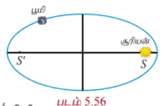

#### தீர்வு

$$AS' = 94.5 \times 10^6 \text{ கி.மீ}, \quad SA' = 152 \times 10^6 \text{ கி.மீ}.$$

$$a + c = 152 \times 10^6$$

$$a - c = 94.5 \times 10^6$$

கழிக்க $2c = 57.5 \times 10^6 = 5.75 \times 10^7$ கி.மீ.

மற்றொரு குவியத்திலிருந்து சூரியனுக்கு உள்ள தூரம் $SS' = 5.75 \times 10^7$ கி.மீ.

---

### எடுத்துக்காட்டு 5.33

ஒரு கான்கிரீட் பாலம் பரவளைய வடிவில் உள்ளது. சாலையின்மேல் உள்ள பாலத்தின் நீளம் 40மீ மற்றும் அதன் அதிகபட்ச உயரம் 15மீ எனில் அந்தப் பரவளைய வளைவின் சமன்பாடு காண்க.

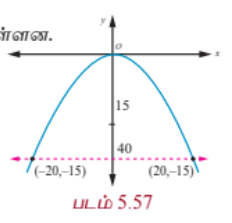

#### தீர்வு

படத்திலிருந்து முனை $(0, 0)$ மற்றும் பரவளையம் கீழ்நோக்கித் திறப்புடையது எனலாம்.

பரவளையத்தின் சமன்பாடு $x^2 = -4ay$

$(20, -15)$ மற்றும் $(-20, -15)$ என்ற புள்ளிகள் பரவளையத்தின் மீதுள்ளன.

$$20^2 = -4a(-15)$$

$$4a = \frac{400}{15}$$

$$x^2 = -\frac{80}{3}y$$

எனவே சமன்பாடு $3x^2 = -80y$.

---

### எடுத்துக்காட்டு 5.34

ஒரு பரவளையத் தொலைத்தொடர்பு அலைவாங்கியின் குவியம் அதன் முனையிலிருந்து 2மீ தூரத்தில் உள்ளது. முனையிலிருந்து 3மீ தூரத்தில் அலைவாங்கியின் அகலம் காண்க.

#### தீர்வு

பரவளையத்தின் சமன்பாடு $y^2 = 4ax$.

குவியம் முனையிலிருந்து 2மீ என்பதால் $a = 2$.

எனவே பரவளையத்தின் சமன்பாடு $y^2 = 8x$.

முனையிலிருந்து 3மீ தூரத்தில் பரவளையத்தின் மீதுள்ள புள்ளி $P$ எனில் $P$ என்பது $(3, y)$ ஆக இருக்கும்.

$$y^2 = 8(3) = 24$$

$$y = 2\sqrt{6}$$

முனையிலிருந்து 3மீ தூரத்தில் அலைவாங்கியின் அகலம் $4\sqrt{6}$ மீ ஆகும்.

---

### 5.7.4 பரவளையத்தின் பிரதிபலிப்பு பண்பு (Reflective property of parabola)

பரவளையத்தின் குவியத்திலிருந்து தோன்றும் ஒளி அல்லது, ஒலி அல்லது, வானொலி அலைகள் பிரதிபலிப்புக்குப் பின்பு பரவளையத்தின் அச்சுக்கு இணையாகச் செல்கின்றன (படம் 5.60). மறுதலையாக பரவளையத்தின் அச்சுக்கு இணையாக வரும் கதிர்கள் பிரதிபலிக்கப்பட்டு பரவளையத்தின் குவியத்தில் குவிகின்றது (படம் 5.59).

---

### எடுத்துக்காட்டு 5.35

$y = \frac{1}{32}x^2$ என்ற சமன்பாடு சூரிய ஆற்றலுக்குப் பயன்படுத்தப்படும் பரவளைய கண்ணாடிகளின் மாதிரியைக் குறிக்கின்றது. பரவளையத்தின் குவியத்தில் வெப்பமூட்டும் குழாய் உள்ளது. இந்தக் குழாய் பரவளையத்தின் முனையிலிருந்து எவ்ளவு உயரத்தில் உள்ளது?

#### தீர்வு

பரவளையத்தின் சமன்பாடு

$$y = \frac{1}{32}x^2$$

அதாவது $x^2 = 32y$; முனை $(0, 0)$

$$= 4(8)y$$

$$\Rightarrow a = 8$$

வெப்பமூட்டும் குழாய் குவியம் $(0, a)$ -இல் பொருத்தப்பட வேண்டும். எனவே வெப்பமூட்டும் குழாய் பரவளையத்தின் முனையிலிருந்து 8 அலகுகள் உயரத்தில் பொருத்தப்பட வேண்டும்.

---

### எடுத்துக்காட்டு 5.36

ஒரு தேடும் விளக்கு பரவளைய பிரதிபலிப்பான் கொண்டது. (குறுக்கு வெட்டு ஒரு கிண்ண வடிவம்). பரவளைய கிண்ணத்தின் விளிம்புகளுக்கு இடையே உள்ள அகலம் 40 செ.மீ மற்றும் ஆழம் 30 செ.மீ. குமிழ் குவியத்தில் பொருத்தப்பட்டுள்ளது.

(1) பிரதிபலிப்புக்குப் பயன்படுத்தப்படும் பரவளையத்தின் சமன்பாடு என்ன?

(2) ஒளி அதிகபட்சம் தூரம் தெரிவதற்கு குமிழ் பரவளையத்தின் முனையிலிருந்து எவ்வளவு தூரத்தில் பொருத்தப்பட வேண்டும்.

#### தீர்வு

முனை $(0, 0)$ என்க.

பரவளையத்தின் சமன்பாடு $y^2 = 4ax$.

(1) விட்டம் 40 செ.மீ மற்றும் உயரம் 30 செ.மீ. என உள்ளதால் பரவளையத்தின் விளிம்பில் உள்ள ஒரு புள்ளி $(30, 20)$ ஆகும்.

$$20^2 = 4a(30)$$

$$4a = \frac{400}{30} = \frac{40}{3}.$$

சமன்பாடு $y^2 = \frac{40}{3}x$.

(2) குமிழ் குவியத்தில் $(a, 0)$ ஆக இருக்க வேண்டும். எனவே குமிழ் பரவளையத்தின் முனையிலிருந்து $\frac{10}{3}$ செ.மீ. தூரத்தில் பொருத்தப்பட வேண்டும்.

---

### எடுத்துக்காட்டு 5.37

ஓர் ஒளியியல் கண்ணாடி அமைப்பின் நீள்வட்டப் பகுதிச்சமன்பாடு $\frac{x^2}{16} + \frac{y^2}{9} = 1$. அந்த அமைப்பின் பரவளையப் பகுதியின் குவியம் நீள்வட்டப்பகுதியின் வலப்பக்க குவியத்தில் உள்ளது. பரவளையத்தின் முனை ஆதிப்புள்ளியிலும், பரவளையம் வலப்பக்கம் திறப்புடையதாகவும் உள்ளது. இந்த பரவளையத்தின் சமன்பாட்டைத் தீர்மானிக்கவும்.

#### தீர்வு

கொடுக்கப்பட்ட நீள்வட்டத்தில்

$$a^2 = 16, \quad b^2 = 9$$

மற்றும்

$$c^2 = a^2 - b^2$$

$$c^2 = 16 - 9 = 7$$

$$c = \pm \sqrt{7}$$

எனவே குவியங்கள் $F(\sqrt{7}, 0)$ மற்றும் $F'(-\sqrt{7}, 0)$.

பரவளையத்தின் குவியம் $(\sqrt{7}, 0) \Rightarrow a = \sqrt{7}$.

பரவளையத்தின் சமன்பாடு $y^2 = 4\sqrt{7}x$.

---

### 5.7.5 நீள்வட்டத்தின் பிரதிபலிப்பு பண்பு (Reflective Property of an Ellipse)

குவியங்களிலிருந்து நீள்வட்டத்தின் மீதுள்ள ஏதேனும் ஒரு புள்ளிக்கான கோடுகள் அந்தப் புள்ளியில் வரையப்படும் தொடுகோட்டுடன் சமமான கோணங்களை ஏற்படுத்துகின்றன (படம் 5.62).

ஒரு குவியத்திலிருந்து உமிழப்படும் ஒளி அல்லது ஒலி அல்லது வானொலி அலைகள் நீள்வட்டத்தின் ஏதேனும் ஒரு புள்ளியில் பட்டு மற்றொரு குவியத்தில் பெறப்படுகின்றது (படம் 5.63).

---

### எடுத்துக்காட்டு 5.38

34மீ நீளமுள்ள ஓர் அறை பிரதிபலிப்புக் கூரையாக கட்டப்படவுள்ளது. அந்த அறையின் கூறை நீள்வட்ட வடிவமாக படம் 5.64-ல் இருப்பது போல் உள்ளது. அந்தக் கூரையின் அதிகபட்ச உயரம் 8 மீ எனில், அதன் குவியங்கள் எங்கே அமையும் என்பதைத் தீர்மானிக்கவும்.

#### தீர்வு

நீள்வட்ட வடிவக் கூரையின் அரை நெட்டச்சு 17மீ, அதன் உயரம் அரை குற்றச்சு 8மீ. இதனால்

$$c^2 = a^2 - b^2 = 17^2 - 8^2$$

$$c = \sqrt{289 - 64} = \sqrt{225} = 15$$

நீள்வட்டக் கூரையின் குவியங்கள் நெட்டச்சின் மீது மையத்திலிருந்து 15மீ தூரத்தில் இருக்கும்.

**துளையில்லாத மருத்துவ அதிசயம் (A non-invasive medical miracle)**

லித்தோடிரிப்டரில், நீள்வட்டத்தின் ஒரு குவியத்தில் இருந்து அதிக அதிர்வெண் கொண்ட ஒலி அலைகள் உமிழப்படுகின்றன. நீள்வட்டத்தில் மற்றொரு குவியத்தில் நோயாளியின் சிறுநீரகக்கல் இருக்குமாறு அமைக்கப்படுகின்றது. நீள்வட்டப் பிரதிபலிப்புப் பண்பின்படி ஒரு குவியத்தில் புறப்பட்ட ஒலி அலைகள் அடுத்தக் குவியத்தில் இருக்கும் சிறுநீரகக் கற்களைத் தூளாக்குகின்றன.

---

### எடுத்துக்காட்டு 5.39

நீள்வட்டத்தின் சமன்பாடు $\frac{(x - 11)^2}{484} + \frac{y^2}{64} = 1$ ( $x$ மற்றும் $y$ -ன் மதிப்புகள் செ.மீ-இல் அளக்கப்படுகின்றது) நோயாளியின் சிறுநீரகக் கல் மீது அதிர்வலைகள் படுமாறு நோயாளி எந்த இடத்தில் இருக்க வேண்டும் எனக் காண்க.

#### தீர்வு

நீள்வட்டத்தின் சமன்பாடு $\frac{(x - 11)^2}{484} + \frac{y^2}{64} = 1$. சிறுநீரகக் கற்களைக் கரைக்க ஒலி அலைகள் தோன்றும் இடமும் நோயாளியின் சிறுநீரகக் கல்லும் குவியங்களில் உள்ளவாறு அமைய வேண்டும்.

$$a^2 = 484 \quad \text{மற்றும்} \quad b^2 = 64$$

$$c^2 = a^2 - b^2$$

$$= 484 - 64 = 420$$

$$c \approx 20.5$$

நோயாளியின் சிறுநீரகக்கல் நீள்வட்டத்தின் நெட்டச்சில் மையத்திலிருந்து 20.5 செ.மீ தூரத்தில் இருக்க வேண்டும்.

---

### 5.7.6 அதிபரவளையத்தின் பிரதிபலிப்புப் பண்பு (Reflective Property of a Hyperbola)

அதிபரவளையத்தின் ஒரு புள்ளியிலிருந்து குவியங்களுக்கு வரையப்படும் கோடுகள் அந்தப் புள்ளியில் உள்ள தொடுகோட்டுடன் சமமான கோணங்களை உருவாக்குகின்றன. (படம் 5.66).

அதிபரவளையத்தின் ஒரு குவியத்திலிருந்து புறப்படும் ஒளி அல்லது ஒலி அல்லது வானொலி அலைகள் நீள்வட்டத்தைப் போல் மற்றொரு குவியத்தில் பெறப்படுகின்றன. இது ஆழ்கடலில் பயணிக்கும் கப்பல்கள் இருக்கும் இடங்களை அறியப் பயன்படுகிறது. (படம் 5.54).

---

### எடுத்துக்காட்டு 5.40

இரு கடலோர காவல்படைத் தளங்கள் 600 கி.மீ. தொலைவில் $A(0, 0)$ மற்றும் $B(0, 600)$ என்ற புள்ளிகளில் அமைந்துள்ளன. $P$ என்ற புள்ளியில் உள்ள கப்பலிலிருந்து ஆபத்திற்கான சமிக்ஞைகள் இரு தளங்களிலும் சிறிதளவு மாறுபட்ட நேரங்களில் பெறப்படுகின்றன. அவற்றிலிருந்து கப்பல், தளம் $B$ யை விட தளம் $A$ -க்கு 200 கி.மீ. அதிக தூரத்தில் உள்ளதாக தீர்மானிக்கப்படுகின்றது. எனவே அந்தக் கப்பல் இருக்கும் இடம் வழியாகச் செல்லும் அதிபரவளையத்தின் சமன்பாடு காண்க.

#### தீர்வு

இரு கடலோர காவல்படைத் தளங்கள் குவியலங்களாதலால் அவற்றின் மையம் $(0, 300)$ அதிபரவளையத்தின் மையமாகும். எனவே சமன்பாடு

$$\frac{(y - 300)^2}{a^2} - \frac{(x - 0)^2}{b^2} = 1.$$

... (1)

$a$ மற்றும் $b$ -ன் மதிப்பு காண அதிபரவளையத்தின் மீதுள்ள இருபுள்ளிகளை எடுத்துப் பிரதியிடலாம்.

$A$ ஆனது $B$ -ஐ விட 200 கி.மீ. அதிக தூரத்தில் உள்ளதால் $(0, 400)$ அதிபரவளையத்தின் மீதுள்ள புள்ளி

$$\frac{(400 - 300)^2}{a^2} - \frac{0^2}{b^2} = 1$$

$$\frac{10000}{a^2} = 1, \quad a^2 = 10000$$

மற்றொரு புள்ளி $(x, 600)$ -ம் அதிபரவளையத்தின் மீது $\sqrt{x^2 + 600^2} = x + 200$ எனுமாறு உள்ளது.

$$x^2 + 360000 = x^2 + 400x + 40000$$

$$x = 800$$

(1)-இல் பிரதியிட,

$$\frac{(600 - 300)^2}{10000} - \frac{(800 - 0)^2}{b^2} = 1$$

$$9 - \frac{640000}{b^2} = 1$$

$$b^2 = 80000$$

தேவையான சமன்பாடு

$$\frac{(y - 300)^2}{10000} - \frac{x^2}{80000} = 1.$$

இந்த அதிபரவளையத்தின் ஏதோ ஒரு புள்ளியில்தான் அந்த கப்பல் உள்ளது. மூன்றாவது ஒரு காவல்படைத் தளத்தைப் பயன்படுத்தி அதன் சரியான இருப்பிடத்தைக் காண முடியும்.

---

### எடுத்துக்காட்டு 5.41

ஒரு குறிப்பிட்ட தொலைநோக்கியில் பரவளைய பிரதிபலிப்பான் மற்றும் அதிபரவளைய பிரதிபலிப்பான் இரண்டும் உள்ளது. படம் 5.68-இல் உள்ள தொலைநோக்கியில் பரவளையத்தின் முனையிலிருந்து 14மீ உயரத்தில் உள்ள $F_1$ என்ற அதிபரவளையத்தின் ஒரு குவியம் பரவளையத்தின் குவியமாகவும் உள்ளது. அதிபரவளையத்தின் இரண்டாவது குவியம் $F_2$ பரவளையத்தின் முனையிலிருந்து 2மீ உயரத்தில் உள்ளது. அதிபரவளையத்தின் முனை $F_1$ -க்கு 1மீ கீழே உள்ளது. அதிபரவளையத்தின் மையத்தை ஆதியாகவும் குவியங்களை $y$ -அச்சிலும் கொண்ட அதிபரவளையத்தின் சமன்பாடு காண்க.

#### தீர்வு

பரவளையத்தின் முனை $V_1$ மற்றும் அதிபரவளையத்தின் முனை $V_2$ என்க.

$$F_1F_2 = 14 - 2 = 12 \text{ மீ}, \quad 2c = 12, \quad c = 6$$

மையத்திலிருந்து அதிபரவளையத்தின் முனைக்கு உள்ள தூரம்

$$a = 6 - 1 = 5$$

$$b^2 = c^2 - a^2 = 36 - 25 = 11.$$

எனவே அதிபரவளையத்தின் சமன்பாடு

$$\frac{y^2}{25} - \frac{x^2}{11} = 1.$$

---

### பயிற்சி 5.5

1. ஒரு பாலம் பரவளைய வளைவில் உள்ளது. மையத்தில் 10மீ உயரமும், அடிப்பகுதியில் 30மீ அகலமும் உள்ளது. மையத்திலிருந்து இருபுறமும் 6 மீ தூரத்தில் பாலத்தின் உயரத்தைக் காண்க.

2. ஒரு நான்கு வழிச்சாலைக்கான மலைவழியேசெல்லும் சுரங்கப்பாதையின் முகப்பு ஒரு நீள்வட்ட வடிவமாக உள்ளது. நெடுஞ்சாலையின் மொத்த அகலம் (முகப்பு அல்ல) 16மீ. சாலையின் விளிம்பில் சுரங்கப்பாதையின் உயரம், 4மீ உயரமுள்ள சரக்கு வாகனம் செல்வதற்குத் தேவையான அளவிற்கும் முகப்பின் அதிகபட்ச உயரம் 5மீ ஆகவும் இருக்க வேண்டுமெனில் சுரங்கப்பாதையின் திறப்பின் அகலம் என்னவாக இருக்க வேண்டும்?

3. ஒரு நீரூற்றில், ஆதியிலிருந்து 0.5மீ கிடைமட்டத் தூரத்தில் நீரின் அதிகபட்ச உயரம் 4மீ, நீரின் பாதை ஒரு பரவளையம் எனில் ஆதியிலிருந்து 0.75மீ கிடைமட்டத் தூரத்தில் நீரின் உயரத்தைக் காண்க.

4. பொறியாளர் ஒருவர் குறுக்கு வெட்டு பரவளையமாக உள்ள ஒரு துணைக்கோள் ஏற்பியை வடிவமைக்கின்றார். ஏற்பி அதன் மேல்பக்கத்தில் 5மீ அகலமும், முனையிலிருந்து குவியம் 1.2 மீ தூரத்திலும் உள்ளது.

   (a) முனையை ஆதியாகவும், $x$-அச்சு பரவளையத்தின் சமச்சீர் அச்சாகவும் கொண்டு ஆய அச்சுகளைப் பொருத்தி பரவளையத்தின் சமன்பாடு காண்க.

   (b) முனையிலிருந்து செயற்கைக்கோள் ஏற்பியின் ஆழம் காண்க.

5. ஒரு தொங்கு பாலத்தின் 60மீ சாலைப்பகுதிக்கு பரவளைய கம்பி வடம் படத்தில் உள்ளவாறு பொறுத்தப்பட்டுள்ளது. செங்குத்துக் கம்பி வடங்கள் சாலைப்பகுதியில் ஒவ்வொன்றுக்கும் 6மீ இடைவெளி இருக்குமாறு அமைக்கப்பட்டுள்ளது. முனையிலிருந்து முதல் இரண்டு செங்குத்து கம்பி வடங்களுக்கான நீளத்தைக் காண்க.

6. ஒரு அணு உலை குளிரூட்டும் தூணின் குறுக்கு வெட்டு அதிபரவளைய வடிவில் உள்ளது. மேலும் அதன் சமன்பாடு $\frac{x^2}{30^2} - \frac{y^2}{44^2} = 1$. தூண் 150மீ உயரமுடையது. மேலும் அதிபரவளையத்தின் மையத்திலிருந்து தூணின் மேல்பகுதிக்கான தூரம் மையத்திலிருந்து அடிப்பகுதிக்கு உள்ள தூரத்தில் பாதியாக உள்ளது. தூணின் மேற்பகுதி மற்றும் அடிப்பகுதியின் விட்டங்களைக் காண்க.

7. 1.2 மீ நீளமுள்ள தடி அதன் முனைகள் எப்போதும் ஆய அச்சுகளைத் தொட்டுச் செல்லுமாறு நகருகின்றது. தடியின் $x$ -அச்சு முனையிலிருந்து 0.3மீ தூரத்தில் உள்ள ஒரு புள்ளி $P$-ன் நியமப்பாதை ஒரு நீள்வட்டம் என நிறுவுக, மேலும் அதன் மையத்தொலைத்தகவும் காண்க.

8. தரைமட்டத்திலிருந்து 7.5மீ உயரத்தில் தரைக்கு இணையாகப் பொருத்தப்பட்ட ஒரு குழாயிலிருந்து வெளியேறும் நீர் தரையைத் தொடும் பாதை ஒரு பரவளையத்தை ஏற்படுத்துகிறது. மேலும் இந்தப் பரவளையப் பாதையின் முனை குழாயின் வாயில் அமைகிறது. குழாய் மட்டத்திற்கு 2.5மீ கீழே நீரின் பாய்வானது குழாயின் முனை வழியாகச் செல்லும் நிலை குத்துக் கோட்டிற்கு 3மீ தூரத்தில் உள்ளது. எனில் குத்துக் கோட்டிலிருந்து எவ்வளவு தூரத்திற்கு அப்பால் நீரானது தரையில் விழும் என்பதைக் காண்க.

9. ஒரு ராக்கெட் வெடியானது கொளுத்தும்போது அது ஒரு பரவளையப் பாதையில் செல்கிறது. அதன் உச்ச உயரம் 4மீ-ஐ எட்டும்போது அது கொளுத்தப்பட்ட இடத்திலிருந்து கிடைமட்டத் தூரம் 6மீ தொலைவிலுள்ளது. இறுதியாக கிடைமட்டமாக 12மீ தொலைவில் தரையை வந்தடைகிறது. எனில் புறப்பட்ட இடத்தில் தரையுடன் ஏற்படுத்தப்படும் எறிகோணம் காண்க.

10. $A$, $B$ என்ற இரு புள்ளிகள் 10கி.மீ இடைவெளியில் உள்ளன. இந்தப் புள்ளிகளில் வெவ்வேறு நேரங்களில் கேட்கப்பட்ட வெடிச்சத்தத்திலிருந்து வெடிச்சத்தம் உண்டான இடம் $A$ என்ற புள்ளி $B$ என்ற புள்ளியைவிட 6 கி.மீ அருகாமையில் உள்ளது என நிர்ணயிக்கப்பட்டது. வெடிச்சத்தம் உண்டான இடம் ஒரு குறிப்பிட்ட வளைவரைக்கு உட்பட்டது என நிரூபித்து அதன் சமன்பாட்டைக் காண்க.
