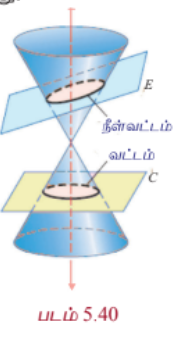
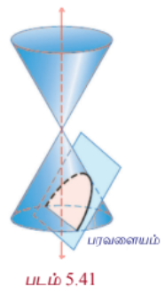
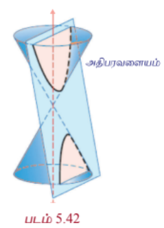
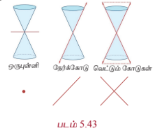

### 5.4 கூம்பு வெட்டு முகங்கள் (Conic Sections)

வளைவரைகளை தீர்மானிக்க பிரிவு 5.3-இல் விவரித்த முறைகளுடன் வடிவியல் முறையிலான கூம்பு வெட்டு முகங்களைப் பற்றி இங்கு காண்போம். ஓர் இரட்டைக் கூம்பை ஒரு தளத்தால் வெட்டும்போது வட்டம், நீள்வட்டம், பரவளையம், அதிபரவளையம் போன்ற வடிவங்களைப் பெறலாம். எனவே அந்த வடிவங்கள் கூம்பின் வெட்டு முக வடிவங்கள் அல்லது சுருக்கமாக கூம்பு வளைவரைகள் எனக்குறிக்கப்படுகின்றன.

---

### 5.4.1 கூம்பு வெட்டு முகங்களின் வடிவியல் விளக்கம்
### (Geometric description of conic section)

கூம்பின் அச்சுக்கு செங்குத்தான ஒரு தளம் (தளம் $C$) இரட்டைக் கூம்பின் ஒரு பகுதியை மட்டும் வெட்டும்போது **வட்டம்** (படம் 5.40) கிடைக்கின்றது. தளம் $E$, அச்சுக்கு செங்குத்தாக இல்லாமல் சற்று சாய்ந்த நிலையில் இரட்டைக் கூம்பின் ஒரே ஒரு பகுதியை மட்டும் வெட்டும்போது **நீள்வட்டம்** (படம் 5.40) கிடைக்கின்றது. இரட்டைக் கூம்பின் ஒரு கூம்பின் பக்கத்திற்கு இணையாக ஒரு தளம் வெட்டும்போது **பரவளையம்** (படம் 5.41) கிடைக்கின்றது. இரட்டைக் கூம்பின் அச்சுக்கு இணையாக ஒரு தளம் இரட்டைக் கூம்பின் இரு பகுதிகளையும் வெட்டும்போது **அதிபரவளையம்** (படம் 5.42) கிடைக்கின்றது.

| படம் 5.40 | படம் 5.41 | படம் 5.42 |
|---|---|---|
||||
---

### 5.4.2 சிதைந்த வடிவங்கள் (Degenerate Forms)

கூம்பு வளைவுகளின் சிதைந்த வடிவங்கள், (படம் 5.43) இரட்டைக் கூம்பை வெட்டும் தளத்தின் கோணம் மற்றும் அது முனை வழிச்செல்கிறதா என்பதைப் பொறுத்து, **புள்ளி, ஒரு நேர்க்கோடு, ஓர் இரட்டை நேர்க்கோடு, வெட்டும் கோடுகள் அல்லது வெற்றுக்கணமாக** இருக்கும். அல்லது தளம் உருளையின் அச்சுக்கு இணையாக இருக்கும்போது சிதைவு ஒரு உருளையாக இருக்கும். கூம்பு வளைவின் வெட்டுகின்ற தளம் இரட்டைக் கூம்பின் முனை வழியாகவும் அச்சுக்கு செங்குத்தாகவும் இருக்கும்போது ஒரு **புள்ளி** அல்லது **புள்ளிவட்டம்** கிடைக்கும்.

வெட்டுகின்ற தளம் கூம்பு உருவாக்கி வழியாகச் செல்லும்போது ஒரு **நேர்க்கோடு** அல்லது ஒரு **சோடி இணைகோடு** கிடைக்கின்றது. இது பரவளையத்தின் ஒரு சிதைந்த வடிவம் கூம்பின் பொதுச் சமன்பாட்டில் $A = B = C = 0$ எனும்போது கிடைக்கின்றது. மற்றும் வெட்டுகின்ற தளம் அச்சு வழியாகவும் இரட்டைக் கூம்பின் முனை வழியாகவும் செல்லும்போது அதிபரவளையத்தின் ஒரு சிதைந்த வடிவம் கிடைக்கின்றது.

---

### குறிப்புரை

நீள்வட்டத்தை ($0 < e < 1$) பொறுத்தவரை $e = \sqrt{1 - \frac{b^2}{a^2}}$, $e \rightarrow 0$ எனில் $\frac{b}{a} \rightarrow 1$ அதாவது $b \rightarrow a$ அல்லது நெட்டச்சு, குற்றச்சு நீளங்கள் சமம். அதாவது நீள்வட்டம் ஒரு **வட்டமாக** மாறுகின்றது. $e \rightarrow 1$ எனில் $\frac{b}{a} \rightarrow 0$ மற்றும் நீள்வட்டம் ஒரு **கோட்டுத்துண்டாக** மாறும். அதாவது நீள்வட்டம் தட்டையாக இருக்கும்.

---

### குறிப்புரை

அதிபரவளையத்தை ($e > 1$) பொறுத்தவரை $e = \sqrt{1 + \frac{b^2}{a^2}}$, $e \rightarrow 1$ எனில் $\frac{b}{a} \rightarrow 0$ அதாவது $e \rightarrow 1$ எனில் $b$-ன் மதிப்பு $a$-ஐப் பொறுத்தவரை மிகச்சிறிய மதிப்பு மற்றும் அதிபரவளையம் ஒரு **கூர்முனையாக** மாறும். $e \rightarrow \infty$ எனில் $a$-ஐப் பொறுத்து $b$ மிகப்பெரிய மதிப்பு மற்றும் அதிபரவளையம் **தட்டையாக** மாறும்.

---

### 5.4.3 கூம்பு வளைவின் பொதுச் சமன்பாடு $Ax^2 + Bxy + Cy^2 + Dx + Ey + F = 0$-லிருந்து கூம்புவளைவின் வடிவங்களை அடையாளம் காணல்

### (Identifying the conics from the general equation of the conic $Ax^2 + Bxy + Cy^2 + Dx + Ey + F = 0$)

இரண்டாம்படி சமன்பாட்டின் வரைபடம் பின்வரும் நிபந்தனைகளுக்கு ஏற்ப வட்டம், பரவளையம், நீள்வட்டம், அதிபரவளையம், ஒரு புள்ளி, வெற்றுக்கணம், ஒரு நேர்க்கோடு அல்லது ஒரு இரட்டை நேர்க்கோடாக இருக்கும்.

(1) $A = C \neq 0$, $B = 0$ மற்றும் $D = -2h$, $E = -2k$, $F = h^2 + k^2 - r^2$ எனில், பொதுச்சமன்பாடு $(x - h)^2 + (y - k)^2 = r^2$ எனக்கிடைக்கும். இது ஒரு **வட்டம்** ஆகும்.

(2) $B = 0$ மற்றும் $A$ அல்லது $C = 0$ எனில், பொதுச்சமன்பாடு நாம் படித்த ஏதேனும் ஒரு **பரவளையம்** ஆகும்.

(3) $A \neq C$ மற்றும் $A$ மற்றும் $C$ இரண்டும் ஒரே குறியாக இருப்பின் பொதுச் சமன்பாடு **நீள்வட்டத்தை**த் தரும்.

(4) $A \neq C$ மற்றும் $A$ மற்றும் $C$ இரண்டும் ஒன்றுக்கொன்று எதிர்குறியாக இருக்குமானால் பொதுச் சமன்பாடு **அதிபரவளையத்தை**த் தரும்.

(5) $A = C$ மற்றும் $B = D = E = F = 0$, எனில் பொதுச் சமன்பாடு $x^2 + y^2 = 0$ என்ற **புள்ளியாக** மாறும்.

(6) $A = C = F$ மற்றும் $B = D = E = 0$, எனில் பொதுச் சமன்பாடு $x^2 + y^2 + 1 = 0$ என்ற **வெற்றுக் கணத்தை**த் தரும்.

(7) $A \neq 0$ அல்லது $C \neq 0$ மற்றும் மற்ற கெழுக்கள் பூச்சியம் எனில் பொதுச் சமன்பாடு ஆய அச்சுகளின் சமன்பாட்டைத் தரும்.

(8) $A = -C$ மற்றும் மற்ற அனைத்து உறுப்புகளும் பூச்சியம் எனில் பொதுச் சமன்பாடு $x^2 - y^2 = 0$ என்ற **இரட்டை நேர்க்கோட்டை**த் தரும்.

---

### எடுத்துக்காட்டு 5.28

பின்வரும் சமன்பாடுகளிலிருந்து கூம்பு வளைவின் வகையைக் கண்டறிக:

(1) $16x^2 = 4y^2 - 64$

(2) $x^2 + y^2 = -4x - 4y + 4$

(3) $x^2 - y = 2x + 3$

(4) $4x^2 - 9y^2 - 16x + 18y - 29 = 0$

#### தீர்வு

| வினா எண் | சமன்பாடு | கட்டுப்பாடு | கூம்பு வளைவின் வகை |
|---|---|---|---|
| 1 | $16x^2 = 4y^2 - 64$ | 4 | அதிபரவளையம் |
| 2 | $x^2 + y^2 = -4x - 4y + 4$ | 1 | வட்டம் |
| 3 | $x^2 - y = 2x + 3$ | 2 | பரவளையம் |
| 4 | $4x^2 - 9y^2 - 16x + 18y - 29 = 0$ | 4 | அதிபரவளையம் |

---

### பயிற்சி 5.3

பின்வரும் சமன்பாடுகளிலிருந்து அவற்றின் கூம்பு வளைவு வகையை கண்டறிக.

1. $2x^2 - 7y^2 = 0$

2. $3x^2 + 3y^2 - 4x + 3y + 10 = 0$

3. $3x^2 + 2y^2 = 14$

4. $x^2 + y^2 + x - y = 0$

5. $11x^2 - 25y^2 - 44x + 50y - 256 = 0$

6. $y^2 + 4y + 3x + 4 = 0$