### 5.3. கூம்பு வளைவுகள் (Conics)

#### வரையறை 5.2

ஒரு தளத்தில் ஒரு நகரும் புள்ளியிலிருந்து நிலைப்புள்ளிக்கு உள்ள தூரத்திற்கும் நகரும் புள்ளியிலிருந்து நிலைப்புள்ளி வழிச்செல்லாத ஒரு நிலைக்கோட்டிற்குமான தூரத்திற்கும் உள்ள விகிதம் ஒரு மாறிலியாக இருக்குமாறு நகரும் எனில் அந்தப் புள்ளியின் நியமப்பாதை ஒரு கூம்பு வளைவு (வளைவரை) எனப்படும்.

நிலைப்புள்ளி **குவியம்** எனப்படும். நிலைக்கோடு **இயக்குவரை** எனப்படும் மற்றும் மாறாத விகிதம் **மையத் தொலைத்தகவு** எனப்படும். இது $e$ என குறிக்கப்படும்.

(i) இந்த மாறிலி $e = 1$ எனில் கூம்பு வளைவரை **பரவளையம்** எனப்படும்.

(ii) இந்த மாறிலி $e < 1$ எனில் கூம்பு வளைவரை **நீள்வட்டம்** எனப்படும்.

(iii) இந்த மாறிலி $e > 1$ எனில் கூம்பு வளைவரை **அதிபரவளையம்** எனப்படும்.

---

### 5.3.1 கூம்பு வளைவின் பொதுச் சமன்பாடு (The general equation of a Conic)

நிலைப்புள்ளி $S(x_1, y_1)$, நிலைக்கோடு $l$, $e$ மையத் தொலைத்தகவு மற்றும் $P(x, y)$ நகரும் புள்ளி என்க. கூம்பு வரையறையின்படி

$$\frac{SP}{PM} = \text{மாறிலி} = e,$$

... (1)

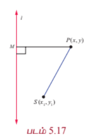

$$SP = \sqrt{(x - x_1)^2 + (y - y_1)^2}$$

$$PM = P(x, y)$$ -இலிருந்து நேர்க்கோடு

$$lx + my + n = 0$$ -க்கான செங்குத்து தூரம்

$$= \frac{|lx + my + n|}{\sqrt{l^2 + m^2}}.$$

மேலும் $$SP^2 = e^2 PM^2$$

$$\Rightarrow (x - x_1)^2 + (y - y_1)^2 = e^2 \left[\frac{lx + my + n}{l^2 + m^2}\right]^2.$$

மேற்கண்ட சமன்பாட்டை சுருக்க இருபடிச் சமன்பாட்டின் பொது வடிவம்

$$Ax^2 + Bxy + Cy^2 + Dx + Ey + F = 0$$

எனக்கிடைக்கும்.

இங்கு

$$A = 1 - \frac{e^2 l^2}{l^2 + m^2}, \quad B = -\frac{2e^2 lm}{l^2 + m^2}, \quad C = 1 - \frac{e^2 m^2}{l^2 + m^2}.$$

தற்போது

$$B^2 - 4AC = 4 - \frac{4e^2(l^2 + m^2)}{l^2 + m^2} = 4(1 - e^2).$$

இதிலிருந்து

(i) $B^2 - 4AC = 0 \iff e = 1$ எனவே கூம்பு வளைவு ஒரு **பரவளையம்**,

(ii) $B^2 - 4AC < 0 \iff 0 < e < 1$ எனவே கூம்பு வளைவு ஒரு **நீள்வட்டம்**,

(iii) $B^2 - 4AC > 0 \iff e > 1$ எனவே கூம்பு வளைவு ஒரு **அதிபரவளையம்**.

---

### 5.3.2 பரவளையம் (Parabola)

பரவளையத்தின் மையத்தொலைத்தகவு $e = 1$ என்பதால் ஒரு தளத்தில் குவியம் மற்றும் இயக்குவரைகளுக்கு சமதூரத்தில் இருக்குமாறு நகரும் ஒரு புள்ளியின் நியமப்பாதை பரவளையம் ஆகும்.

(i) **முனை $(0, 0)$ உள்ள பரவளைய சமன்பாட்டின் திட்ட வடிவம்** (Equation of a parabola in standard form with vertex at $(0, 0)$)

$S$ குவியம் எனவும் $l$ இயக்குவரை எனவும் கொள்க.

$l$ -க்கு செங்குத்தாக $S$ வழியே $SZ$ வரைக.

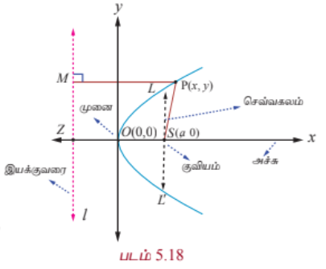

$SZ$ -ஐ $x$ -அச்சு எனவும் $SZ$ -ன் மையக்குத்துக்கோட்டை $y$ - அச்சு எனவும் கொள்க.

மையக்குத்துக்கோடு $SZ$ -ஐ சந்திக்கும் புள்ளி ஆதிப்புள்ளி $O$ என்க.

$SZ = 2a$ எனில், $S$ என்பது $(a, 0)$ மற்றும் இயக்குவரையின் சமன்பாடு $x + a = 0$ ஆகும்.

பரவளையத்தை தரும் நகரும் புள்ளி $P(x, y)$ என்க. இயக்குவரைக்கு செங்குத்தாக $PM$ வரைக.

பரவளைய வரையறையின்படி $e = \frac{SP}{PM} = 1$. அதாவது $SP^2 = PM^2$.

எனவே, $(x - a)^2 + y^2 = (x + a)^2$. இதை விரிவுபடுத்திச் சுருக்க

$$y^2 = 4ax$$

எனக் கிடைக்கின்றது.

இது பரவளையச்சமன்பாட்டின் திட்ட வடிவமாகும். பரவளையச்சமன்பாட்டின் மற்ற திட்டவடிவங்கள்

$$y^2 = -4ax, \quad x^2 = 4ay, \quad \text{மற்றும்} \quad x^2 = -4ay$$

ஆகும்.

### வரையறை 5.3

- இயக்குவரைக்கு செங்குத்தாகவும், குவியம் வழியாகவும் செல்லும் நேர்கோடு பரவளையத்தின் **அச்சு** எனப்படும்.

- பரவளையம் மற்றும் அதன் அச்சு வெட்டிக்கொள்ளும் புள்ளி பரவளையத்தின் **முனை** எனப்படும்.

- பரவளையத்தின் குவியம் வழியாகச் செல்லும் நாண் அப்பரவளையத்தின் **குவி நாண்** எனப்படும்.

- பரவளையத்தின் அச்சுக்கு செங்குத்தாக உள்ள குவிநாண் பரவளையத்தின் **செவ்வகலம்** ஆகும்.

---

### எடுத்துக்காட்டு 5.14

பரவளையம் $y^2 = 4ax$ -ன் செவ்வகல நீளம் காண்க.

#### தீர்வு

பரவளையத்தின் சமன்பாடு $y^2 = 4ax$.

செவ்வகலம் $LL'$ குவியம் $(a, 0)$ வழிச் செல்கின்றது. (படம் 5.18-ஐ பார்க்கவும்)

எனவே $L$ என்பது $(a, y_1)$ ஆகும்.

அதனால் $y_1^2 = 4a^2$.

எனவே $y_1 = \pm 2a$.

செவ்வகலத்தின் முனைப்புள்ளிகள் $(a, 2a)$ மற்றும் $(a, -2a)$ ஆகும்.

எனவே செவ்கலத்தின் நீளம் $LL' = 4a$.

### குறிப்புரை

பரவளையச் சமன்பாட்டின் திட்ட வடிவம் $y^2 = 4ax$ -க்கு முனை $(0, 0)$, அச்சு $x$ -அச்சு மற்றும் குவியம் $(a, 0)$ ஆக இருக்கும். பரவளையம் $y^2 = 4ax$ முழுவதுமாக $x$ -அச்சின் குறையற்ற பகுதியில் அமையும். $y^2 = 4ax$ -இல் $y$ -க்கு $-y$ பிரதியிட சமன்பாடு மாறாமல் இருக்கின்றது. எனவே பரவளையம் $y^2 = 4ax$, $x$ -அச்சுக்கு சமச்சீராக இருக்கும். அதாவது $y^2 = 4ax$ பரவளைத்தின் சமச்சீர் அச்சு $x$ -அச்சாகும்.

(ii) **$(h, k)$ -ஐ முனையாக உடைய பரவளையங்கள்** (Parabolas with vertex at $(h, k)$)

முனை $(h, k)$ மற்றும் அச்சு $x$ -அச்சுக்கு இணை எனில் பரவளையத்தின் சமன்பாடு

$$(y - k)^2 = 4a(x - h) \quad \text{அல்லது} \quad (y - k)^2 = -4a(x - h)$$

என இருக்கும் (படம் 5.19, 5.20).

முனை $(h, k)$ மற்றும் அச்சு $y$ -அச்சுக்கு இணை எனில் பரவளையத்தின் சமன்பாடு

$$(x - h)^2 = 4a(y - k) \quad \text{அல்லது} \quad (x - h)^2 = -4a(y - k)$$

(படம் 5.21, 5.22).

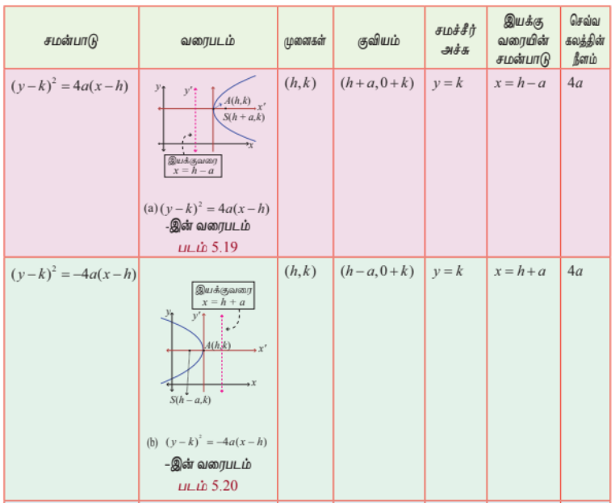

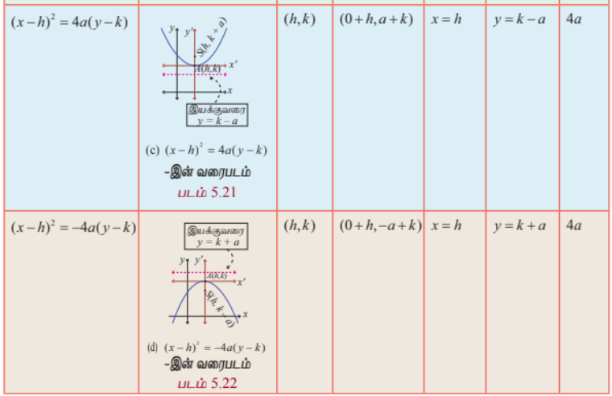

### 5.3.3 நீள்வட்டம் (Ellipse)

ஒரு தளத்தில், ஒரு நகரும் புள்ளிக்கும் குவியத்திற்கும் உள்ள தூரம் அந்த நகரும் புள்ளிக்கும் இயக்குவரைக்கும் உள்ள தூரத்தைவிடக் குறைவாக $e$ என்ற மாறாத விகிதமுடையதாக ($0 < e < 1$) இருப்பின் அந்த நகரும் புள்ளியின் நியமப்பாதை ஓர் **நீள்வட்டம்** ஆகும்.

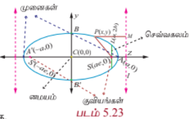

(i) **மையம் $(0, 0)$ உடைய நீள்வட்டச் சமன்பாட்டின் திட்ட வடிவம்**

குவியம் $S$, இயக்குவரை $l$, மையத் தொலைத்தகவு $e$ ($0 < e < 1$) மற்றும் நகரும் புள்ளி $P(x, y)$ என்க.

இயக்குவரை $l$ -க்குச் செங்குத்தாக $SZ$ மற்றும் $PM$ வரைக.

$A$ மற்றும் $A'$ என்ற புள்ளிகள் முறையே $SZ$ -ஐ உட்புறமாகவும் வெளிப்புறமாகவும் $e:1$ என்ற விகிதத்தில் பிரிக்கின்றன என்க. $AA' = 2a$ என்க. $AA'$ -ன் மையக்குத்துக்கோடு $AA'$ -ஐ $C$ -இல் வெட்டுகின்றது என்க.

$C$ -ஐ மையமாகவும் $CZ$ -இன் நீட்சியை $x$ -அச்சாகவும், $AA'$ -இன் மையக் குத்துக்கோட்டை $y$ -அச்சாகவும் கொள்க. அதனால் $CA = a$ மற்றும் $CA' = a$ ஆகும்.

வரையறையின்படி

$$\frac{SA}{AZ} = e \quad \text{மற்றும்} \quad \frac{SA'}{A'Z} = e$$

$$SA = eAZ \quad \text{மற்றும்} \quad SA' = eA'Z$$

$$CA - CS = e(CZ - CA) \quad \text{மற்றும்} \quad CA' + CS = e(A'C + CZ)$$

$$a - CS = e(CZ - a) \tag{1}$$

$$a + CS = e(a + CZ) \tag{2}$$

(2) + (1) இதிலிருந்து $CZ = \frac{a}{e}$ மற்றும் (2) - (1) இதிலிருந்து $CS = ae$ எனக்கிடைக்கும்.

எனவே $M$ என்பது $\left(\frac{a}{e}, y\right)$ மற்றும் $S$ என்பது $(ae, 0)$ ஆக இருக்கும்.

வரையறையின்படி

$$\frac{SP}{PM} = e \quad \text{அல்லது} \quad SP^2 = e^2 PM^2$$

$$\Rightarrow (x - ae)^2 + (y - 0)^2 = e^2 \left(x - \frac{a}{e}\right)^2$$

இதைச்சுருக்க

$$\frac{x^2}{a^2} + \frac{y^2}{a^2(1 - e^2)} = 1.$$

$1 - e^2$ மிகை மதிப்பு எனவே, $b^2 = a^2(1 - e^2)$ எனவும் $a^2 e^2 = a^2 - b^2$ எனக்கொண்டால்

இப்போது $P$ -ன் நியமப்பாதை

$$\frac{x^2}{a^2} + \frac{y^2}{b^2} = 1$$

எனக்கிடைக்கும். இது நீள்வட்டச் சமன்பாட்டின் திட்டவடிவம் ஆகும். மேலும் வளைவரை $x, y$ அச்சுகளுக்கு சமச்சீராக உள்ளதைக் கவனிக்கவும்.

### வரையறை 5.4

(1) கோட்டுத்துண்டு $AA'$ என்பது **நெட்டச்சு** மற்றும் அதன் நீளம் $2a$ ஆகும்.

(2) கோட்டுத்துண்டு $BB'$ என்பது **குற்றச்சு** மற்றும் அதன் நீளம் $2b$ ஆகும்.

(3) கோட்டுத்துண்டு $CA =$ கோட்டுத்துண்டு $CA' =$ **அரை நெட்டச்சு** $= a$ மற்றும் கோட்டுத்துண்டு $CB =$ கோட்டுத்துண்டு $CB' =$ **அரை குற்றச்சு** $= b$.

(4) சமச்சீர் தன்மையினால் குவியம் $S'(-ae, 0)$ மற்றும் இயக்குவரை $l'$, $x = -\frac{a}{e}$ எடுத்துக்கொண்டாலும் அதே நீள்வட்டம் கிடைக்கும்.

இதன் மூலம் நீள்வட்டத்திற்கு $S(ae, 0)$ மற்றும் $S'(-ae, 0)$ என இரு குவியங்களும் $A(a, 0)$ மற்றும் $A'(-a, 0)$ என இரு முனைகளும், $x = \frac{a}{e}$ மற்றும் $x = -\frac{a}{e}$ என இரு இயக்குவரைகளும் உண்டு.

### எடுத்துக்காட்டு 5.15

நீள்வட்டம் $\frac{x^2}{a^2} + \frac{y^2}{b^2} = 1$ -ன் செவ்வகல நீளம் காண்க.

### தீர்வு

$\frac{x^2}{a^2} + \frac{y^2}{b^2} = 1$ என்ற நீள்வட்டத்தின் செவ்வகலம் $LL'$ (படம் 5.22) $S(ae, 0)$ வழிச்செல்கின்றது.

எனவே, $L(ae, y_1)$ நீள்வட்டத்தின் மீதுள்ளது.

அதனால்,

$$\frac{a^2 e^2}{a^2} + \frac{y_1^2}{b^2} = 1$$

$$\frac{y_1^2}{b^2} = 1 - e^2$$

$$y_1^2 = b^2(1 - e^2)$$

$$= b^2\left(1 - \frac{b^2}{a^2}\right) \quad \left(\because e^2 = 1 - \frac{b^2}{a^2}\right)$$

$$y_1 = \pm \frac{b^2}{a}.$$

அதாவது செவ்வகலத்தின் முனைப்புள்ளிகள் $L$ மற்றும் $L'$ முறையே $\left(ae, \frac{b^2}{a}\right)$ மற்றும் $\left(ae, -\frac{b^2}{a}\right)$ ஆகும்.

செவ்வகலத்தின் நீளம்

$$LL' = \frac{2b^2}{a}.$$

---

(ii) **மையம் $(h, k)$ உடைய நீள்வட்டத்தின் வகைகள்** (Types of ellipses with centre at $(h, k)$)

**(அ) நெட்டச்சு $x$-அச்சுக்கு இணை** (Major axis parallel to the x-axis)

நீள்வட்டத்தின் சமன்பாடு (படம் 5.24)

$$\frac{(x - h)^2}{a^2} + \frac{(y - k)^2}{b^2} = 1, \quad a > b.$$

நெட்டச்சின் நீளம் $2a$ மற்றும் குற்றச்சின் நீளம் $2b$ ஆகும். முனைப்புள்ளிகள் $(h + a, k)$ மற்றும் $(h - a, k)$, மேலும் குவியங்கள் $(h + c, k)$ மற்றும் $(h - c, k)$ ஆக இருக்கும். இங்கு $c^2 = a^2 - b^2$.

**(ஆ) நெட்டச்சு $y$-அச்சுக்கு இணை** (Major axis parallel to the y-axis)

நீள்வட்டத்தின் சமன்பாடு (படம் 5.25)

$$\frac{(x - h)^2}{b^2} + \frac{(y - k)^2}{a^2} = 1, \quad a > b.$$

நெட்டச்சின் நீளம் $2a$, குற்றச்சின் நீளம் $2b$ ஆகும். முனைப்புள்ளிகள் $(h, k + a)$ மற்றும் $(h, k - a)$ மேலும் குவியங்கள் $(h, k + c)$ மற்றும் $(h, k - c)$ ஆக இருக்கும். இங்கு $c^2 = a^2 - b^2$.

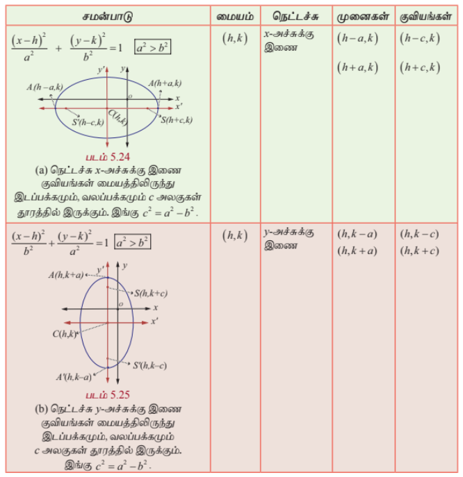

### தேற்றம் 5.5

நீள்வட்டத்தின் மீதுள்ள ஏதேனும் ஒரு புள்ளியின் குவித்தொலைவுகளின் கூடுதல் அதன் நெட்டச்சின் நீளத்திற்குச் சமம்.

#### நிரூபணம்

$P(x, y)$ என்பது நீள்வட்டம் $\frac{x^2}{a^2} + \frac{y^2}{b^2} = 1$-ன் மீதுள்ள ஏதேனும் ஒரு புள்ளி என்க.

$P$ -ன் வழியாக $l, l'$ இயக்குவரைகளுக்கு செங்குத்தாக $MM'$ வரைக.

$x$ -அச்சுக்கு செங்குத்தாக $PN$ வரைக.

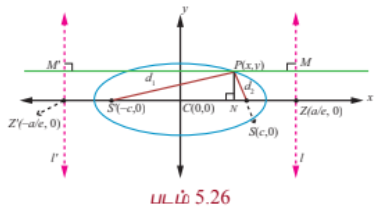

வரையறையிலிருந்து

$$SP = ePM$$

$$= eNZ$$

$$= e(CZ - CN)$$

$$= e\left(\frac{a}{e} - x\right) = a - ex$$

... (1)

$$SP' = ePM'$$

$$= e(CN + CZ')$$

$$= e\left(x + \frac{a}{e}\right) = ex + a$$

... (2)

$$SP + SP' = (a - ex) + (ex + a) = 2a$$

### குறிப்புரை

$b = a$ ஆக இருக்கும்போது $\frac{(x - h)^2}{a^2} + \frac{(y - k)^2}{b^2} = 1$ என்ற சமன்பாடு

$$(x - h)^2 + (y - k)^2 = a^2$$

என மாறும். இது மையம் $(h, k)$ மற்றும் ஆரம் $a$ உடைய வட்டத்தின் சமன்பாடு ஆகும்.

$b = a$ ஆக இருக்கும்போது $e = \sqrt{1 - \frac{a^2}{a^2}} = 0$. எனவே வட்டத்தின் மையத்தொலைத்தகவு பூச்சியம்.

$$\frac{SP}{PM} = 0 \Rightarrow PM \rightarrow \infty.$$

அதாவது வட்டத்தின் இயக்குவரை (முடிவிலியில்) கந்தழியில் உள்ளது எனலாம்.

### குறிப்புரை

ஒரு நீள்வட்டத்தின் நெட்டச்சை விட்டமாகக் கொண்ட வட்டம் **துணைவட்டம்** அல்லது **சுற்றுவட்டம்** எனப்படும். மேலும் குற்றச்சை விட்டமாகக் கொண்ட வட்டம் **உள்வட்டம்** எனப்படும். அவற்றின் சமன்பாடுகள் முறையே $x^2 + y^2 = a^2$ மற்றும் $x^2 + y^2 = b^2$ ஆகும்.

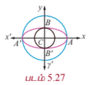

---

### 5.3.4 அதிபரவளையம் (Hyperbola)

ஒரு தளத்தில், ஒரு நகரும் புள்ளிக்கும் குவியத்திற்கும் உள்ள தூரம் அந்த நகரும் புள்ளிக்கும் இயக்குவரைக்கும் உள்ள தூரத்தைவிட அதிகமாக, $e$ ($e > 1$) என்ற மாறாத விகிதம் உடையதாக இருப்பின் அந்த நகரும் புள்ளியின் நியமப்பாதை ஓர் **அதிபரவளையம்** ஆகும்.

(i) **மையம் $(0, 0)$ உடைய நீள்வட்டச் சமன்பாட்டின் திட்ட வடிவம்**

$A$ மற்றும் $A'$ என்ற புள்ளிகள் முறையே $SZ$ -ஐ உட்புறமாகவும் வெளிப்புறமாகவும் $e:1$ என்ற விகிதத்தில் பிரிக்கின்றன என்க. $AA' = 2a$ என்க. $AA'$ -ன் மையக்குத்துக்கோடு $AA'$ -ஐ $C$ -இல் வெட்டுகின்றது என்க. $C$ -ஐ மையமாகவும் $CZ$ -இன் நீட்சியை $x$ -அச்சாகவும், $AA'$ -இன் மையக் குத்துக்கோட்டை $y$ -அச்சாகவும் கொள்க. அதனால் $CA = a$ மற்றும் $CA' = a$ ஆகும்.

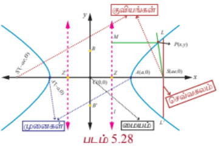

வரையறையின்படி

$$\frac{AS}{AZ} = e \quad \text{மற்றும்} \quad \frac{A'S}{A'Z} = e$$

ஆகும்.

$$\Rightarrow AS = eAZ \quad \text{மற்றும்} \quad A'S = eA'Z$$

$$\Rightarrow CS - CA = e(CA - CZ) \quad \text{மற்றும்} \quad CA' + CS = e(A'C + CZ)$$

$$\Rightarrow CS - a = e(a - CZ) \tag{1}$$

$$a + CS = e(a + CZ) \tag{2}$$

(1)+(2) -இலிருந்து $CS = ae$ மற்றும் (2)-(1) -இலிருந்து $CZ = \frac{a}{e}$ என கிடைக்கும்.

எனவே, $S$ -ன் ஆயத்தொலைகள் $(ae, 0)$. $PM = x - \frac{a}{e}$, மற்றும் இயக்குவரையின் சமன்பாடு $x - \frac{a}{e} = 0$ எனக்கிடைக்கும். $P(x, y)$ அதிபரவளையத்தின் மீதுள்ள புள்ளி என்க.

கூம்பு வளைவின் வரையறைப்படி,

$$\frac{SP}{PM} = e \quad \text{அல்லது} \quad SP^2 = e^2 PM^2.$$

அதனால்

$$(x - ae)^2 + (y - 0)^2 = e^2\left(x - \frac{a}{e}\right)^2$$

$$\Rightarrow (x - ae)^2 + y^2 = (ex - a)^2$$

$$\Rightarrow (e^2 - 1)x^2 - y^2 = a^2(e^2 - 1)$$

$$\Rightarrow \frac{x^2}{a^2} - \frac{y^2}{a^2(e^2 - 1)} = 1$$

இங்கு $a^2(e^2 - 1) = b^2$ எனப்பிரதியிட $P$ -ன் நியமப்பாதை

$$\frac{x^2}{a^2} - \frac{y^2}{b^2} = 1$$

எனக்கிடைக்கும். இந்த அதிபரவளையச் சமன்பாட்டின் திட்ட வடிவம். இங்கு $ae = c$ என எடுக்க,

$$c^2 = a^2 + b^2$$

எனக்கிடைக்கும். இந்த அதிபரவளையம் $x$ மற்றும் $y$-அச்சுகளுக்கு சமச்சீராக உள்ளதைக் காணலாம்.

### வரையறை 5.5

(1) கோட்டுத்துண்டு $AA'$ என்பது **குறுக்கச்சு** மற்றும் அதன் நீளம் $2a$ ஆகும்.

(2) கோட்டுத்துண்டு $BB'$ என்பது **துணையச்சு** மற்றும் அதன் நீளம் $2b$ ஆகும்.

(3) கோட்டுத்துண்டு $CA =$ கோட்டுத்துண்டு $CA' =$ **அரைக்குறுக்கச்சு** $= a$ மற்றும் கோட்டுத்துண்டு $CB =$ கோட்டுத்துண்டு $CB' =$ **அரைத்துணையச்சு** $= b$ ஆகும்.

(4) சமச்சீர் தன்மையினால் குவியம் $S'(-ae, 0)$ மற்றும் இயக்குவரை $l'$, $x = -\frac{a}{e}$ என எடுத்துக்கொண்டாலும் அதே அதிபரவளையம் கிடைக்கும். இதன் மூலம் அதிபரவளையத்திற்கு $S(ae, 0)$ மற்றும் $S'(-ae, 0)$ என இரு குவியங்களும் $A(a, 0)$ மற்றும் $A'(-a, 0)$ என இரு முனைகளும், $x = \frac{a}{e}$ மற்றும் $x = -\frac{a}{e}$ என இரு இயக்குவரைகளும் உள்ளதைக் காணலாம்.

அதிபரவளையத்தின் செவ்வகலத்தின் நீளம் $\frac{2b^2}{a}$, என நீள்வட்டத்தில் பெற்றதுபோல பெறலாம்.

### தொலைத்தொடுகோடுகள் (Asymptotes)

$P(x, y)$ என்பது $y = f(x)$ என வரையறுக்கப்பட்ட வளைவரையின் மீதுள்ள புள்ளி என்க. $P$ என்ற புள்ளிக்கும் ஏதேனும் ஒரு நிலைக்கோட்டிற்குமான தூரம் பூச்சியத்தை நெருங்குமாறு $P$ என்ற புள்ளி ஆதிப்புள்ளியை விட்டு மேலும் மேலும் விலகிச் செல்லுமானால் அந்த நிலைக்கோடு வளைவரையின் **தொலைத்தொடுகோடு** எனப்படும்.

அதிபரவளையத்திற்கு தொலைத்தொடுகோடுகள் உண்டு. அதே சமயம் பரவளையத்திற்கும், நீள்வட்டத்திற்கும் தொலைத்தொடுகோடுகள் இல்லை.

(ii) **$(h, k)$ -ஐ முனையாக உடைய அதிபரவளையங்கள்** (Types of Hyperbola with centre at $(h, k)$)

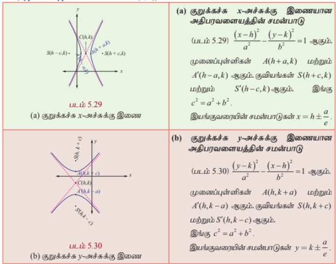
---

### குறிப்புரை

(1) அதிபரவளையத்தின் குறுக்கச்சை விட்டமாகக்கொண்டு வரையப்படும் வட்டம் அதிபரவளையத்தின் **துணைவட்டம்** எனப்படும். அதன் சமன்பாடு $x^2 + y^2 = a^2$.

(2) அதிபரவளையத்தின் மீதுள்ள ஒரு புள்ளிக்கும் குவியங்களுக்கும் இடையேயான தூரங்களின் வித்தியாசத்தின் மட்டு மதிப்பு குறுக்கச்சின் நீளத்திற்குச் சமம். அதாவது $||PS - PS'|| = 2a$. (இதை நீள்வட்டத்திற்கான நிரூபணம் போன்று நிறுவலாம்.)

இதுவரை நாம் பரவளையத்தின் நான்கு திட்டவடிவங்களையும், நீள்வட்டத்தின் இரு திட்டவடிவங்களையும், அதிபரவளையத்தின் இரு திட்டவடிவங்களையும் பற்றி படித்தோம். இவற்றைத் தவிர இந்த திட்ட வடிவங்களில் வகைப்படுத்த முடியாத பல வகையான, பரவளையங்கள், நீள்வட்டங்கள் மற்றும் அதிபரவளையங்களும் உள்ளன. எடுத்துக்காட்டாக பின்வரும் பரவளையம், நீள்வட்டம், அதிபரவளையம் ஆகியவற்றைக் கருத்தில் கொள்க.

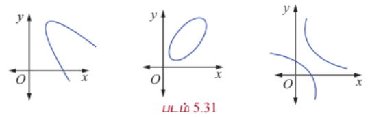

ஆனால் மேற்கண்ட வளைவரைகளை சரியான அச்சின் இடப்பெயர்ச்சி மூலம் திட்டவடிவங்களுக்கு மாற்றலாம்.

### எடுத்துக்காட்டு 5.16

குவியம் $(-2, 0)$ மற்றும் இயக்குவரை $x = 2$ உடைய பரவளையத்தின் சமன்பாடு காண்க.

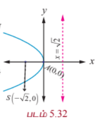

#### தீர்வு

பரவளையம் இடப்பக்கம் திறப்புடையது மற்றும் சமச்சீர் அச்சு $x$ -அச்சாகவும் முனை $(0, 0)$ ஆகவும் இருக்கும்.

எனவே தேவையான பரவளையத்தின் சமன்பாடு

$$(y - 0)^2 = -4(2)(x - 0)$$

$$\Rightarrow y^2 = -8x.$$

---

### எடுத்துக்காட்டு 5.17

முனை $(5, -2)$ மற்றும் குவியம் $(2, -2)$ உடைய பரவளையத்தின் சமன்பாடு காண்க.

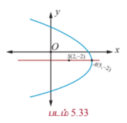

#### தீர்வு

கொடுக்கப்பட்டவைகள் முனை $A(5, -2)$ மற்றும் குவியம் $S(2, -2)$,

குவியதூரம் $AS = a = 3$.

பரவளையத்தின் சமச்சீர் அச்சு $x$ -அச்சுக்கு இணை மற்றும் பரவளையம் இடப்பக்கம் திறப்புடையது.

தேவையான பரவளையத்தின் சமன்பாடு

$$(y + 2)^2 = -4(3)(x - 5)$$

$$\Rightarrow y^2 + 4y + 4 = -12x + 60$$

$$\Rightarrow y^2 + 4y + 12x - 56 = 0.$$

---

### எடுத்துக்காட்டு 5.18

முனை $(-1, -2)$, அச்சு $y$ -அச்சுக்கு இணை மற்றும் $(3, 6)$ வழிச்செல்லும் பரவளையத்தின் சமன்பாடு காண்க.

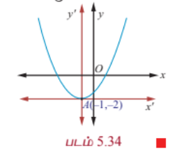

#### தீர்வு

அச்சு $y$ -அச்சுக்கு இணை என்பதால் தேவையான பரவளையத்தின் சமன்பாடு

$$(x + 1)^2 = 4a(y + 2).$$

இது $(3, 6)$ வழிச்செல்வதால்

$$(3 + 1)^2 = 4a(6 + 2)$$

$$16 = 32a \Rightarrow a = \frac{1}{2}.$$

எனவே பரவளையத்தின் சமன்பாடு

$$(x + 1)^2 = 2(y + 2)$$

இதைச்சுருக்க

$$x^2 + 2x - 2y - 3 = 0$$

எனக்கிடைக்கும்.

---

### எடுத்துக்காட்டு 5.19

$x^2 - 4x - 5y - 1 = 0$ என்ற பரவளையத்தின் முனை, குவியம், இயக்குவரை மற்றும் செவ்வகல நீளம் ஆகியவற்றைக் காண்க.

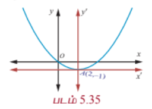

#### தீர்வு

பரவளையத்தின் சமன்பாடு

$$x^2 - 4x - 5y - 1 = 0$$

$$\Rightarrow x^2 - 4x = 5y + 1$$

$$\Rightarrow x^2 - 4x + 4 = 5y + 5$$

$$(x - 2)^2 = 5(y + 1)$$

இது திட்ட வடிவம் ஆகும்.

எனவே, $4a = 5$ மற்றும் முனை $(2, -1)$,

குவியம் $\left(2, -1 + \frac{5}{4}\right) = \left(2, \frac{1}{4}\right)$.

இயக்குவரையின் சமன்பாடு

$$y - k + a = 0$$

$$y + 1 + \frac{5}{4} = 0$$

$$4y + 9 = 0.$$

செவ்வகலத்தின் நீளம் $5$ அலகுகள்.

---

### எடுத்துக்காட்டு 5.20

குவியங்கள் $(\pm 2, 0)$, மற்றும் முனைகள் $(\pm 3, 0)$ உடைய நீள்வட்டத்தின் சமன்பாடு காண்க.

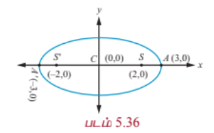

#### தீர்வு

படம் 5.36லிருந்து

$$SS' = 2c \quad \text{மற்றும்} \quad 2c = 4; \quad AA' = 2a = 6$$

$$\Rightarrow c = 2 \quad \text{மற்றும்} \quad a = 3,$$

$$\Rightarrow b^2 = a^2 - c^2 = 9 - 4 = 5.$$

நெட்டச்சு $x$ -அச்சு, $a > b$.

மையம் $(0, 0)$ மற்றும் குவியம் $(\pm 2, 0)$.

எனவே நீள்வட்டத்தின் சமன்பாடు

$$\frac{x^2}{9} + \frac{y^2}{5} = 1.$$

---

### எடுத்துக்காட்டு 5.21

மையத்தொலைத்தகவு $\frac{1}{2}$, குவியங்களில் ஒன்று $(2, 3)$ மற்றும் ஒரு இயக்குவரை $x = 7$ உடைய நீள்வட்டத்தின் சமன்பாடு காண்க. மேலும் நெட்டச்சு, குற்றச்சு நீளங்களைக் காண்க.

#### தீர்வு

கூம்பு வளைவின் வரையறைப்படி

$$\frac{SP}{PM} = e \quad \text{அல்லது} \quad SP^2 = e^2 PM^2.$$

இதனால்,

$$(x - 2)^2 + (y - 3)^2 = \frac{1}{4}(x - 7)^2$$

$$\Rightarrow 3x^2 + 4y^2 - 2x - 24y + 43 = 0,$$

இதைப்பின்வருமாறு எழுதலாம்

$$\Rightarrow 3\left(x - \frac{1}{3}\right)^2 + 4(y - 3)^2 = 3\left(\frac{1}{9}\right) + 4(9) - 43 = \frac{100}{3}.$$

$$\Rightarrow \frac{\left(x - \frac{1}{3}\right)^2}{\frac{100}{9}} + \frac{(y - 3)^2}{\frac{100}{12}} = 1$$

இது திட்டவடிவம் ஆகும்.

எனவே நெட்டச்சின் நீளம் $= 2a = 2\sqrt{\frac{100}{9}} = \frac{20}{3}$ மற்றும்

குற்றச்சின் நீளம் $= 2b = 2\sqrt{\frac{100}{12}} = \frac{10}{\sqrt{3}}$.

---

### எடுத்துக்காட்டு 5.22

$4x^2 + 36y^2 + 40x - 288y + 532 = 0$ என்ற கூம்பு வளைவின் குவியங்கள், முனைகள் மற்றும் அதன் நெட்டச்சு, குற்றச்சு நீளங்களைக் காண்க.

#### தீர்வு

$x$ மற்றும் $y$ மதிப்புகளை முழுவர்க்கமாக்க

$$4(x^2 + 10x + 25) + 36(y^2 - 8y + 16) = -532 + 100 + 576$$

இலிருந்து

$$4(x + 5)^2 + 36(y - 4)^2 = 144.$$

இருபுறமும் 144 -ஆல் வகுக்க சமன்பாடு

$$\frac{(x + 5)^2}{36} + \frac{(y - 4)^2}{4} = 1.$$

இது மையம் $(-5, 4)$, மற்றும் நெட்டச்சு $x$ -அச்சுக்கு இணையான நீள்வட்டம். இதன் அரை நெட்டச்சின் நீளம் $6$ மற்றும் குற்றச்சின் நீளம் $2$. முனைகள் $(-5 \pm 6, 4)$ அதாவது $(1, 4)$ மற்றும் $(-11, 4)$.

தற்போது, $c^2 = a^2 - b^2 = 36 - 4 = 32$

மற்றும் $c = \pm 4\sqrt{2}$.

எனவே குவியங்கள் $(-5 \pm 4\sqrt{2}, 4)$.

நெட்டச்சின் நீளம் $= 2a = 12$ அலகுகள் மற்றும்

குற்றச்சின் நீளம் $= 2b = 4$ அலகுகள்.

---

### எடுத்துக்காட்டு 5.23

$4x^2 + y^2 + 24x - 2y + 21 = 0$ என்ற நீள்வட்டத்தின் மையம், முனைகள் மற்றும் குவியங்கள் காண்க. மேலும் செவ்வகல நீளம் $2$ என நிறுவுக.

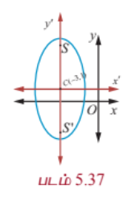

#### தீர்வு

உறுப்புகளை வரிசைப்படுத்தி எழுத நீள்வட்டத்தின் சமன்பாடு

$$4x^2 + 24x + y^2 - 2y + 21 = 0$$

அதாவது,

$$4(x^2 + 6x + 9) + (y^2 - 2y + 1) - 36 - 1 + 21 = 0,$$

$$4(x + 3)^2 + (y - 1)^2 = 16,$$

$$\frac{(x + 3)^2}{4} + \frac{(y - 1)^2}{16} = 1.$$

மையம் $(-3, 1)$, $a = 4, b = 2$, மற்றும் நெட்டச்சு $y$ -அச்சுக்கு இணை

$$c^2 = 16 - 4 = 12$$

$$c = \pm 2\sqrt{3}.$$

எனவே குவியங்கள் $(-3, 1 \pm 2\sqrt{3})$ மற்றும்

முனைகள் $(-3, 1 \pm 4)$, அதாவது $(-3, 5)$ மற்றும் $(-3, -3)$, மற்றும்

செவ்வகல நீளம் $= \frac{2b^2}{a} = \frac{2(4)}{4} = 2$ அலகுகள்.

---

### எடுத்துக்காட்டு 5.24

முனைகள் $(0, \pm 4)$ மற்றும் குவியங்கள் $(0, \pm 6)$ உள்ள அதிபரவளையத்தின் சமன்பாடு காண்க.

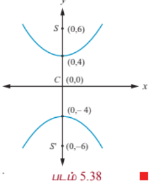

#### தீர்வு

குவியங்களின் நடுப்புள்ளி மையம் $C(0, 0)$ (படம் 5.38)

குறுக்கச்சு $y$ -அச்சு

$$AA' = 2a \Rightarrow 2a = 8,$$

$$SS' = 2c \Rightarrow 2c = 12,$$

$$a = 4, \quad c = 6$$

$$b^2 = c^2 - a^2 = 36 - 16 = 20.$$

எனவே தேவையான அதிபரவளையத்தின் சமன்பாடு

$$\frac{y^2}{16} - \frac{x^2}{20} = 1.$$

---

### எடுத்துக்காட்டு 5.25

$9x^2 - 16y^2 = 144$ என்ற அதிபரவளையத்தின் முனைகள், குவியங்கள் காண்க.

#### தீர்வு

$9x^2 - 16y^2 = 144$ என்ற சமன்பாட்டைத் திட்டவடிவில் மாற்ற

$$\frac{x^2}{16} - \frac{y^2}{9} = 1$$

எனக்கிடைக்கும்.

குறுக்கச்சு $x$ -அச்சு, முனைகள் $(-4, 0)$ மற்றும் $(4, 0)$;

மற்றும் $c^2 = a^2 + b^2 = 16 + 9 = 25$, $c = 5$.

எனவே குவியங்கள் $(-5, 0)$ மற்றும் $(5, 0)$.

---

### எடுத்துக்காட்டு 5.26

$11x^2 - 25y^2 - 44x + 50y - 256 = 0$ என்ற அதிபரவளையத்தின் மையம், குவியங்கள் மற்றும் மையத்தொலைத்தகவு காண்க.

#### தீர்வு

சமன்பாட்டின் உறுப்புகளை வரிசைப்படுத்தி அதிபரவளையத்தின் திட்டவடிவமாக மாற்ற

$$11(x^2 - 4x) - 25(y^2 - 2y) - 256 = 0$$

$$11(x - 2)^2 - 25(y - 1)^2 = 256 + 44 - 25$$

$$11(x - 2)^2 - 25(y - 1)^2 = 275$$

$$\frac{(x - 2)^2}{25} - \frac{(y - 1)^2}{11} = 1.$$

மையம் $(2, 1)$, $a^2 = 25$, $b^2 = 11$

$$c^2 = a^2 + b^2 = 25 + 11 = 36$$

எனவே, $c = \pm 6$

$$e = \frac{c}{a} = \frac{6}{5}$$

மற்றும் குவியங்கள் $(2 \pm 6, 1)$ அதாவது $(8, 1)$ மற்றும் $(-4, 1)$.

---

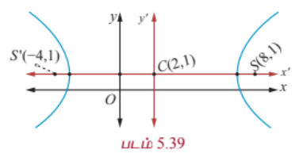

### எடுத்துக்காட்டு 5.27

ஹாலேயின் வால் நட்சத்திர சுற்றுப்பாதை, (படம் 5.51) $36.18$ விண்வெளி அலகு நீளமும் $9.12$ விண்வெளி அலகுகள் அகலமும் கொண்ட நீள்வட்டம். அந்த நீள்வட்டத்தின் மையத்தொலைத்தகவு காண்க.

#### தீர்வு

$2a = 36.18$, $2b = 9.12$, எனத் தரப்பட்டுள்ளது.

இதிலிருந்து

$$e = \sqrt{1 - \frac{b^2}{a^2}} = \frac{\sqrt{a^2 - b^2}}{a}$$

$$= \frac{\sqrt{(18.09)^2 - (4.56)^2}}{18.09}$$

$$e = \frac{\sqrt{327.2481 - 20.7936}}{18.09} \approx 0.97.$$

### குறிப்பு

ஒரு விண்வெளி அலகு (சூரியனுக்கும் பூமிக்கும் இடையேயுள்ள தூரத்தின் சராசரி) என்பது $149,597,870$ கி.மீ, பூமியின் சுற்றுப்பாதையின் அரைநெட்டச்சு.

---

### பயிற்சி 5.2

1. பின்வரும் ஒவ்வொன்றிற்கும் பரவளையத்தின் சமன்பாடு காண்க:

   (i) குவியம் $(4, 0)$ மற்றும் இயக்குவரை $x = -4$.

   (ii) $y$ -அச்சுக்கு சமச்சீரானது மற்றும் $(2, -3)$ வழிச்செல்வது.

   (iii) முனை $(1, -2)$ மற்றும் குவியம் $(4, -2)$.

   (iv) செவ்வகலத்தின் முனைகள் $(4, -8)$ மற்றும் $(4, 8)$.

2. பின்வரும் ஒவ்வொன்றிற்குமான நீள்வட்டத்தின் சமன்பாடு காண்க:

   (i) குவியங்கள் $(\pm 3, 0)$ மற்றும் $e = \frac{1}{2}$

   (ii) குவியங்கள் $(0, \pm 4)$ மற்றும் நெட்டச்சின் முனைகள் $(0, \pm 5)$.

   (iii) செவ்வகல நீளம் 8, $e = \frac{3}{5}$, மையம் $(0,0)$ மற்றும் நெட்டச்சு $x$ -அச்சு.

   (iv) செவ்வகல நீளம் 4, குவியங்களுக்கிடையேயான தூரம் $4\sqrt{2}$, மையம் $(0,0)$ மற்றும் நெட்டச்சு $y$ - அச்சு.

3. பின்வரும் ஒவ்வொன்றிற்குமான அதிபரவளையத்தின் சமன்பாடு காண்க:

   (i) குவியங்கள் $(\pm 2, 0)$, $e = \frac{3}{2}$.

   (ii) மையம் $(2, 1)$, ஒரு குவியம் $(8, 1)$ மற்றும் இதற்கொத்த இயக்குவரை $x = 4$.

   (iii) $(5, -2)$ வழிச்செல்வது மற்றும் குறுக்கச்சின் நீளம் 8 அலகுகள், குறுக்கச்சு $x$ -அச்சு.

4. பின்வருவனவற்றிற்கான முனை, குவியம், இயக்குவரையின் சமன்பாடு மற்றும் செவ்வகல நீளம் காண்க:

   (i) $y^2 = 16x$

   (ii) $x^2 = 24y$

   (iii) $y^2 = -8x$

   (iv) $x^2 - 2x + 8y + 17 = 0$

   (v) $y^2 - 4y - 8x + 12 = 0$

5. பின்வரும் சமன்பாடுகளின் கூம்புவளைவின் வகையைக் கண்டறிந்து அவற்றின் மையம், குவியங்கள், முனைகள் மற்றும் இயக்குவரைகள் காண்க:

   (i) $\frac{x^2}{25} + \frac{y^2}{9} = 1$

   (ii) $\frac{x^2}{3} + \frac{y^2}{10} = 1$

   (iii) $\frac{x^2}{25} - \frac{y^2}{144} = 1$

   (iv) $\frac{y^2}{16} - \frac{x^2}{9} = 1$

6. $\frac{x^2}{a^2} - \frac{y^2}{b^2} = 1$ என்ற அதிபரவளையத்தின் செவ்வகல நீளம் $\frac{2b^2}{a}$ என நிறுவுக.

7. அதிபரவளையத்தின் மீதுள்ள புள்ளி $P$-இலிருந்து அதன் குவியத்தூரங்களின் வித்தியாசத்தின் மட்டு மதிப்பு குறுக்கச்சின் நீளத்திற்குச் சமம் என நிறுவுக.

8. பின்வரும் சமன்பாடுகளின் கூம்பு வளைவின் வகையைக் கண்டறிந்து அவற்றின் மையம், குவியங்கள், முனைகள் மற்றும் இயக்குவரைகளைக் காண்க:

   (i) $\frac{(x - 3)^2}{225} + \frac{(y - 4)^2}{289} = 1$

   (ii) $\frac{(x + 1)^2}{100} + \frac{(y - 2)^2}{64} = 1$

   (iii) $\frac{(x + 3)^2}{225} - \frac{(y - 4)^2}{64} = 1$

   (iv) $\frac{(y - 2)^2}{25} - \frac{(x + 1)^2}{16} = 1$

   (v) $18x^2 + 12y^2 + 144x + 48y + 120 = 0$

   (vi) $9x^2 + 36y^2 + 6x + 18y = 0$