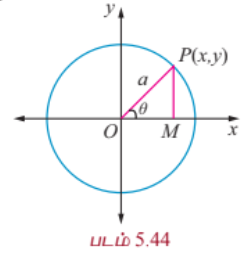
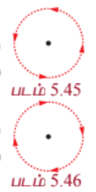
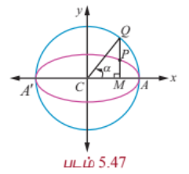

### 5.5 கூம்பு வடிவின் துணையலகு வடிவம் (Parametric form of Conics)

#### 5.5.1 துணையலகுச் சமன்பாடுகள் (Parametric equations)

$f(t)$ மற்றும் $g(t)$ என்பன $t$ -ன் சார்புகள் எனில் $x = f(t)$ மற்றும் $y = g(t)$ என்ற சமன்பாடுகள் இரண்டும் சேர்ந்து தளத்தில் ஒரு வளைவரையை உருவாக்கும். பொதுவாக $t$ ஒரு தனித்த மாறியாகும், இங்கு இது ஒரு **துணையலகு** எனப்படும், மற்றும் ஒரு வளைவரையை இந்த முறையில் குறிப்பிடுவதை **துணையலகுச் சமன்பாடுகள்** என அறியப்படுகிறது. $t$ -ன் ஒரு முக்கியப் பொருள் காலத்தைக் குறிப்பது. இந்த விளக்கத்தில் $x = f(t)$ மற்றும் $y = g(t)$ என்ற சமன்பாடுகள் ஒரு குறிப்பிட்ட நேரம் $t$ -இல் ஒரு பொருளின் நிலையைக் குறிக்கின்றன.

சுருக்கமாக, $x$ மற்றும் $y$ மதிப்புகளை ஒரு மூன்றாவது மாறி மூலம் எழுதுவது துணையலகுச் சமன்பாடு எனப்படும். இந்த மூன்றாவது மாறி துணையலகு எனப்படும். ஒரு துணையலகு எப்போதும் $t$ ஆக இருக்க வேண்டியதில்லை. $t$ -ஐப் பயன்படுத்துவது ஒரு வழக்கு என்றாலும் வேறு மாறிகளையும் பயன்படுத்தலாம்.

---

(i) **$x^2 + y^2 = a^2$ என்ற வட்டத்தின் துணையலகு வடிவம்** (Parametric form of the circle $x^2 + y^2 = a^2$)

$P(x, y)$ என்பது $x^2 + y^2 = a^2$ என்ற வட்டத்தின் மீதுள்ள ஏதேனும் ஒரு புள்ளி என்க.

$OP$ -ஐ இணைத்து அது $x$-அச்சுடன் $\theta$ என்ற கோணத்தை உருவாக்கும் என்க.

$x$ -அச்சுக்கு செங்குத்தாக $PM$ வரைக.

முக்கோணம் $OPM$ -இலிருந்து

$$x = OM = a\cos\theta$$

$$y = PM = a\sin\theta$$

இதனால் வட்டத்தின் மீதுள்ள ஏதேனும் ஒரு புள்ளி $(a\cos\theta, a\sin\theta)$.

மேலும் $x = a\cos\theta, y = a\sin\theta, 0 \leq \theta \leq 2\pi$ என்பன $x^2 + y^2 = a^2$ என்ற வட்டத்தின் துணையலகுச் சமன்பாடுகள் ஆகும்.

மறுதலையாக, $x = a\cos\theta, y = a\sin\theta, 0 \leq \theta \leq 2\pi$ எனில்,

$\frac{x}{a} = \cos\theta, \frac{y}{a} = \sin\theta$.

வர்க்கப்படுத்திக் கூட்ட,

$\frac{x^2}{a^2} + \frac{y^2}{a^2} = \cos^2\theta + \sin^2\theta = 1$.

எனவே $x^2 + y^2 = a^2$ என்ற சமன்பாடு மையம் $(0, 0)$ மற்றும் ஆரம் $a$ அலகுகள் கொண்ட வட்டத்தைத் தரும்.

### குறிப்பு

(1) $x = a\cos t, y = a\sin t, 0 \leq t \leq 2\pi$ என்ற துணையலகுச் சமன்பாடுகளும் $x^2 + y^2 = a^2$ என்ற வட்டத்தைக் குறிக்கின்றன. இங்கு $t$ கடிகார எதிர்திசையில் அதிகரிக்கும்.

(2) $x = a\sin t, y = a\cos t, 0 \leq t \leq 2\pi$ என்ற துணையலகுச் சமன்பாடுகளும் $x^2 + y^2 = a^2$ என்ற வட்டத்தைக் குறிக்கின்றன. இங்கு $t$ கடிகார திசையில் அதிகரிக்கும்.

---

(ii) **பரவளையம் $y^2 = 4ax$ -ன் துணையலகு வடிவம்** (Parametric form of the parabola $y^2 = 4ax$)

$P(x_1, y_1)$ பரவளையத்தின் மீதுள்ள புள்ளி என்க.

$$y_1^2 = 4ax_1$$

$$(y_1)(y_1) = (2a)(2x_1)$$

$$\frac{y_1}{2a} = \frac{2x_1}{y_1} = t \quad (-\infty < t < \infty)$$

என்க.

$$y_1 = 2at, \quad x_1 = at^2$$

எனவே $y^2 = 4ax$ துணையலகு வடிவம்

$$x = at^2, \quad y = 2at, \quad -\infty < t < \infty$$

மறுதலையாக $x = at^2$ மற்றும் $y = 2at$, $-\infty < t < \infty$ எனில் இவற்றிலிருந்து $t$ -ஐ நீக்க, $y^2 = 4ax$ என்ற சமன்பாடு கிடைக்கும்.

---

(iii) **நீள்வட்டம் $\frac{x^2}{a^2} + \frac{y^2}{b^2} = 1$ -ன் துணையலகு வடிவம்** (Parametric form of the Ellipse $\frac{x^2}{a^2} + \frac{y^2}{b^2} = 1$)

நீள்வட்டத்தின் மீதுள்ள ஏதேனும் ஒரு புள்ளி $P$ என்க. $P$-ன் $y$-அச்சு தூரம் $MP$ துணைவட்டத்தை $Q$ -இல் சந்திக்கின்றது என்க.

$\angle ACQ = \alpha$ என்க.

$$\therefore CM = a\cos\alpha, \quad MQ = a\sin\alpha$$

மற்றும் $Q(a\cos\alpha, a\sin\alpha)$.

தற்போது $P$ -ன் $x$ -அச்சு தூரம் $a\cos\alpha$.

$y$ -அச்சு தூரம் $y'$, எனில் $P(a\cos\alpha, y')$, $\frac{x^2}{a^2} + \frac{y^2}{b^2} = 1$ என்ற நீள்வட்டத்தின் மீதுள்ளது.

எனவே $\cos^2\alpha + \frac{y'^2}{b^2} = 1$

$$\Rightarrow y' = b\sin\alpha.$$

அதனால் $P$ -ன் ஆயத்தொலைகள் $(a\cos\alpha, b\sin\alpha)$.

இந்த துணையலகு $\alpha$ $P$ -ன் மையத்தகவு கோணம் எனப்படும். இங்கு $\alpha$ என்பது $CQ$ என்ற கோடு $x$ -அச்சுடன் ஏற்படுத்தும் கோணம் மற்றும் $CP$ ஏற்படுத்தும் கோணம் அல்ல என்பது குறிப்பிடத்தக்கது.

எனவே நீள்வட்டத்தின் துணையலகுச் சமன்பாடுகள்

$$x = a\cos\theta, \quad y = b\sin\theta, \quad \text{இங்கு } \theta \text{ ஒரு துணையலகு } 0 \leq \theta \leq 2\pi.$$

---

(iv) **அதிபரவளையம் $\frac{x^2}{a^2} - \frac{y^2}{b^2} = 1$ -இன் துணையலகு வடிவம்** (Parametric form of the Hyperbola $\frac{x^2}{a^2} - \frac{y^2}{b^2} = 1$)

இதுபோலவே அதிபரவளையத்தின் துணையலகுச் சமன்பாடுகள்

$$x = a\sec\theta, \quad y = b\tan\theta, \quad \text{இங்கு } \theta \text{ ஒரு துணையலகு } -\pi \leq \theta \leq \pi, \theta = \pm\frac{\pi}{2} \text{ தவிர}.$$

---

சுருக்கமாக வட்டம், பரவளையம், நீள்வட்டம், அதிபரவளையம் ஆகியவற்றின் துணையலகுச் சமன்பாடுகள் பின்வரும் அட்டவணையில் தரப்பட்டுள்ளன.

| கூம்பு வளைவு | துணையலகுச் சமன்பாடுகள் | துணையலகு வீச்சு | கூம்பு வளைவின் மீதுள்ள ஒரு புள்ளி |
|---|---|---|---|
| வட்டம் | $x = a\cos\theta$   $y = a\sin\theta$ | $0 \leq \theta \leq 2\pi$ | $(a\cos\theta, a\sin\theta)$ |
| பரவளையம் | $x = at^2$   $y = 2at$ | $-\infty < t < \infty$ | $(at^2, 2at)$ |
| நீள்வட்டம் | $x = a\cos\theta$   $y = b\sin\theta$ | $0 \leq \theta \leq 2\pi$ | $(a\cos\theta, b\sin\theta)$ |
| அதிபரவளையம் | $x = a\sec\theta$   $y = b\tan\theta$ | $-\pi \leq \theta \leq \pi$   $\theta \neq \pm\frac{\pi}{2}$ | $(a\sec\theta, b\tan\theta)$ |

---

### குறிப்புரை

(1) துணையலகு வடிவம் என்பது கூம்பு வளைவின் மீதுள்ள புள்ளிகளின் தொகுப்பைக் குறிக்கின்றது. மேலும் துணையலகு, மாறிலி மற்றும் மாறி என்ற இரண்டு பணிகளையும் செய்கிறது. ஆனால் கார்ட்டீசியன் வடிவம் என்பது கூம்பு வளைவை உருவாக்கும் ஒரு புள்ளியின் நியமப்பாதையைக் குறிக்கின்றது. துணையலகு முறை வளைவரையின் திசைப்போக்கைக் குறிக்கின்றது.

(2) துணையலகு வடிவம் என்பது ஒருமைத்தன்மையுடையதாக இருக்கத் தேவையில்லை.

(3) துணையலகு வடிவம் என்பது மாறிகளின் எண்ணிக்கையில் குறைந்தது ஒன்றையாவது குறைக்கின்றது.