### 5.7 அன்றாட வாழ்வில் கூம்பு வளைவுகளின் பயன்பாடுகள் (Real life Applications of Conics)

#### 5.7.1 பரவளையம் (Parabola)

பரவளையத்தின் முக்கியப் பயன்பாடுகள் ஒளி அல்லது வானொலி அலைகளின் எதிரொளிப்பான் அல்லது ஏற்பியை உள்ளடக்கியதாக இருக்கின்றது. எடுத்துக்காட்டாக வாகனங்களின் முகப்பு விளக்கின் குறுக்கு வெட்டு. சுடர் விளக்கு இவற்றில் பரவளைய எதிரொளிப்பான்கள் பயன்படுத்தப்படுகிறது.

பரவளைய எதிரொளிப்பான் என்பது வெள்ளி முலாம் பூசப்பட்ட பரவளையம் தன் அச்சைப் பற்றிச் சுற்றுவதால் உருவாகும் வளைதளப்பரப்பாகும். இவற்றில் பல்புகள் குவியத்தில் பொருத்தப்படுகின்றன. இதனால் குவியத்திலிருந்து புறப்படும் ஒளி பரவளையத்தில் பட்டு பரவளையத்தின் அச்சுக்கு இணையாக பிரதிபலிக்கின்றது. (படம் 5.60) அதே சமயம் துணைக்கோள் கிண்ண ஏற்பி மற்றும் விளையாட்டு நிகழ்ச்சிகளில் பயன்படுத்தப்படும் ஒலிப்பெருக்கிகள் போன்றவற்றில் உள்ளே வரும் அச்சுக்கு இணையான வானொலி அலைகள் அல்லது ஒலி அலைகள் பிரதிபலிக்கப்பட்டு குவியத்தில் ஒன்று சேருகின்றது (படம் 5.59). இதேபோல் ஒரு சட்டத்தில் பரவளையக் கண்ணாடியும் அதன் குவியத்தில் சமையற்பாத்திரமும் பொருத்தப்பட்டால் (படம் 5.1) உள்ளே வரும் அச்சுக்கு இணையான சூரிய ஒளிக்கற்றைகள் பிரதிபலிக்கப்பட்டுக் குவியத்தில் சமைப்பதற்குத் தேவையான வெப்பத்தை உற்பத்தி செய்கின்றது.

பரவளைய வளைவுகள் அதன் மிகச்சிறந்த கட்டுமான நிலைத்தன்மைக்கும் மற்றும் அதன் அழகுக்கும் சிறந்தது. அவற்றில் சில இந்தியாவில், ஆந்திர மாநிலத்தில் கோதாவரி நதியின் மீதுள்ள பாலம், பிரான்ஸ் நாட்டில் பாரிஸ் நகரில் உள்ள ஈபில் கோபுரம் ஆகும்.

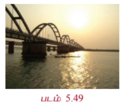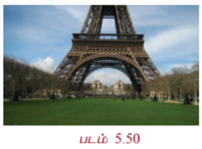

---

#### 5.7.2 நீள்வட்டம் (Ellipse)

ஜோகன்ஸ் கெப்ளரின் கூற்றுப்படி சூரியக் குடும்பத்தில் உள்ள எல்லாக் கோள்களும் சூரியனை ஒரு குவியமாகக் கொண்ட நீள்வட்டப்பாதையில் சுற்றுகின்றன. சில வால் நட்சத்திரங்களும்கூட சூரியனை ஒரு குவியமாகக் கொண்ட நீள்வட்டப்பாதையிலேயே சுற்றுகின்றன. எடுத்துக்காட்டாக, 75 ஆண்டுகளுக்கு ஒருமுறை தோன்றும் ஹாலேயின் வால் நட்சத்திரம் $e \approx 0.97$ கொண்ட ஒரு நீள்வட்டப் பாதையில் (படம் 5.51) சுற்றுகின்றது. நம்முடைய துணைக்கோள் சந்திரன் பூமியை ஒரு குவியமாகக் கொண்ட நீள்வட்டப்பாதையில் சுற்றுகின்றது. மற்ற கோள்களின் துணைக்கோள்களும் அவற்றின் கோள்களைச் சுற்றி நீள்வட்டப்பாதையிலேயே சுற்றுகின்றன.

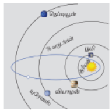

நீள்வட்ட வளைவுகள் அவற்றின் நிலைத்தன்மைக்கும் அழகுக்கும் பயன்படுத்தப்படுகின்றன. தலைப்பு பாகம் நெட்டச்சும் குற்றச்சும் $2:1$ என்ற விகிதத்தில் இருக்குமாறு நீள்வட்ட வடிவில் அமைக்கப்பட்ட நீராவி கொதிகலன்கள் மிகவும் பலம் வாய்ந்ததாக இருக்கும் என நம்பப்படுகின்றது. ஃபோர்-சோபர் பீல்டு (Bohr-Sommerfeld) அணுக்கோட்பாட்டில் எலக்ட்ரானின் சுற்றுப்பாதை வட்டம் அல்லது நீள்வட்டமாக இருக்கும். சில நேரங்களில் (குறிப்பிட்ட தேவைக்காக) பற்சக்கரங்களும் நீள்வட்ட வடிவில் செய்யப்படுகின்றன. (படம் 5.52)

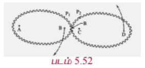

நாம் வாழும் கோளாகிய பூமி சாய்ந்த கோளமாகும். அதாவது நீள்வட்டம் தனது குற்றச்சைப் பற்றிச் சுற்றுவதால் உருவாகும் திண்மம். இந்த சாய்வுக் கோளமானது நிலநடுக்கோட்டுப் பகுதியில் புடைத்தும், துருவப்பகுதியில் தட்டையாகவும் இருக்கும்.

நீள்வட்டத்தின் ஒரு குவியத்திலிருந்து வெளியாகும் ஒளி அல்லது ஒளிக்கற்றை நீள்வட்டத்தில் பட்டுப் பிரதிபலித்து மற்றொரு குவியத்தை (படம் 5.62) அடைகின்றது. இது நீள்வட்டத்தின் பிரதிபலிப்பு பண்பு ஆகும். இதை இயற்பியலின் படுகதிர் மற்றும் பிரதிபலிப்புக் கதிர் என்ற கருத்துக்களைப் பயன்படுத்தி நிறுவலாம்.

ஓர் ஆச்சரியமூட்டும் நீள்வட்ட எதிரொளிப்பான் பயன்படுத்தும் மருத்துவக் கருவி லித்தோரிப்டர் (படம் 5.4 மற்றும் 5.63). இது சிறுநீரகக் கற்களைக் கரைப்பதற்கு மின்காந்த தொழில்நுட்பம் அல்லது அல்ட்ராசவுண்டை பயன்படுத்தி மின் அதிர்வு அலைகளை உருவாக்குகின்றது. அந்த அலைகள் நீள்வட்டத்தின் குறுக்குவெட்டில் ஒரு குவியத்தில் தோன்றி மற்றொரு குவியப்புள்ளியில் சிறுநீரகக் கல்லில் பிரதிபலிக்கின்றது. இந்த முறையில் குணமாவதற்கான காலம் வழக்கமான அறுவைச் சிகிச்சைக்கு ஆவதைவிட குறைவாக இருக்கும். மேலும் அறுவைச் சிகிச்சை இல்லாதது மற்றும் இறப்பு விகிதம் குறைவானது இதன் சிறப்பம்சம்.

---

#### 5.7.3 அதிபரவளையம் (Hyperbola)

சில வால் நட்சத்திரங்கள் சூரியனை ஒரு குவியத்தில் கொண்ட அதிபரவளையப் பாதையில் பயணிக்கின்றன. இவ்வகை வால் நட்சத்திரங்கள், நீள் வட்டப்பாதையில் வரும் வால் நட்சத்திரங்கள் குறிப்பிட்ட இடைவெளியில் வருவதுபோல் அல்லாமல் ஒரே ஒரு முறை மட்டும் சூரியனின் அருகில் வரும். மேலும் மும்பை விமான நிலையக்கட்டிடக்கலை (படம் 5.53), கோளரங்கத்தின் குறுக்குவெட்டு, கப்பல்களின் இருப்பிடம் காணல் (படம் 5.54) அணுமின் நிலைய அல்லது அனல்மின் நிலையக் குளிரவைக்கும் கோபுரங்கள் (படம் 5.5).

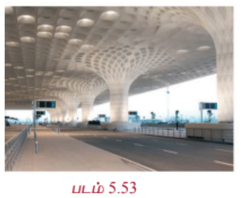
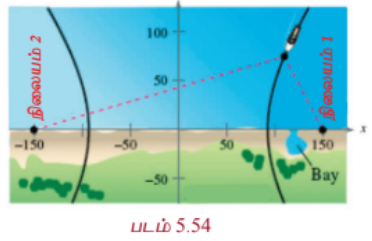

---

### எடுத்துக்காட்டு 5.31

ஒருவழிப்பாதையில் உள்ள அரை நீள்வட்ட வளைவின் உயரம் 3 மீ மற்றும் அகலம் 12 மீ. ஒரு சரக்கு வாகனத்தின் அகலம் 3 மீ மற்றும் உயரம் 2.7 மீ எனில் இந்த வாகனம் வளைவின் வழி செல்ல முடியுமா? (படம் 5.6)

#### தீர்வு

சரக்கு வாகனத்தின் அகலம் 3மீ என்பதால் அது வளைவு வழிச் செல்ல சாலையின் மையத்திலிருந்து 1.5மீ தூரத்தில் வளைவின் உயரம் கணக்கிட வேண்டும். இந்த உயரம் 2.7மீ அல்லது குறைவாக இருந்தால் சரக்கு வாகனம் வளைவு வழிச் செல்லாது. (படம் 5.6)

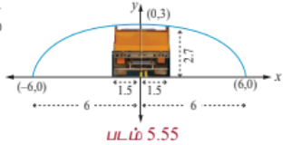

படத்திலிருந்து $a = 6$ மற்றும் $b = 3$ என்பது $\frac{x^2}{6^2} + \frac{y^2}{3^2} = 1$ என்ற நீள்வட்டச் சமன்பாட்டை அளிக்கின்றது.

3மீ அகல வாகனத்தின் விளிம்பு மையத்திலிருந்து $x = 1.5$ மீ-இல் இருக்கும். மையத்திலிருந்து 1.5மீ தூரத்தில் வளைவின் உயரம் காண $x = 1.5$ எனச் சமன்பாட்டில் பிரதியிட்டு $y$ -இன் தீர்வு காண

$$\frac{(1.5)^2}{36} + \frac{y^2}{9} = 1$$

$$y^2 = 9\left(1 - \frac{2.25}{36}\right) = 9\left(\frac{33.75}{36}\right) = \frac{135}{16}$$

$$y = \frac{\sqrt{135}}{4} = \frac{11.62}{4} = 2.90$$

இதனால் வளைவின் மையத்திலிருந்து 1.5மீ தூரத்தில் வளைவின் உயரம் 2.90மீ, சரக்கு வாகனத்தின் உயரம் 2.7மீ என்பதால் அது நீள்வட்ட வளைவு வழியேச் செல்லும்.

---

### எடுத்துக்காட்டு 5.32

சூரியனிலிருந்து பூமியின் அதிகபட்சம் மற்றும் குறைந்தபட்ச தூரங்கள் முறையே $152 \times 10^6$ கி.மீ மற்றும் $94.5 \times 10^6$ கி.மீ. நீள்வட்டப் பாதையின் ஒரு குவியத்தில் சூரியன் உள்ளது. சூரியனுக்கும் மற்றொரு குவியத்திற்குமான தூரம் காண்க.

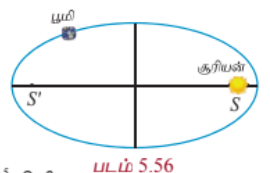

#### தீர்வு

$$AS' = 94.5 \times 10^6 \text{ கி.மீ}, \quad SA' = 152 \times 10^6 \text{ கி.மீ}.$$

$$a + c = 152 \times 10^6$$

$$a - c = 94.5 \times 10^6$$

கழிக்க $2c = 57.5 \times 10^6 = 5.75 \times 10^7$ கி.மீ.

மற்றொரு குவியத்திலிருந்து சூரியனுக்கு உள்ள தூரம் $SS' = 5.75 \times 10^7$ கி.மீ.

---

### எடுத்துக்காட்டு 5.33

ஒரு கான்கிரீட் பாலம் பரவளைய வடிவில் உள்ளது. சாலையின்மேல் உள்ள பாலத்தின் நீளம் 40மீ மற்றும் அதன் அதிகபட்ச உயரம் 15மீ எனில் அந்தப் பரவளைய வளைவின் சமன்பாடு காண்க.

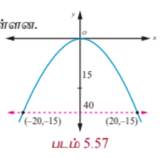

#### தீர்வு

படத்திலிருந்து முனை $(0, 0)$ மற்றும் பரவளையம் கீழ்நோக்கித் திறப்புடையது எனலாம்.

பரவளையத்தின் சமன்பாடு $x^2 = -4ay$

$(20, -15)$ மற்றும் $(-20, -15)$ என்ற புள்ளிகள் பரவளையத்தின் மீதுள்ளன.

$$20^2 = -4a(-15)$$

$$4a = \frac{400}{15}$$

$$x^2 = -\frac{80}{3}y$$

எனவே சமன்பாடு $3x^2 = -80y$.

---

### எடுத்துக்காட்டு 5.34

ஒரு பரவளையத் தொலைத்தொடர்பு அலைவாங்கியின் குவியம் அதன் முனையிலிருந்து 2மீ தூரத்தில் உள்ளது. முனையிலிருந்து 3மீ தூரத்தில் அலைவாங்கியின் அகலம் காண்க.

#### தீர்வு

பரவளையத்தின் சமன்பாடு $y^2 = 4ax$.

குவியம் முனையிலிருந்து 2மீ என்பதால் $a = 2$.

எனவே பரவளையத்தின் சமன்பாடு $y^2 = 8x$.

முனையிலிருந்து 3மீ தூரத்தில் பரவளையத்தின் மீதுள்ள புள்ளி $P$ எனில் $P$ என்பது $(3, y)$ ஆக இருக்கும்.

$$y^2 = 8(3) = 24$$

$$y = 2\sqrt{6}$$

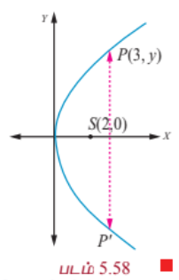

முனையிலிருந்து 3மீ தூரத்தில் அலைவாங்கியின் அகலம் $4\sqrt{6}$ மீ ஆகும்.

---

### 5.7.4 பரவளையத்தின் பிரதிபலிப்பு பண்பு (Reflective property of parabola)

பரவளையத்தின் குவியத்திலிருந்து தோன்றும் ஒளி அல்லது, ஒலி அல்லது, வானொலி அலைகள் பிரதிபலிப்புக்குப் பின்பு பரவளையத்தின் அச்சுக்கு இணையாகச் செல்கின்றன (படம் 5.60). மறுதலையாக பரவளையத்தின் அச்சுக்கு இணையாக வரும் கதிர்கள் பிரதிபலிக்கப்பட்டு பரவளையத்தின் குவியத்தில் குவிகின்றது (படம் 5.59).

---

### எடுத்துக்காட்டு 5.35

$y = \frac{1}{32}x^2$ என்ற சமன்பாடு சூரிய ஆற்றலுக்குப் பயன்படுத்தப்படும் பரவளைய கண்ணாடிகளின் மாதிரியைக் குறிக்கின்றது. பரவளையத்தின் குவியத்தில் வெப்பமூட்டும் குழாய் உள்ளது. இந்தக் குழாய் பரவளையத்தின் முனையிலிருந்து எவ்ளவு உயரத்தில் உள்ளது?

#### தீர்வு

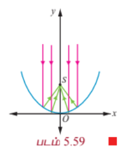

பரவளையத்தின் சமன்பாடு

$$y = \frac{1}{32}x^2$$

அதாவது $x^2 = 32y$; முனை $(0, 0)$

$$= 4(8)y$$

$$\Rightarrow a = 8$$

வெப்பமூட்டும் குழாய் குவியம் $(0, a)$ -இல் பொருத்தப்பட வேண்டும். எனவே வெப்பமூட்டும் குழாய் பரவளையத்தின் முனையிலிருந்து 8 அலகுகள் உயரத்தில் பொருத்தப்பட வேண்டும்.

---

### எடுத்துக்காட்டு 5.36

ஒரு தேடும் விளக்கு பரவளைய பிரதிபலிப்பான் கொண்டது. (குறுக்கு வெட்டு ஒரு கிண்ண வடிவம்). பரவளைய கிண்ணத்தின் விளிம்புகளுக்கு இடையே உள்ள அகலம் 40 செ.மீ மற்றும் ஆழம் 30 செ.மீ. குமிழ் குவியத்தில் பொருத்தப்பட்டுள்ளது.

(1) பிரதிபலிப்புக்குப் பயன்படுத்தப்படும் பரவளையத்தின் சமன்பாடு என்ன?

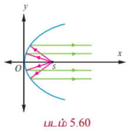

(2) ஒளி அதிகபட்சம் தூரம் தெரிவதற்கு குமிழ் பரவளையத்தின் முனையிலிருந்து எவ்வளவு தூரத்தில் பொருத்தப்பட வேண்டும்.

#### தீர்வு

முனை $(0, 0)$ என்க.

பரவளையத்தின் சமன்பாடு $y^2 = 4ax$.

(1) விட்டம் 40 செ.மீ மற்றும் உயரம் 30 செ.மீ. என உள்ளதால் பரவளையத்தின் விளிம்பில் உள்ள ஒரு புள்ளி $(30, 20)$ ஆகும்.

$$20^2 = 4a(30)$$

$$4a = \frac{400}{30} = \frac{40}{3}.$$

சமன்பாடு $y^2 = \frac{40}{3}x$.

(2) குமிழ் குவியத்தில் $(a, 0)$ ஆக இருக்க வேண்டும். எனவே குமிழ் பரவளையத்தின் முனையிலிருந்து $\frac{10}{3}$ செ.மீ. தூரத்தில் பொருத்தப்பட வேண்டும்.

---

### எடுத்துக்காட்டு 5.37

ஓர் ஒளியியல் கண்ணாடி அமைப்பின் நீள்வட்டப் பகுதிச்சமன்பாடு $\frac{x^2}{16} + \frac{y^2}{9} = 1$. அந்த அமைப்பின் பரவளையப் பகுதியின் குவியம் நீள்வட்டப்பகுதியின் வலப்பக்க குவியத்தில் உள்ளது. பரவளையத்தின் முனை ஆதிப்புள்ளியிலும், பரவளையம் வலப்பக்கம் திறப்புடையதாகவும் உள்ளது. இந்த பரவளையத்தின் சமன்பாட்டைத் தீர்மானிக்கவும்.

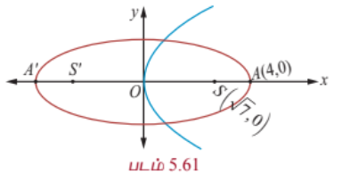

#### தீர்வு

கொடுக்கப்பட்ட நீள்வட்டத்தில்

$$a^2 = 16, \quad b^2 = 9$$

மற்றும்

$$c^2 = a^2 - b^2$$

$$c^2 = 16 - 9 = 7$$

$$c = \pm \sqrt{7}$$

எனவே குவியங்கள் $F(\sqrt{7}, 0)$ மற்றும் $F'(-\sqrt{7}, 0)$.

பரவளையத்தின் குவியம் $(\sqrt{7}, 0) \Rightarrow a = \sqrt{7}$.

பரவளையத்தின் சமன்பாடு $y^2 = 4\sqrt{7}x$.

---

### 5.7.5 நீள்வட்டத்தின் பிரதிபலிப்பு பண்பு (Reflective Property of an Ellipse)

குவியங்களிலிருந்து நீள்வட்டத்தின் மீதுள்ள ஏதேனும் ஒரு புள்ளிக்கான கோடுகள் அந்தப் புள்ளியில் வரையப்படும் தொடுகோட்டுடன் சமமான கோணங்களை ஏற்படுத்துகின்றன (படம் 5.62).

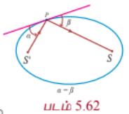

ஒரு குவியத்திலிருந்து உமிழப்படும் ஒளி அல்லது ஒலி அல்லது வானொலி அலைகள் நீள்வட்டத்தின் ஏதேனும் ஒரு புள்ளியில் பட்டு மற்றொரு குவியத்தில் பெறப்படுகின்றது (படம் 5.63).

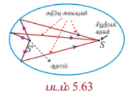

---

### எடுத்துக்காட்டு 5.38

34மீ நீளமுள்ள ஓர் அறை பிரதிபலிப்புக் கூரையாக கட்டப்படவுள்ளது. அந்த அறையின் கூறை நீள்வட்ட வடிவமாக படம் 5.64-ல் இருப்பது போல் உள்ளது. அந்தக் கூரையின் அதிகபட்ச உயரம் 8 மீ எனில், அதன் குவியங்கள் எங்கே அமையும் என்பதைத் தீர்மானிக்கவும்.

#### தீர்வு

நீள்வட்ட வடிவக் கூரையின் அரை நெட்டச்சு 17மீ, அதன் உயரம் அரை குற்றச்சு 8மீ. இதனால்

$$c^2 = a^2 - b^2 = 17^2 - 8^2$$

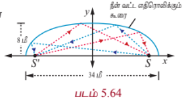

$$c = \sqrt{289 - 64} = \sqrt{225} = 15$$

நீள்வட்டக் கூரையின் குவியங்கள் நெட்டச்சின் மீது மையத்திலிருந்து 15மீ தூரத்தில் இருக்கும்.

**துளையில்லாத மருத்துவ அதிசயம் (A non-invasive medical miracle)**

லித்தோடிரிப்டரில், நீள்வட்டத்தின் ஒரு குவியத்தில் இருந்து அதிக அதிர்வெண் கொண்ட ஒலி அலைகள் உமிழப்படுகின்றன. நீள்வட்டத்தில் மற்றொரு குவியத்தில் நோயாளியின் சிறுநீரகக்கல் இருக்குமாறு அமைக்கப்படுகின்றது. நீள்வட்டப் பிரதிபலிப்புப் பண்பின்படி ஒரு குவியத்தில் புறப்பட்ட ஒலி அலைகள் அடுத்தக் குவியத்தில் இருக்கும் சிறுநீரகக் கற்களைத் தூளாக்குகின்றன.

---

### எடுத்துக்காட்டு 5.39

நீள்வட்டத்தின் சமன்பாடు $\frac{(x - 11)^2}{484} + \frac{y^2}{64} = 1$ ( $x$ மற்றும் $y$ -ன் மதிப்புகள் செ.மீ-இல் அளக்கப்படுகின்றது) நோயாளியின் சிறுநீரகக் கல் மீது அதிர்வலைகள் படுமாறு நோயாளி எந்த இடத்தில் இருக்க வேண்டும் எனக் காண்க.

#### தீர்வு

நீள்வட்டத்தின் சமன்பாடு $\frac{(x - 11)^2}{484} + \frac{y^2}{64} = 1$. சிறுநீரகக் கற்களைக் கரைக்க ஒலி அலைகள் தோன்றும் இடமும் நோயாளியின் சிறுநீரகக் கல்லும் குவியங்களில் உள்ளவாறு அமைய வேண்டும்.

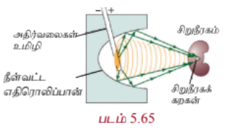

$$a^2 = 484 \quad \text{மற்றும்} \quad b^2 = 64$$

$$c^2 = a^2 - b^2$$

$$= 484 - 64 = 420$$

$$c \approx 20.5$$

நோயாளியின் சிறுநீரகக்கல் நீள்வட்டத்தின் நெட்டச்சில் மையத்திலிருந்து 20.5 செ.மீ தூரத்தில் இருக்க வேண்டும்.

---

### 5.7.6 அதிபரவளையத்தின் பிரதிபலிப்புப் பண்பு (Reflective Property of a Hyperbola)

அதிபரவளையத்தின் ஒரு புள்ளியிலிருந்து குவியங்களுக்கு வரையப்படும் கோடுகள் அந்தப் புள்ளியில் உள்ள தொடுகோட்டுடன் சமமான கோணங்களை உருவாக்குகின்றன. (படம் 5.66).

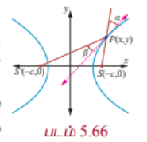

அதிபரவளையத்தின் ஒரு குவியத்திலிருந்து புறப்படும் ஒளி அல்லது ஒலி அல்லது வானொலி அலைகள் நீள்வட்டத்தைப் போல் மற்றொரு குவியத்தில் பெறப்படுகின்றன. இது ஆழ்கடலில் பயணிக்கும் கப்பல்கள் இருக்கும் இடங்களை அறியப் பயன்படுகிறது. (படம் 5.54).

---

### எடுத்துக்காட்டு 5.40

இரு கடலோர காவல்படைத் தளங்கள் 600 கி.மீ. தொலைவில் $A(0, 0)$ மற்றும் $B(0, 600)$ என்ற புள்ளிகளில் அமைந்துள்ளன. $P$ என்ற புள்ளியில் உள்ள கப்பலிலிருந்து ஆபத்திற்கான சமிக்ஞைகள் இரு தளங்களிலும் சிறிதளவு மாறுபட்ட நேரங்களில் பெறப்படுகின்றன. அவற்றிலிருந்து கப்பல், தளம் $B$ யை விட தளம் $A$ -க்கு 200 கி.மீ. அதிக தூரத்தில் உள்ளதாக தீர்மானிக்கப்படுகின்றது. எனவே அந்தக் கப்பல் இருக்கும் இடம் வழியாகச் செல்லும் அதிபரவளையத்தின் சமன்பாடு காண்க.

#### தீர்வு

இரு கடலோர காவல்படைத் தளங்கள் குவியலங்களாதலால் அவற்றின் மையம் $(0, 300)$ அதிபரவளையத்தின் மையமாகும். எனவே சமன்பாடு

$$\frac{(y - 300)^2}{a^2} - \frac{(x - 0)^2}{b^2} = 1.$$

... (1)

$a$ மற்றும் $b$ -ன் மதிப்பு காண அதிபரவளையத்தின் மீதுள்ள இருபுள்ளிகளை எடுத்துப் பிரதியிடலாம்.

$A$ ஆனது $B$ -ஐ விட 200 கி.மீ. அதிக தூரத்தில் உள்ளதால் $(0, 400)$ அதிபரவளையத்தின் மீதுள்ள புள்ளி

$$\frac{(400 - 300)^2}{a^2} - \frac{0^2}{b^2} = 1$$

$$\frac{10000}{a^2} = 1, \quad a^2 = 10000$$

மற்றொரு புள்ளி $(x, 600)$ -ம் அதிபரவளையத்தின் மீது $\sqrt{x^2 + 600^2} = x + 200$ எனுமாறு உள்ளது.

$$x^2 + 360000 = x^2 + 400x + 40000$$

$$x = 800$$

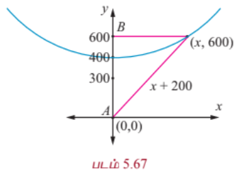

(1)-இல் பிரதியிட,

$$\frac{(600 - 300)^2}{10000} - \frac{(800 - 0)^2}{b^2} = 1$$

$$9 - \frac{640000}{b^2} = 1$$

$$b^2 = 80000$$

தேவையான சமன்பாடு

$$\frac{(y - 300)^2}{10000} - \frac{x^2}{80000} = 1.$$

இந்த அதிபரவளையத்தின் ஏதோ ஒரு புள்ளியில்தான் அந்த கப்பல் உள்ளது. மூன்றாவது ஒரு காவல்படைத் தளத்தைப் பயன்படுத்தி அதன் சரியான இருப்பிடத்தைக் காண முடியும்.

---

### எடுத்துக்காட்டு 5.41

ஒரு குறிப்பிட்ட தொலைநோக்கியில் பரவளைய பிரதிபலிப்பான் மற்றும் அதிபரவளைய பிரதிபலிப்பான் இரண்டும் உள்ளது. படம் 5.68-இல் உள்ள தொலைநோக்கியில் பரவளையத்தின் முனையிலிருந்து 14மீ உயரத்தில் உள்ள $F_1$ என்ற அதிபரவளையத்தின் ஒரு குவியம் பரவளையத்தின் குவியமாகவும் உள்ளது. அதிபரவளையத்தின் இரண்டாவது குவியம் $F_2$ பரவளையத்தின் முனையிலிருந்து 2மீ உயரத்தில் உள்ளது. அதிபரவளையத்தின் முனை $F_1$ -க்கு 1மீ கீழே உள்ளது. அதிபரவளையத்தின் மையத்தை ஆதியாகவும் குவியங்களை $y$ -அச்சிலும் கொண்ட அதிபரவளையத்தின் சமன்பாடு காண்க.

#### தீர்வு

பரவளையத்தின் முனை $V_1$ மற்றும் அதிபரவளையத்தின் முனை $V_2$ என்க.

$$F_1F_2 = 14 - 2 = 12 \text{ மீ}, \quad 2c = 12, \quad c = 6$$

மையத்திலிருந்து அதிபரவளையத்தின் முனைக்கு உள்ள தூரம்

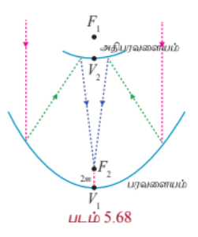

$$a = 6 - 1 = 5$$

$$b^2 = c^2 - a^2 = 36 - 25 = 11.$$

எனவே அதிபரவளையத்தின் சமன்பாடு

$$\frac{y^2}{25} - \frac{x^2}{11} = 1.$$

---

### பயிற்சி 5.5

1. ஒரு பாலம் பரவளைய வளைவில் உள்ளது. மையத்தில் 10மீ உயரமும், அடிப்பகுதியில் 30மீ அகலமும் உள்ளது. மையத்திலிருந்து இருபுறமும் 6 மீ தூரத்தில் பாலத்தின் உயரத்தைக் காண்க.

2. ஒரு நான்கு வழிச்சாலைக்கான மலைவழியேசெல்லும் சுரங்கப்பாதையின் முகப்பு ஒரு நீள்வட்ட வடிவமாக உள்ளது. நெடுஞ்சாலையின் மொத்த அகலம் (முகப்பு அல்ல) 16மீ. சாலையின் விளிம்பில் சுரங்கப்பாதையின் உயரம், 4மீ உயரமுள்ள சரக்கு வாகனம் செல்வதற்குத் தேவையான அளவிற்கும் முகப்பின் அதிகபட்ச உயரம் 5மீ ஆகவும் இருக்க வேண்டுமெனில் சுரங்கப்பாதையின் திறப்பின் அகலம் என்னவாக இருக்க வேண்டும்?

3. ஒரு நீரூற்றில், ஆதியிலிருந்து 0.5மீ கிடைமட்டத் தூரத்தில் நீரின் அதிகபட்ச உயரம் 4மீ, நீரின் பாதை ஒரு பரவளையம் எனில் ஆதியிலிருந்து 0.75மீ கிடைமட்டத் தூரத்தில் நீரின் உயரத்தைக் காண்க.

4. பொறியாளர் ஒருவர் குறுக்கு வெட்டு பரவளையமாக உள்ள ஒரு துணைக்கோள் ஏற்பியை வடிவமைக்கின்றார். ஏற்பி அதன் மேல்பக்கத்தில் 5மீ அகலமும், முனையிலிருந்து குவியம் 1.2 மீ தூரத்திலும் உள்ளது.

   (a) முனையை ஆதியாகவும், $x$-அச்சு பரவளையத்தின் சமச்சீர் அச்சாகவும் கொண்டு ஆய அச்சுகளைப் பொருத்தி பரவளையத்தின் சமன்பாடு காண்க.

   (b) முனையிலிருந்து செயற்கைக்கோள் ஏற்பியின் ஆழம் காண்க.

5. ஒரு தொங்கு பாலத்தின் 60மீ சாலைப்பகுதிக்கு பரவளைய கம்பி வடம் படத்தில் உள்ளவாறு பொறுத்தப்பட்டுள்ளது. செங்குத்துக் கம்பி வடங்கள் சாலைப்பகுதியில் ஒவ்வொன்றுக்கும் 6மீ இடைவெளி இருக்குமாறு அமைக்கப்பட்டுள்ளது. முனையிலிருந்து முதல் இரண்டு செங்குத்து கம்பி வடங்களுக்கான நீளத்தைக் காண்க.

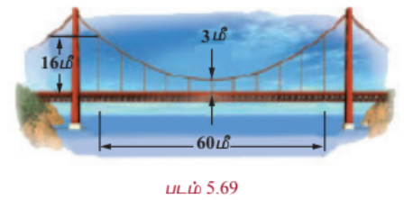

6. ஒரு அணு உலை குளிரூட்டும் தூணின் குறுக்கு வெட்டு அதிபரவளைய வடிவில் உள்ளது. மேலும் அதன் சமன்பாடு $\frac{x^2}{30^2} - \frac{y^2}{44^2} = 1$. தூண் 150மீ உயரமுடையது. மேலும் அதிபரவளையத்தின் மையத்திலிருந்து தூணின் மேல்பகுதிக்கான தூரம் மையத்திலிருந்து அடிப்பகுதிக்கு உள்ள தூரத்தில் பாதியாக உள்ளது. தூணின் மேற்பகுதி மற்றும் அடிப்பகுதியின் விட்டங்களைக் காண்க.

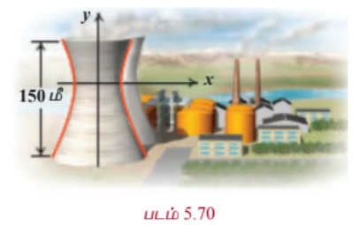

7. 1.2 மீ நீளமுள்ள தடி அதன் முனைகள் எப்போதும் ஆய அச்சுகளைத் தொட்டுச் செல்லுமாறு நகருகின்றது. தடியின் $x$ -அச்சு முனையிலிருந்து 0.3மீ தூரத்தில் உள்ள ஒரு புள்ளி $P$-ன் நியமப்பாதை ஒரு நீள்வட்டம் என நிறுவுக, மேலும் அதன் மையத்தொலைத்தகவும் காண்க.

8. தரைமட்டத்திலிருந்து 7.5மீ உயரத்தில் தரைக்கு இணையாகப் பொருத்தப்பட்ட ஒரு குழாயிலிருந்து வெளியேறும் நீர் தரையைத் தொடும் பாதை ஒரு பரவளையத்தை ஏற்படுத்துகிறது. மேலும் இந்தப் பரவளையப் பாதையின் முனை குழாயின் வாயில் அமைகிறது. குழாய் மட்டத்திற்கு 2.5மீ கீழே நீரின் பாய்வானது குழாயின் முனை வழியாகச் செல்லும் நிலை குத்துக் கோட்டிற்கு 3மீ தூரத்தில் உள்ளது. எனில் குத்துக் கோட்டிலிருந்து எவ்வளவு தூரத்திற்கு அப்பால் நீரானது தரையில் விழும் என்பதைக் காண்க.

9. ஒரு ராக்கெட் வெடியானது கொளுத்தும்போது அது ஒரு பரவளையப் பாதையில் செல்கிறது. அதன் உச்ச உயரம் 4மீ-ஐ எட்டும்போது அது கொளுத்தப்பட்ட இடத்திலிருந்து கிடைமட்டத் தூரம் 6மீ தொலைவிலுள்ளது. இறுதியாக கிடைமட்டமாக 12மீ தொலைவில் தரையை வந்தடைகிறது. எனில் புறப்பட்ட இடத்தில் தரையுடன் ஏற்படுத்தப்படும் எறிகோணம் காண்க.

10. $A$, $B$ என்ற இரு புள்ளிகள் 10கி.மீ இடைவெளியில் உள்ளன. இந்தப் புள்ளிகளில் வெவ்வேறு நேரங்களில் கேட்கப்பட்ட வெடிச்சத்தத்திலிருந்து வெடிச்சத்தம் உண்டான இடம் $A$ என்ற புள்ளி $B$ என்ற புள்ளியைவிட 6 கி.மீ அருகாமையில் உள்ளது என நிர்ணயிக்கப்பட்டது. வெடிச்சத்தம் உண்டான இடம் ஒரு குறிப்பிட்ட வளைவரைக்கு உட்பட்டது என நிரூபித்து அதன் சமன்பாட்டைக் காண்க.
